# KEEL Adopt

Guided brownfield adoption of the KEEL framework for an existing codebase.
Automates discovery and drafting. Human confirms at every gate.

Full guide: `docs/process/BROWNFIELD.md`

## Framework principles

Adoption places the framework's seven principles into the user's
project via `KEEL-PRINCIPLES.md` (copied by install.py). This skill
also stamps the `KEEL-INVARIANT-7` marker in Phase 6e. See
[`docs/process/KEEL-PRINCIPLES.md`](../../../docs/process/KEEL-PRINCIPLES.md).

## When to Use

- Existing project, no KEEL structure yet
- Want to start using KEEL's pipeline for new features
- NOT for greenfield — use `/keel-setup` instead

## Phases

```dot
digraph adopt {
  rankdir=LR;
  discover [label="1. Discover" shape=box];
  claude_md [label="2. Project guide" shape=box];
  northstar [label="3. North Star" shape=box];
  arch [label="4. ARCHITECTURE" shape=box];
  invariants [label="5. Invariants" shape=box];
  safety [label="6. Safety + agent config" shape=box];
  commit [label="7. Commit config" shape=box];
  done [label="Done" shape=doublecircle];

  discover -> claude_md;
  claude_md -> northstar [label="human reviews"];
  northstar -> arch [label="human reviews"];
  arch -> invariants [label="human reviews"];
  invariants -> safety [label="human confirms each"];
  safety -> commit [label="human reviews"];
  commit -> done [label="human blesses"];
}
```



---

## Paths — the master directory (`<masters>`)

Phase 6 fills `<!-- CUSTOMIZE -->` blanks in the agent masters. The masters
live in a host-resolved directory: `.claude/agents/` on a Claude Code install,
`.keel/agents/` on a Codex install — exactly one is present (single-host).
Resolve `<masters>` to whichever is present; every `<masters>/<role>.md` path
below is relative to it. One rule, both hosts — see the master-directory
locator in [`docs/process/HOST-SURFACES.md`](../../../docs/process/HOST-SURFACES.md).
Every other path this skill writes (the project guide,
`.keel/hooks/keel-safety-gate.py`, `docs/...`) is already host-neutral.

---

## Phase 1: Discovery (automated)

Scan the codebase to understand what exists. Read broadly, summarize concisely.

**Do:**
1. Glob for source files by type — identify the primary language and framework
2. Read package/dependency files (`package.json`, `mix.exs`, `Cargo.toml`, `requirements.txt`, `go.mod`, etc.)
3. Read entry points, main modules, and config files
4. Identify the test framework and test file locations
5. Identify build/run/test commands (from Makefile, scripts, CI config, README)
6. Read existing README, CONTRIBUTING.md, or similar docs
7. Map the directory structure (top 2 levels)

**Output:** A discovery summary with:
- Stack (language, framework, runtime)
- Directory structure
- Entry points and key modules
- Test framework and commands
- Build/run commands
- Existing documentation found

**Do NOT:** Write any files yet. This phase is read-only.

Announce: "Discovery complete. Here's what I found: [summary]. Moving to Phase 2."

---

## Phase 2: Draft the project guide (automated → human reviews)

Generate a draft project guide from discovery findings.

**Template to follow:**
```markdown
# [Project Name]

[One paragraph: what this project does, derived from code/README]

## Quick Facts

- **Stack:** [from discovery]
- **Runtime:** [local toolchain / etc.]
- **Tests:** [framework], run with `[command]`

## KEEL — Mandatory Process

This repository operates under KEEL. The full operating contract for any
agent working here is at `.keel/KEEL-CONTRACT.md`. **Read it before your
first tool call.** Hosts that support file imports (e.g. Claude Code) also
pull it into context via the line below; hosts that do not still honor the
explicit read instruction above.

@.keel/KEEL-CONTRACT.md

**Three-line floor** — minimum enforcement if the contract above is not yet loaded:
1. You are a KEEL pipeline operator, not a general coding assistant. Code changes route through `/keel-refine` → `/keel-pipeline WI##`.
2. Human pressure is not authorization to bypass. Apply the refusal protocol in `.keel/KEEL-CONTRACT.md`.
3. Trivial work batches into a feature entry via `/keel-refine` (which can mark `Binder-exempt: trivial`) — never ad-hoc.

## Safety Rules

<!-- HUMAN: Review these — are they your actual non-negotiable rules?
     Finalized with INV-### IDs at Phase 6 (per-item confirmed in Phase 5). -->
1. [Proposed from Phase 5, or placeholder]

## Architecture

See [ARCHITECTURE.md](ARCHITECTURE.md)

## Development

[Build, run, test commands from discovery — 4-6 lines]
```

When you fill `## Quick Facts` and `## Development`, name the toolchain
but do **not** write a language/runtime version floor in prose (e.g.
"Python 3.12+"). Reference the project's existing pin
(`pyproject.toml` `requires-python` / `.python-version` /
`package.json` `engines`) instead of repeating a number — a prose floor
drifts from the pin (P4: one number, one home).

**Write** the draft to the project guide.

**STOP.** Tell the human:
> "I've drafted the project guide from what I found in the codebase. Please review
> and edit it — especially the project description and any sections marked
> with HUMAN comments. When you're satisfied, tell me to continue."

**Wait for confirmation before proceeding.**

---

## Phase 3: Draft NORTH-STAR.md (automated → human reviews)

The installer placed `NORTH-STAR.md` at the project root with placeholders
substituted (project name, stack, description). It is still a generic
template. This phase refines it from what Phase 1 discovery learned about
the actual codebase.

**Draft** the refined NORTH-STAR.md from:
- Project description from Phase 2 (already filled into the project guide and the
  templated NORTH-STAR.md)
- Stack implications observed in Phase 1 — what growth stages look like
  for THIS codebase given its current size, test coverage, and modules
  (e.g., a 200-file Phoenix app is past Stage 2; a single-file CLI is
  Stage 1)
- User-provided vision docs if Phase 1 found any (README, ROADMAP,
  CONTRIBUTING, design notes in `docs/`)
- Reasonable defaults for the guiding questions (what we're building,
  who steers, what we adopt/adapt/skip)

For brownfield, draft the "What We Adapt" and "What We Skip" sections
against the codebase's *current state*, not against a hypothetical
future. If there is no observability layer in the code, "Observability
stack" lists what's there (e.g., "stdout logging only — formal stack
deferred"). If tests already exist with a specific framework, the
"Mechanical enforcement" section names that framework, not an
aspirational one.

For sections you cannot derive from discovery, mark with
`<!-- HUMAN: ... -->`.

Present the draft:
> "Here's a refined NORTH-STAR.md based on the codebase's current state
> and what I found in your existing docs. Edit the parts that don't
> match your vision, especially anything marked <!-- HUMAN: ... -->."

**Write** NORTH-STAR.md. Wait for confirmation before proceeding.

---

## Phase 4: Draft ARCHITECTURE.md (automated → human reviews)

Generate a draft ARCHITECTURE.md from the codebase structure.

**What you CAN derive from code (include these):**
- Module/file map with import relationships
- Directory structure as layer diagram
- Data flow for a typical request (trace from entry point)
- Dependencies between components

**What you CANNOT derive from code (mark these):**
- Why architectural decisions were made
- Historical context for structural choices
- Intentional patterns vs accidental ones
- Which modules are considered stable vs experimental

**For every section you can't derive, insert:**
```markdown
<!-- HUMAN: [specific question about what you need to know] -->
```

Examples:
```markdown
<!-- HUMAN: Why is auth handled in middleware rather than per-route? Intentional or legacy? -->
<!-- HUMAN: Is the services/ vs lib/ split meaningful, or did it just grow that way? -->
```

**Write** the draft to `ARCHITECTURE.md`.

**STOP.** Tell the human:
> "I've drafted ARCHITECTURE.md with the structural parts I could derive
> from code. Sections marked <!-- HUMAN --> need your input — these are
> the 'why' questions only you can answer. Edit those, then tell me to continue."

**Wait for confirmation before proceeding.**

---

## Phase 5: Propose Domain Invariants (interactive — per-item confirmation)

This is the most important phase. Wrong invariants propagate through the
safety-auditor into every future feature.

**Scan the codebase for candidate invariants.** Look for:
- Validation patterns (input checking, type assertions, auth guards)
- Error handling conventions (what's caught, what's propagated)
- Security patterns (auth, sanitization, encryption)
- Data integrity patterns (transactions, constraints, idempotency)
- Forbidden patterns (raw SQL, force flags, unsafe operations)

**Multi-model pressure test (optional — only if roundtable MCP is available).**

Before presenting candidates to the human, stress-test the draft slate with
the `roundtable` MCP server. Invariants encoded here propagate into every
future feature via the safety-auditor — a second opinion before the human
review is cheap insurance. If roundtable is unavailable, skip this step
silently and proceed.

1. **Critique pass** — call `mcp__roundtable__roundtable-critique` with the draft
   invariants plus codebase evidence. Ask it to attack the slate: missing
   patterns visible in the scan, grep patterns that will produce false
   positives or miss real violations, rules that conflict with the codebase's
   existing conventions.
2. **Canvass consensus** — take the critique output plus the original
   draft and call `mcp__roundtable__roundtable-canvass` to synthesize a consensus
   slate: which invariants survive, which get reworded, which get dropped,
   which get added.
3. Use the consensus slate as the candidate list below. Mark each candidate's
   source so the human knows what to scrutinize.

> **Optional escalation (opt-in, not prescribed).** If canvass surfaces a
> non-trivial split that you cannot reconcile before presenting to the
> human, you MAY invoke `mcp__roundtable__roundtable-converge` on the prior
> dispatch as a final reconciliation pass. If convergence returns a clearer recommendation, use it in place of the canvass output for the next step; otherwise keep the canvass result and surface the split to the human. Skip when the panel already
> agreed, when there is a single-model panel, or when time/token budget
> would not afford a second round. See `docs/process/REVIEW-PANEL.md` §"When the
> panel splits".

**Present each candidate individually. Do NOT present a bulk document.**

Format for each:
```
CANDIDATE INVARIANT #N:
  Rule: [the invariant in plain language]
  Evidence: [where in code you see this pattern]
  Grep pattern: [how safety-auditor would detect violations]
  Confidence: [high/medium/low — based on how consistently the pattern appears]
  Source: [draft | roundtable-added | roundtable-reworded]

  Accept this invariant? [y/n/edit]
```

The human is still the final authority — roundtable informs, it does not decide.

Wait for the human to respond to EACH candidate before presenting the next.

**Collect confirmed invariants** into a list for Phase 5.

If the human adds invariants you didn't find, include those too.

After all candidates are reviewed, announce:
> "We have N confirmed invariants. Moving to Phase 6 to wire them into
> the safety-auditor and hooks."

---

## Phase 6: Scaffold Safety + Agent Config (automated → human reviews)

Wire confirmed invariants into the KEEL safety enforcement layer. **Start by
registering them in the project guide §Safety Rules** — that section is the canonical
invariant registry `/keel-refine` reads.

**Register confirmed invariants in the project guide §Safety Rules.** Replace the
provisional §Safety Rules list drafted earlier in the project guide (the
`[Proposed from Phase 5, or placeholder]` line) with the Phase 5 confirmed
set. Prefix each rule with a minted `INV-###` ID — `INV-001`, `INV-002`, … in
confirmation order:

    ## Safety Rules

    1. **INV-001 — Short name.** Full rule text.
    2. **INV-002 — Short name.** Full rule text.

These IDs are the traceability anchor: `/keel-refine` parses this list, and
in every Binder (a bounded body of related work that decomposes into Work Items) each `invariants_exercised[].invariant_id` must resolve to an `INV-###`
declared here (schema pattern `^INV-[0-9]{3,}$`). Without IDs no invariant is
citable and every Binder drafts with empty `invariants_exercised`. A project with
no domain invariants leaves the section empty — that is valid.

**6a. Write `docs/design-docs/core-beliefs.md`**

Use the template from `template/docs/design-docs/core-beliefs.md`. Fill in:
- Domain safety section with confirmed invariants
- Testing strategy adapted to the project's existing test framework
- Design philosophy from what you observed in the codebase

Fill **every** `<!-- CUSTOMIZE -->` blank from the test framework and patterns
Phase 1 discovery observed in the existing codebase — these are setup-owned and
the Phase 7 verification halts on any that survive:
- §Domain Safety (`:11`) — the confirmed invariants as safety tests
- the four testing-layer sections — Layer 1 Safety Invariants (`:66`),
  Layer 2a Integration (`:76`), Layer 3 Service (`:91`), Layer 4 UI (`:100`)
- §Layer 5 Acceptance project-specific criteria (`:123`)
- §Testing Infrastructure (`:127`) — the interface/mock-framework/fixture/tag
  shape the existing tests actually use

Apply the same version-floor rule as Phase 2: name the toolchain, not a
prose version number — reference the existing pin.

**6b. Configure `<masters>/safety-auditor.md`**

In the agent definition, replace the `<!-- CUSTOMIZE -->` sections with:
- The confirmed invariant rules
- The grep patterns from Phase 5
- The critical file paths for this project

**6c. Configure `.keel/hooks/keel-safety-gate.py`**

Set the `CRITICAL_PATTERNS` variable to match the project's critical files:
```bash
CRITICAL_PATTERNS="*/auth/*|*/middleware/*|*/transactions/*"
```

**6d. Configure stack-specific agent commands**

Fill `<!-- CUSTOMIZE -->` sections in the six pipeline agents with the
build/test/scaffold/format commands the codebase actually uses. **Source
every value from Phase 1 discovery** — observed test command, real build
command, the framework actually present, the formatter the existing code
runs through. Do NOT use stack defaults when discovery surfaced a real
value; the agents need to match the codebase's existing patterns, not
the stack's typical shape.

For each agent file below, replace the listed `<!-- CUSTOMIZE -->`
fields. If Phase 1 didn't surface a value (rare), fall back to the
stack default and mark with `<!-- HUMAN: confirm? -->` so the human
catches it on review.

- `<masters>/pre-check.md` — build/compile command (from Makefile,
  package.json scripts, Cargo.toml, mix.exs aliases, etc.)
- `<masters>/test-writer.md` — test framework, mock framework,
  test command (from observed test directories + dependency files)
- `<masters>/implementer.md` — formatter command, domain
  invariants confirmed in Phase 5
- `<masters>/landing-verifier.md` — test command per pipeline
  variant (backend, frontend, cross-cutting if applicable)
- `<masters>/scaffolder.md` — framework scaffold command (only
  relevant if the project uses a framework with a generator;
  brownfield projects often skip this — leave a `<!-- HUMAN: ... -->`
  marker if there's no scaffold pattern in use)
- `<masters>/config-writer.md` — build/compile command (same
  value as pre-check.md, kept consistent)

**Write** all six files. The values must be consistent across them
where they share a field (e.g., the test command in `test-writer.md`,
`landing-verifier.md`, and the project guide `## Development` should match).

**6e. Stamp brownfield bootstrap marker**

Brownfield projects already have runtime, scaffold, and test infrastructure
— that's the definition. KEEL's bootstrap features (tagged `Binder-exempt:
bootstrap`) are greenfield-only. Mark this in the backlog so `/keel-refine`
knows bootstrap is satisfied.

Three independent, idempotent sub-steps. Each sub-step has its own
fingerprint gate — any deviation from the shipped template means "user
customized this" and we skip that sub-step.

Target file: `docs/exec-plans/active/backlog.md`.

**6e.1 Stamp marker (always, idempotent).**

- If the backlog file does not exist: create it using the canonical
  brownfield template below, with the marker pre-stamped.
- If the file exists and already contains the exact string
  `<!-- KEEL-BOOTSTRAP: not-applicable -->`: no-op.
- Otherwise: insert `<!-- KEEL-BOOTSTRAP: not-applicable -->` on its own
  line after the `**Architecture:** ...` preamble line and immediately
  before the first `---` divider. Exact string, no variants.

**6e.2 Strip Bootstrap section (gated).**

Only if the Bootstrap section contains these two exact unticked entries
(bit-exact on the `[ ]`, the `**WI0N Title**` formatting, and the Test lines;
the trailing `| Binder-exempt: bootstrap` on each Spec line is **optional** —
match both the current tagged template and pre-tag legacy templates):

```markdown
- [ ] **WI01 Project scaffold**
  Spec: [YOUR-SPEC]:technical | Agent: scaffolder | Binder-exempt: bootstrap
  Test: App boots at expected port

- [ ] **WI02 Test infrastructure**
  Spec: core-beliefs:Testing | Needs: WI01 | Agent: config-writer | Binder-exempt: bootstrap
  Test: Mock framework configured, test helper compiles
```

Replace the entire `## Bootstrap (...)` block (heading + body up to the next
`##` heading) with a one-line comment:

```markdown
<!-- Bootstrap not applicable — brownfield adoption on {ISO-date}. -->
```

Any deviation (an entry's title or Spec changed, an entry already ticked,
extra entries added, etc.) → skip this sub-step. Log: `"6e.2 skipped:
Bootstrap section customized."`

**6e.3 Clear placeholder entries (gated, per section).**

For each of Foundation / Service / UI / Cross-cutting: only if that section
contains exactly one entry whose title matches the bit-exact shipped
placeholder pattern AND whose Spec line contains the literal `[spec:section]`:

| Section | Placeholder title |
|-|-|
| Foundation | `**WI03 [YOUR FOUNDATION FEATURE]**` |
| Service | `**WI04 [YOUR SERVICE FEATURE]**` |
| UI | `**WI05 [YOUR UI FEATURE]**` |
| Cross-cutting | `**WI06 [YOUR CROSS-CUTTING FEATURE]**` |

Remove that single entry (and its body: Spec, Needs, Design, Test lines,
plus the blank line separator). Preserve the section heading and its
`<!-- CUSTOMIZE: ... -->` comment.

Any deviation in a section (title customized, body changed, extra entries,
missing Spec line) → skip that section only. Log: `"6e.3 skipped {section}:
customized."`

**6e.ii — Stamp the KEEL-INVARIANT-7 marker**

After bootstrap marker placement, scan the backlog for the highest
existing WI## ID. Stamp the grandfather marker in the backlog preamble:

```
<!-- KEEL-INVARIANT-7: legacy-through=WI<max> -->
```

Announce (CTA-style):

> *"Placed KEEL-INVARIANT-7 marker with `legacy-through=WI<max>`
> based on current max feature ID. Entries WI01-WI<max> are
> grandfathered; new entries from WI<max+1> forward must carry
> `Binder:` or `Binder-exempt:`. Edit the marker value in the backlog
> if this is wrong."*

**Canonical brownfield backlog** (used by 6e.1 when the file is missing):

````markdown
# Backlog

Smallest independently testable features. Execute top-to-bottom.
Each feature: read spec → write test → write code → verify.

**Binders:** `docs/exec-plans/binders/<slug>.json` (drafted by `/keel-refine`)
**Principles:** `docs/design-docs/core-beliefs.md`
**Architecture:** `ARCHITECTURE.md`

<!-- KEEL-BOOTSTRAP: not-applicable -->

---

## Foundation

<!-- BROWNFIELD: Start real features at WI01. Foundation-layer modules. -->

## Service

<!-- BROWNFIELD: Features that build on foundation. -->

## UI

<!-- BROWNFIELD: UI entries may include a Design: line with repo-local asset paths. -->

## Cross-cutting

<!-- BROWNFIELD: Tests, fixtures, safety checks, shared infrastructure. -->
````

**STOP.** Tell the human:
> "I've stamped `backlog.md` with the brownfield bootstrap marker.
> Actions taken: {list of completed sub-steps}. Skipped (content was
> customized): {list of skipped sub-steps, or 'none'}. Review the backlog
> and confirm it's clean. When satisfied, tell me to continue."

Wait for confirmation before proceeding to 6f.

**6f. Configure pipeline preferences**

Fill the `## Pipeline Preferences` section in the project guide. Every knob (Review
panel, Branching policy, Prototype mode, Maintenance review, Onboarding commit)
ships with a sensible default and a doc block explaining it; keep the defaults
unless the project needs otherwise, and adjust any during the interview.

**Write** all files.

**STOP.** Tell the human:
> "Safety enforcement and pipeline preferences are configured. Review
> core-beliefs.md, the safety-auditor agent definition, keel-safety-gate.py,
> and the pipeline preferences in the project guide. These control what the
> auditor enforces and which review panel runs. When satisfied,
> we're done with adoption."

Wait for confirmation before proceeding to Phase 7.

---

## Phase 7: Commit adoption config (verify → stage → bless → commit)

Adoption just authored the repo's KEEL configuration. Leaving it uncommitted
face-plants the very first `/keel-pipeline`, which enforces a clean working
tree. Adoption owns its own commit — this is **not** the maintenance lane (that
lane is for ongoing non-feature churn; the KEEL configuration is authored by
the skill that produced it). Four ordered sub-steps — IDENTICAL in shape to
keel-setup Phase 7.

**7a. Residual-marker verification (HALT on any setup-owned survivor).**

Before staging, grep ONLY the files this skill authored (the allowlist below).
Do **not** grep project-wide — the shipped skill sources themselves contain
literal `<!-- CUSTOMIZE` strings, and a brownfield tree's `node_modules`/vendor
dirs would false-halt.

Allowlist (exactly the files adoption writes):
- `the project guide`
- `NORTH-STAR.md`
- `ARCHITECTURE.md`
- `docs/design-docs/core-beliefs.md`
- `<masters>/pre-check.md`, `test-writer.md`, `implementer.md`,
  `landing-verifier.md`, `scaffolder.md`, `config-writer.md`,
  `safety-auditor.md`
- `.keel/hooks/keel-safety-gate.py`

Two halting conditions over the allowlist:
1. **Any `DELETE AFTER FILLING`** — the installer strips these on copy
   (`install.py` regex). A survivor means the install is defective; surface it.
2. **Any UNFILLED `<!-- CUSTOMIZE -->` fill blank** — a CUSTOMIZE marker whose
   adjacent value is still a placeholder (`[YOUR ...]`, `[spec:section]`, an
   empty table cell like `| <!-- CUSTOMIZE --> | | | |`). Also halt on any
   surviving `[YOUR INVARIANT RULE`, `[YOUR ...]`, or `<!-- HUMAN:` in an
   allowlist file.

**NOT a fill blank — do not halt on these:** the `## Pipeline Preferences`
knob-label comments in the project guide (`<!-- CUSTOMIZE: Review panel -->`,
`Branching policy`, `Prototype mode`) sit *above* an already-populated value
line (`- **Review panel:** personas`) — they are persistent discoverability
anchors for the knobs and MUST remain. The optional project guide
"Add your own spec files" CUSTOMIZE is user-fills-later.

**NOT in the allowlist — never grepped, never halts:** `backlog.md` (its
section-heading CUSTOMIZE comments are deferred to `/keel-refine` by Phase 6e.3,
preserved on purpose; the `<!-- KEEL-BOOTSTRAP: not-applicable -->` and
`<!-- KEEL-INVARIANT-7: ... -->` markers are expected committed content, not
residue), `docs/design-docs/ui-design.md` and `docs/design-docs/index.md`
(user-fills-later; `ui-design.md` ships to every install including non-UI
projects), and the resident skill sources (`.claude/skills/` on Claude Code,
`.agents/skills/` on Codex).

On a survivor, **HALT (P7)**: list each as `file:line` plus one line of
context, name the phase that should have filled it (e.g. "Phase 6a fills
core-beliefs testing sections"), and the next step:
> "Setup-owned markers are still unfilled. Re-run the listed phase / fill the
> marker, then re-run Phase 7. I will not commit a half-configured repo."

**7b. Stage the allowlist + dirty-tree guard.**

Stage ONLY the enumerated allowlist as an explicit pathspec — **never
`git add -A`** (an `-A` here would sweep the user's unrelated WIP into the
config commit; that ambiguity is exactly why the pipeline's clean-tree gate
exists). The diff legitimately includes the `KEEL-BOOTSTRAP: not-applicable`
and `KEEL-INVARIANT-7` backlog markers — that is expected adoption content, not
residue. Then run `git status --porcelain`: if any UNSTAGED or untracked
residue remains, note it in the bless prompt:
> "These files are not part of the KEEL config commit and will leave the tree
> dirty; the first `/keel-pipeline` will halt until you commit or stash them:
> `<list>`."

Present `git diff --cached` plus a file/line summary of what is staged.

**7c. Bless gate (default — present-and-bless).**

> "This is your project's KEEL configuration. Review the staged diff above.
> Reply `commit` to commit it as one snapshot, or tell me what to change."

Wait for the explicit `commit` verb. On a change request: edit, re-stage the
pathspec, re-present — reentrant.

**Onboarding-commit knob.** Read `Onboarding commit:` from the
`## Pipeline Preferences` section you drafted in the project guide (Phase 6f). The
default — and the behavior when the key is absent — is **bless**: present the
diff and wait (7c). Only `Onboarding commit: auto` skips the 7c bless gate and
commits directly (for headless / CI installs). This is a **separate axis** from
pipeline-execution autonomy (`docs/process/AUTONOMY-PROGRESSION.md`) — do NOT
infer auto-commit from the autonomy stage. Pushing (7d) is always interactive
regardless.

**7d. Commit + offer push.**

Commit with message `chore(keel-adopt): configure <project>` (`<project>` from
the project guide's name/heading). Capture the commit exit code — if a user pre-commit
hook rejects it, surface stderr and **HALT** (do not proceed to push); do not
use `--no-verify`. Note the current branch in the bless prompt
(`git branch --show-current` → "Committing to branch `<name>`.") — this is a
note, not a forced branch creation.

**Push is always interactive** regardless of autonomy stage (it is a
network/org-visible action). Only if `git remote` lists a remote, offer:
> "Push `<branch>` to `<remote>`? (push/skip)"

On push rejection (e.g. branch protection), report the git error verbatim and
the next step (open a PR / create a branch), then exit cleanly — do not loop,
never force-push.

---

## After Adoption

Print the brownfield checklist from `docs/process/BROWNFIELD.md`:

```
[x] Agent has read the full codebase
[x] Project guide written
[x] NORTH-STAR.md written
[x] ARCHITECTURE.md written
[x] Domain invariants defined in core-beliefs.md
[x] Safety-auditor configured
[x] Safety-gate hook configured
[x] Brownfield bootstrap marker stamped in backlog.md
[x] KEEL configuration committed — working tree is clean
[ ] First real feature drafted — use /keel-refine, or edit backlog.md by hand
[ ] First feature spec written — YOUR TURN
[ ] First feature run through pipeline — use /keel-pipeline
```

Tell the human:
> "KEEL adoption is complete and the configuration is committed (clean tree).
> `backlog.md` is marker-stamped and ready for real features starting at WI01.
> Next: draft entries with `/keel-refine` (Binder or prose input) or edit the
> backlog by hand, then write the spec for your first feature and run
> `/keel-pipeline` to execute it."

## Rules

- **Every phase has a human checkpoint.** Never proceed without confirmation.
- **Phase 5 is per-item, not bulk.** Present one invariant at a time.
- **Draft, don't prescribe.** The project guide and ARCHITECTURE.md are drafts for human refinement.
- **Mark what you don't know.** Use `<!-- HUMAN: ... -->` markers (with colon, specific question), never guess at intent.
- **Don't touch existing code.** This skill writes KEEL docs, not project code.
- **Don't automate backlog/specs.** Steps 6-8 from BROWNFIELD.md are human judgment. **Exception:** Phase 6e stamps the bootstrap marker and removes bit-exact template scaffolding (per-sub-step fingerprint-gated). It never authors user-facing content — every sub-step is either a deterministic marker insertion or a bit-exact placeholder removal.
- **Phase 7 commits only adoption-owned files via an explicit pathspec.** It is
  adoption's own configuration commit, NOT the maintenance lane. Never
  `git add -A`; never force-push; HALT on any unfilled setup-owned marker
  (7a) or pre-commit-hook rejection (7d).
