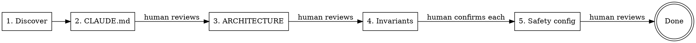

# KEEL Adopt

Guided brownfield adoption of the KEEL framework for an existing codebase.
Automates discovery and drafting. Human confirms at every gate.

Full guide: `docs/process/BROWNFIELD.md`

## When to Use

- Existing project, no KEEL structure yet
- Want to start using KEEL's pipeline for new features
- NOT for greenfield — use `/keel-setup` instead

## Phases



---

## Phase 1: Discovery (automated)

Scan the codebase to understand what exists. Read broadly, summarize concisely.

**Do:**
1. Glob for source files by type — identify the primary language and framework
2. Read package/dependency files (`package.json`, `mix.exs`, `Cargo.toml`, `requirements.txt`, `go.mod`, etc.)
3. Read entry points, main modules, and config files
4. Identify the test framework and test file locations
5. Identify build/run/test commands (from Makefile, scripts, CI config, README)
6. Read existing README, CONTRIBUTING.md, or similar docs
7. Map the directory structure (top 2 levels)

**Output:** A discovery summary with:
- Stack (language, framework, runtime)
- Directory structure
- Entry points and key modules
- Test framework and commands
- Build/run commands
- Existing documentation found

**Do NOT:** Write any files yet. This phase is read-only.

Announce: "Discovery complete. Here's what I found: [summary]. Moving to Phase 2."

---

## Phase 2: Draft CLAUDE.md (automated → human reviews)

Generate a draft CLAUDE.md from discovery findings.

**Template to follow:**
```markdown
# [Project Name]

[One paragraph: what this project does, derived from code/README]

## Quick Facts

- **Stack:** [from discovery]
- **Runtime:** [Docker / local / etc.]
- **Tests:** [framework], run with `[command]`

## Safety Rules

<!-- HUMAN: Review these — are they your actual non-negotiable rules? -->
1. [Proposed from Phase 4, or placeholder]

## Architecture

See [ARCHITECTURE.md](ARCHITECTURE.md)

## Development

[Build, run, test commands from discovery — 4-6 lines]
```

**Write** the draft to `CLAUDE.md`.

**STOP.** Tell the human:
> "I've drafted CLAUDE.md from what I found in the codebase. Please review
> and edit it — especially the project description and any sections marked
> with HUMAN comments. When you're satisfied, tell me to continue."

**Wait for confirmation before proceeding.**

---

## Phase 3: Draft ARCHITECTURE.md (automated → human reviews)

Generate a draft ARCHITECTURE.md from the codebase structure.

**What you CAN derive from code (include these):**
- Module/file map with import relationships
- Directory structure as layer diagram
- Data flow for a typical request (trace from entry point)
- Dependencies between components

**What you CANNOT derive from code (mark these):**
- Why architectural decisions were made
- Historical context for structural choices
- Intentional patterns vs accidental ones
- Which modules are considered stable vs experimental

**For every section you can't derive, insert:**
```markdown
<!-- HUMAN: [specific question about what you need to know] -->
```

Examples:
```markdown
<!-- HUMAN: Why is auth handled in middleware rather than per-route? Intentional or legacy? -->
<!-- HUMAN: Is the services/ vs lib/ split meaningful, or did it just grow that way? -->
```

**Write** the draft to `ARCHITECTURE.md`.

**STOP.** Tell the human:
> "I've drafted ARCHITECTURE.md with the structural parts I could derive
> from code. Sections marked <!-- HUMAN --> need your input — these are
> the 'why' questions only you can answer. Edit those, then tell me to continue."

**Wait for confirmation before proceeding.**

---

## Phase 4: Propose Domain Invariants (interactive — per-item confirmation)

This is the most important phase. Wrong invariants propagate through the
safety-auditor into every future feature.

**Scan the codebase for candidate invariants.** Look for:
- Validation patterns (input checking, type assertions, auth guards)
- Error handling conventions (what's caught, what's propagated)
- Security patterns (auth, sanitization, encryption)
- Data integrity patterns (transactions, constraints, idempotency)
- Forbidden patterns (raw SQL, force flags, unsafe operations)

**Present each candidate individually. Do NOT present a bulk document.**

Format for each:
```
CANDIDATE INVARIANT #N:
  Rule: [the invariant in plain language]
  Evidence: [where in code you see this pattern]
  Grep pattern: [how safety-auditor would detect violations]
  Confidence: [high/medium/low — based on how consistently the pattern appears]

  Accept this invariant? [y/n/edit]
```

Wait for the human to respond to EACH candidate before presenting the next.

**Collect confirmed invariants** into a list for Phase 5.

If the human adds invariants you didn't find, include those too.

After all candidates are reviewed, announce:
> "We have N confirmed invariants. Moving to Phase 5 to wire them into
> the safety-auditor and hooks."

---

## Phase 5: Scaffold Safety Config (automated → human reviews)

Wire confirmed invariants into the KEEL safety enforcement layer.

**5a. Write `docs/design-docs/core-beliefs.md`**

Use the template from `template/docs/design-docs/core-beliefs.md`. Fill in:
- Domain safety section with confirmed invariants
- Testing strategy adapted to the project's existing test framework
- Design philosophy from what you observed in the codebase

**5b. Configure `.claude/agents/safety-auditor.md`**

In the agent definition, replace the `<!-- CUSTOMIZE -->` sections with:
- The confirmed invariant rules
- The grep patterns from Phase 4
- The critical file paths for this project

**5c. Configure `.claude/hooks/safety-gate.py`**

Set the `CRITICAL_PATTERNS` variable to match the project's critical files:
```bash
CRITICAL_PATTERNS="*/auth/*|*/middleware/*|*/transactions/*"
```

**5d. Configure pipeline preferences**

Fill the `## Pipeline Preferences` section in CLAUDE.md:
- Roundtable review: `true` (default — gracefully skipped if MCP unavailable)

**Write** all files.

**STOP.** Tell the human:
> "Safety enforcement and pipeline preferences are configured. Review
> core-beliefs.md, the safety-auditor agent definition, safety-gate.py,
> and the pipeline preferences in CLAUDE.md. These control what the
> auditor enforces and whether roundtable review runs. When satisfied,
> we're done with adoption."

---

## After Adoption

Print the brownfield checklist from `docs/process/BROWNFIELD.md`:

```
[x] Agent has read the full codebase
[x] CLAUDE.md written
[x] ARCHITECTURE.md written
[x] Domain invariants defined in core-beliefs.md
[x] Safety-auditor configured
[x] Safety-gate hook configured
[ ] Feature backlog created — YOUR TURN
[ ] First feature spec written — YOUR TURN
[ ] First feature run through pipeline — use /keel-pipeline
```

Tell the human:
> "KEEL adoption is complete. Next: create your feature backlog
> (docs/exec-plans/active/feature-backlog.md) and write a spec for
> your first new feature. Then run `/keel-pipeline` to execute it."

## Rules

- **Every phase has a human checkpoint.** Never proceed without confirmation.
- **Phase 4 is per-item, not bulk.** Present one invariant at a time.
- **Draft, don't prescribe.** CLAUDE.md and ARCHITECTURE.md are drafts for human refinement.
- **Mark what you don't know.** Use `<!-- HUMAN: ... -->` markers (with colon, specific question), never guess at intent.
- **Don't touch existing code.** This skill writes KEEL docs, not project code.
- **Don't automate backlog/specs.** Steps 6-8 from BROWNFIELD.md are human judgment.
