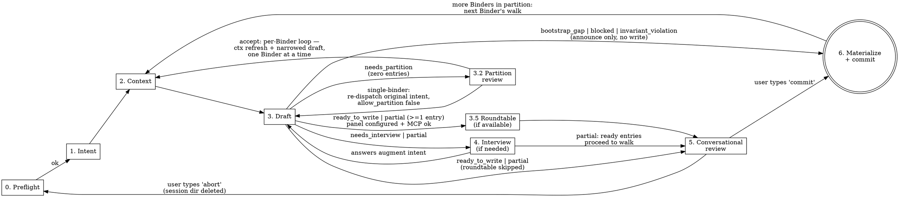

## Framework principles

This skill's invariants: P4 (no redundant storage — drafted entries
uniquely author the WI##'s contract, Binder (a bounded body of related work that decomposes into Work Items) files author the cohesion
narrative), P7 (halt-with-CTA — every exit path produces an
actionable message). See
[`docs/process/KEEL-PRINCIPLES.md`](../../../docs/process/KEEL-PRINCIPLES.md).

# KEEL Refine

Binder + backlog refinement for an existing KEEL project. Given a prose description, a markdown Binder, a bundle directory with design assets, or images pasted in chat, drafts a **structured JSON Binder** at `docs/exec-plans/binders/<slug>.json` (schema v1, validated against `schemas/binder.schema.json`) plus the matching WI## entries in `docs/exec-plans/active/backlog.md`. Reviews both in conversation before committing.

This skill is the single conversion hub between non-JSON feature input (prose, markdown, bundles, images) and the one shape the pipeline reads (JSON Binder). Markdown Binders are raw material here, never pipeline input. See `docs/process/PIPELINE-DOCTRINE.md` §"Feature input canon — single path, JSON Binders only".

## When to Use

- You have a Binder (or rough feature description) and want backlog entries drafted.
- You have hi-fi comps, wireframes, or UX flows — paste them in chat or point at a bundle directory.
- The project is already bootstrapped — all bootstrap features (tagged `Binder-exempt: bootstrap`) are ticked, `ARCHITECTURE.md` describes real layers.
- You are starting a new feature and don't want to write `WI##` entries by hand.

**Not for:**
- Initial project setup → use `/keel-setup` (greenfield) or `/keel-adopt` (brownfield).
- Running a feature → use `/keel-pipeline WI## docs/exec-plans/binders/<slug>.json` after the human has reviewed and committed the drafted JSON Binder plus backlog entries.
- Hand-editing JSON → the Binder is KEEL-authored. Humans steer via the card walk in Phase 5; they do not edit `<slug>.json` in an external editor. Re-run `/keel-refine` on an existing Binder to revise it through the same gates.

## Design Principle

**Draft first, review conversationally, commit on verb.** Same draft-first ethos as `keel-setup` and `keel-adopt`, with one upgrade: the review surface for the drafting phase is the chat conversation, not the user's editor. The human edits entries in plain English, types `commit` when ready, and the skill commits with a deterministic message — no confirmation prompt. Feature-branch commits are trivially reversible (`git commit --amend`, `git reset`); announcing is safer than prompting.

**Repo is truth, enforced strictly.** Pasted images are staged to `.keel-refine-session/<id>/` (gitignored, outside `docs/`). They move into `docs/exec-plans/binders/<slug>/assets/` only at commit time. Abort → session dir deleted → zero pollution of tracked territory.

## Phases



Branch targets on failure before review:
- `needs_partition` → walk the partition card (Phase 3.2); on accept, per-Binder loop. Not a failure.
- `bootstrap_gap` → announce gap, route to `/keel-adopt`, exit. No write.
- `invariant_violation` → announce, exit. No write.
- `blocked` (other) → announce the drafter's reason verbatim plus a copy-pasteable CTA — size_cap-sourced: `Narrow the ask and re-run: /keel-refine "<one slice of the ask>"`; any other reason: `Address the cause above, then re-run: /keel-refine "<original ask>"` — then exit. No write.

---

## Phase 0: Preflight (automated, silent)

Before touching anything, verify the repo is in a state where drafting makes sense.

**Do:**
1. Verify the project guide, `ARCHITECTURE.md`, and `docs/exec-plans/active/backlog.md` all exist.
2. Parse the backlog and check the bootstrap gate. Accept **either**:
   - (a) **greenfield-complete** — there is at least one bootstrap feature and every bootstrap feature is ticked `[x]`. A feature is a bootstrap feature if its entry carries `Binder-exempt: bootstrap` **or** sits under the `## Bootstrap` heading (the tag is the robust signal; the heading is a backward-compat fallback for legacy untagged backlogs). The set is **variable** — a single-package stack has two, a full-stack backend+frontend has three. Do **not** hard-code a fixed WI range. **or**
   - (b) the exact string `<!-- KEEL-BOOTSTRAP: not-applicable -->` is present anywhere in the file.

   Reject otherwise. Do **not** accept "Bootstrap section absent / no bootstrap features at all" as valid state — that is indistinguishable from accidental deletion; route to `/keel-setup`. The marker match is exact (case-sensitive, whitespace-sensitive); any variant fails.
3. For path (a) only: skip the spec-file existence check for every `Binder-exempt: bootstrap` (and `## Bootstrap`-section) entry — bootstrap features run orchestrator-direct against framework specs (`core-beliefs:…`, `ARCHITECTURE.md:…`), not product spec files. For any non-bootstrap entry, verify only `Spec:` values that are file paths. Path (b) skips this check — brownfield bootstrap never existed.
4. Verify `.gitignore` contains a `.keel-refine-session/` line. If missing, append it (single `Edit` call). Announce the addition; Phase 6 Step 4 stages `.gitignore` in this session's first commit so the skill never exits leaving the edit uncommitted.
5. Generate a session id: `<ISO-timestamp>-<6-char-random>` (e.g., `20260420-0347-x7k2bp`). Create `.keel-refine-session/<id>/` as the ephemeral workspace for this invocation.

**If check 1 fails (missing files):**
- Print: `"KEEL Refine requires a bootstrapped project. Missing: <what>. Run /keel-setup (greenfield) or /keel-adopt (existing repo) first."`
- Exit. Do not prompt, do not create the session dir, do not proceed.

**If check 2 fails (bootstrap gate not satisfied):**

Print this three-option message verbatim and exit without changes:

```text
KEEL Refine requires a bootstrapped project. Bootstrap gate not satisfied.

Pick one:

  [A] Greenfield, bootstrap not yet run: build your project skeleton by
      running each bootstrap feature in backlog.md in order, one
      invocation per landing:

          /keel-pipeline WI01
          /keel-pipeline WI02      (and so on — one per bootstrap feature)

      Each scaffolds part of the project and ticks its own box when it
      lands; you never tick boxes by hand. Re-run /keel-refine once every
      bootstrap box is [x]. If the Bootstrap section still shows the
      shipped template (not yet adapted to your stack), run
      /keel-setup first to initialize it.

  [B] Brownfield (primary path) — or a greenfield project you scaffolded
      by hand: your project already has runtime, scaffold, and test infra.
      Paste this exact line between the preamble and the first --- divider
      in backlog.md:

          <!-- KEEL-BOOTSTRAP: not-applicable -->

      That's the only change needed. Shipped WI01–WI06 placeholders
      are ignored by the parser when the marker is present.

  [C] Brownfield, first-time adoption: run /keel-adopt (it will
      stamp the marker + clear template scaffolding in Phase 6e).
      WARNING: if /keel-adopt has already run, do NOT re-run —
      it will overwrite the project guide and ARCHITECTURE.md. Use [B].

Exiting without changes.
```

**If check 3 fails (missing spec files on greenfield path):** use the existing "Missing: <what>" message from check 1.

**Do NOT:** Write source code. Write is restricted to `.gitignore` (one line append if missing) and `.keel-refine-session/**` (session workspace).

---

## Phase 1: Intent Ingestion

Parse the user's invocation into a normalized `intent_blob`.

**Four invocation shapes:**

| Invocation | `intent.source` | `intent.content` | `intent.path` | Design assets source |
|-|-|-|-|-|
| `/keel-refine docs/binders/auth.md` | `binder_path` | full text of the file | absolute path | markdown `` refs in the file's dir |
| `/keel-refine docs/binders/auth-redesign/` | `binder_path` | full text of `<dir>/README.md` if present, else `""` | absolute dir path | sibling image/pdf files + markdown refs + working prototype HTML/CSS/JS if detected |
| `/keel-refine "let users edit profile inline"` | `prose` | quoted string | `null` | pasted images in this chat turn, if any |
| `/keel-refine` | `interview` | `""` (filled via interview) | `null` | pasted images in any turn, if any |

**Source label.** Display surfaces (the Phase 3.2 partition-card header
and the Phase 5 orientation summary) and the Phase 6 commit message
render the source as: `binder_path` → the file or directory basename;
`prose` → the quoted intent content hard-truncated to its first 40
characters (`…` appended inside the quotes when truncated);
`interview` → the literal `via interview`.

**Do:**
1. Parse the positional argument:
   - File path ending `.md` → `binder_path`, file mode.
   - Directory path → `binder_path`, bundle mode (see step 3).
   - Non-path string → `prose`.
   - Absent → `interview`.
2. For `binder_path` file mode: verify file exists and is markdown. If not, print fix suggestion and exit.
3. For `binder_path` bundle mode: verify the directory exists, then classify its shape.

   **Enumeration.** Walk the directory with depth cap **2** and the ignore-list `{node_modules, dist, build, .next, .vite, .git, coverage, out}`. Hard caps: **50 files total**, **100 MB total**. Over either cap → halt with CTA naming what to prune (e.g. *"Bundle exceeds 50-file cap. Prune build artifacts (`dist/`, `out/`) or split the bundle. Found: <count> files, <size> MB."*). The 50/100 numbers are heuristics (no measurement), chosen to comfortably fit a hand-authored prototype while flagging unpruned build artifacts. Tune in your install if real prototypes trip them — the ignore-list is the better lever for `node_modules`-style bloat than the file-count cap.

   **Shape classification** (set `intent.prototype` accordingly):
   - **Single-file prototype** — directory contains exactly one HTML file at root and no `README.md`. `intent.prototype = {kind: "single-file", entry: "<basename>"}`.
   - **Multi-file prototype** — directory contains an `index.html` (or `index.htm`) at root. `intent.prototype = {kind: "directory", entry: "index.html"}` (or `"index.htm"`). Subdirectory HTML files are enumerated as additional design assets.
   - **Ambiguous multi-file** — directory contains ≥2 HTML files at root, none named `index.html`/`index.htm`, and no `prototype.json` declaring an entry. Halt with CTA: *"Bundle contains <N> HTML files but no clear entry. Add a `prototype.json` with `{\"entry\": \"<file>\"}` or rename the entry to `index.html`. Candidates: <comma-joined names>."*
   - **Image/PDF bundle (today's behavior)** — no HTML files at all. `README.md` is required as before; halt with CTA *"Bundle directory has no HTML prototype and no README.md prose. Add a README.md describing the intent, or include a prototype HTML."* if absent.
   - **Mixed** — `README.md` AND HTML present. Both are consumed: the README is the prose intent; the HTML is the prototype. `intent.prototype` populated per the rules above.

   **Manifest read.** If a `prototype.json` exists at the bundle root, parse it (validated against `schemas/prototype.schema.json`). Its fields override autodetection — for example, a manifest declaring `{"entry": "dashboard.html"}` resolves an otherwise-ambiguous multi-file shape. Do NOT halt the ambiguity case if the manifest is present.

   **Asset enumeration.** All enumerated files (HTML, CSS, JS, images, fonts, manifest) populate `intent.ui_design_assets[]` with the existing `{path, kind, bytes, label}` shape. The prototype manifest itself is included (`kind: "json"`).
4. For `prose`: accept any non-empty string.
5. For `interview`: ask the minimum viable set:
   - "What feature are you refining? Give me a one-line summary."
   - "What's the user-facing goal?"
   - "Any related specs, prior features, or constraints I should know about?"
   Accumulate answers into `intent.content`.
6. Detect pasted images in the current conversation turn. For each attached image, write it to `.keel-refine-session/<id>/pasted-<n>.<ext>` using the inferred extension from mime type.

**Format and size caps (applied to every candidate design asset):**

| Format | Accepted | Notes |
|-|-|-|
| PNG | yes | standard raster |
| JPG / JPEG | yes | standard raster |
| GIF | yes | treat as static frame 0 |
| SVG | yes | vector |
| PDF | yes | max 20 pages at paste time. Heuristic anchored to the host's `Read` tool: the tool requires the `pages` parameter for any PDF >10 pages and accepts at most 20 pages per request. The 20-page paste cap matches a single non-paginated downstream `Read` so shallow consumers can fetch the whole doc in one call without reasoning about pagination. Larger PDFs are not a tool-level limit — agents that paginate (`pages: "1-20"`, `"21-40"`, …) can consume them — the paste gate is conservative on purpose. Raise this cap in your install if your downstream agents reliably paginate. |
| HTML / HTM | yes | clickable comp, prototype, or hand-coded mockup. `Read` returns text (markup), not a vision render — downstream agents extract structure/layout/state cues from the source |
| CSS | yes | accompanies HTML prototypes; shallow-read for layout/token cues |
| JS / MJS | yes | accompanies HTML prototypes; shallow-read for state and interaction cues |
| WOFF / WOFF2 / TTF / OTF | yes | accompanies HTML prototypes; preserved at storage time, not parsed |
| JSON | yes | reserved for `prototype.json` manifests at the bundle root |
| anything else | no | reject with: `"File <name> format <.ext> is not supported. Accepted: PNG, JPG, GIF, SVG, PDF, HTML, CSS, JS, fonts, JSON (manifest). Export to one of these and re-paste."` |

Per-file size cap: **20 MB.** Over cap → reject: `"File <name> is <X>MB (cap 20). Compress, split into frames, or reduce resolution."` No partial-session state; the file is never written to disk. The JS/CSS/font/JSON expansions exist solely to support working-prototype bundles — they are never accepted as standalone pasted attachments outside the bundle-directory mode.

**Provenance of the per-file caps:** the 20 MB number is a heuristic, not a measured floor. Anthropic API limits are denominated in tokens, not raw MB; the `Read` tool documents no explicit byte cap. Tune in your install if your real comps trip it.

**Output:** Normalized `intent_blob` in memory with:
- `intent.ui_design_assets: [{path, kind, bytes, label}]` populated from the three possible sources (bundle siblings, markdown refs, pasted attachments).
- `intent.prototype: {kind, entry, manifest_path?, mode?, stack_match?, screens?, notes?}` populated when bundle mode detected a prototype shape (single-file or directory). Absent for prose, interview, file-mode markdown Binders, and image/PDF-only bundles. The `mode | stack_match | screens | notes` fields are populated only when an on-disk `prototype.json` is present; otherwise they are filled by the Phase 5 prototype-disposition card.

Not yet surfaced to the user.

---

## Phase 2: Repo Context Gathering

Build the `repo_context` that `backlog-drafter` needs.

**Do:**
1. Parse `ARCHITECTURE.md` → extract `architecture_layers`. Canonical sources:
   - Section headings under `## Layers` or `## Module Map`
   - If none, fall back to the section headings in `backlog.md` (excluding `Bootstrap`)
2. Parse `backlog.md` → extract `existing_features` as a list of `{id, title, layer, status, needs, source_tag, binder}`.
   - `status: shipped` if entry has `[x]`, else `planned`.
   - `source_tag`: read any `<!-- SOURCE: ... -->` comment on the entry.
   - `binder`: the slug from the entry's `Binder: <slug>` line; `null` when the entry carries `Binder-exempt: <reason>` instead, or lacks both lines entirely (pre-cutoff legacy entries). Derived per dispatch, never stored (P4) — the drafter uses it for cross-Binder needs mapping and the sibling collision exemption.
   - `layer`: case-fold the section heading the entry sits under (Unicode NFKC + lowercase) into the schema enum `{service, ui, cross-cutting, foundation}`. Step 8 below pre-flights that every architecture layer folds; in extraction here, apply the same fold so `existing_features[].layer` is uniform with the JSON Binder shape.
   - **Exclude bootstrap features from `existing_features`** — any entry carrying `Binder-exempt: bootstrap` or sitting under the `## Bootstrap` heading is infrastructure, not a product layer (`Bootstrap` does not fold into the layer enum, and bootstrap features are never product dependency context). Their WI## IDs remain **reserved** for `next_free_id` (step 4) so product features never collide with them.
3. **Brownfield-marker filter.** If the backlog contains the exact string `<!-- KEEL-BOOTSTRAP: not-applicable -->`, exclude from `existing_features` (and therefore from `next_free_id` allocation):
   - the entire `## Bootstrap` section (all entries within it, regardless of content)
   - any exact-match shipped placeholder entries whose title matches one of:
     - `**WI03 [YOUR FOUNDATION FEATURE]**`
     - `**WI04 [YOUR SERVICE FEATURE]**`
     - `**WI05 [YOUR UI FEATURE]**`
     - `**WI06 [YOUR CROSS-CUTTING FEATURE]**`

   Match must be exact on title (case and whitespace sensitive). A customized WI03 (real title) is kept in `existing_features`; only bit-exact shipped placeholders are filtered. Result: an untouched brownfield template plus the marker yields `next_free_id = WI01`.
4. Compute `next_free_id`: lowest WI## integer not in the **reserved id set**, where the reserved id set = every WI## id present in `backlog.md` (including bootstrap ids — those are excluded from `existing_features` in step 2 but still reserved here) ∪ the `work_items[].id` set of the target JSON Binder (re-run mode, when the Binder file already exists at `docs/exec-plans/binders/<slug>.json`). When the brownfield marker is present, the bootstrap section + bit-exact shipped placeholders are removed from the reserved set (step 3) so an untouched brownfield template yields `next_free_id = WI01`. Both sources are reserved so the drafter can never synthesize an ID that collides with a WI## already in the backlog or authored in this Binder. **Freeze this value for the entire Binder-walk** — even across interview loops and review turns. In a single-Binder session the walk IS the session, so nothing changes. In a multi-Binder session (Phase 3.2 partition accepted), the value is recomputed from the just-committed backlog at the start of each Binder's walk and frozen until that Binder commits — a session-frozen value would stale against sibling commits; the freeze's idempotency rationale is per-walk drafting/interview loops, which this preserves.
5. Parse the project guide → extract `invariants` as a list of objects `{id, name, text}`. For each list item under `## Safety Rules` (ignore markdown emphasis such as `**`):
   - `id` — first match of `INV-[0-9]{3,}` in the rule line, or `null` if the rule carries no ID.
   - `name` — the short label after the `INV-###` ID and its `—`/`:` separator, up to the next `.`, `:`, or `—` (for an un-ID'd rule, the label before the first `:` or `—`); `null` if there is no distinct label.
   - `text` — the full rule text verbatim.

   Registered rules follow the form keel-setup Phase 5 / keel-adopt Phase 6 write — `**INV-001 — <name>.** <rule text>` — yielding `id` = `INV-001`, `name` = `<name>`.

   The drafter cites IDs from this list when populating `invariants_exercised`; rules with `id: null` are visible to the drafter for invariant-violation detection but cannot be cited as exercised (the schema requires `^INV-[0-9]{3,}$`).

   **Zero-registered-invariants advisory (non-fatal).** If the parsed `invariants` list is non-empty but *every* entry has `id: null` — rules exist in §Safety Rules, none carry an `INV-###` — emit one advisory line before drafter dispatch, then proceed:

   > the project guide §Safety Rules lists N rule(s) but none carry an `INV-###` ID, so `invariants_exercised` will be empty for every Binder drafted here. If these are real domain invariants, register IDs (keel-setup Phase 5 / keel-adopt Phase 6) before drafting. Proceeding drafts with no invariant traceability.

   Advisory, not a halt — a project may legitimately have no domain invariants. The check distinguishes "has rules, none registered" (worth one line) from "no invariants" (silent, valid); downstream both produce an empty `invariants_exercised`.
6. Derive `spec_dir`: default `docs/product-specs/` unless the project guide explicitly points elsewhere. Passed to the drafter for legacy compatibility only — under the JSON-only doctrine the JSON Binder's `contract` + `oracle` IS the spec, and the drafter no longer emits `spec_ref`.
7. Enumerate existing Binder slugs by listing `docs/exec-plans/binders/*.json` (filenames minus `.json` extension). Pass to `backlog-drafter` as `binder.existing_slugs` for collision avoidance when synthesizing a new slug.
8. **Schema enum preflight.** Case-fold each entry in `architecture_layers` (Unicode NFKC + lowercase) and verify it matches the Binder schema's `layer` enum: `{service, ui, cross-cutting, foundation}`. If any layer doesn't fold to an enum value (e.g. the repo declares `Backend`, `Database`, `Frontend/UX`), halt with CTA before the drafter dispatches:
   > *"ARCHITECTURE.md layer `<value>` does not case-fold to the schema's `layer` enum `{service, ui, cross-cutting, foundation}`. JSON Binders cannot encode this layer. Rename the layer in ARCHITECTURE.md to one of the four schema values (the four are the framework's universal partitioning), or extend `schemas/binder.schema.json` in a framework-level change before drafting."*

   The preflight prevents the card walk from hard-halting mid-session on a fundamentally unrecoverable state. After preflight succeeds, replace `architecture_layers` with the case-folded enum form before passing to the drafter — the drafter receives schema-enum values directly and emits them verbatim into `drafted_entries[].layer`.
9. Snapshot `backlog.md` contents (full text + SHA-256 of contents) to `.keel-refine-session/<id>/backlog-snapshot.md` and `.keel-refine-session/<id>/backlog-snapshot.sha`. Used for staleness detection at commit time. In re-run mode over an existing JSON Binder, additionally snapshot `docs/exec-plans/binders/<slug>.json` (full text + SHA-256) for the same staleness window. In a multi-Binder session, each Binder-walk's Phase 2 refresh writes its snapshots under `.keel-refine-session/<id>/<slug>/` instead (taken immediately after the prior Binder's commit, so the baseline is the post-commit state); Phase 6 Step 1 compares against the current walk's snapshot.

**Do NOT:**
- Invent layers not declared in `ARCHITECTURE.md` or present in the backlog.
- Change `next_free_id` mid-walk — idempotency depends on it being frozen for the duration of one Binder's draft/interview/review loop. (Multi-Binder sessions recompute it at each walk's start; see step 4.)
- Write outside `.keel-refine-session/<id>/`.

---

## Phase 3: Agent Dispatch

Invoke the `backlog-drafter` agent with the YAML blob.

**Do:**

Dispatch a subagent named `backlog-drafter`. Pass exactly this prompt shape:

```
[KEEL-ROLE backlog-drafter] Operate as the `backlog-drafter` role. Acquire your role contract by the FIRST route that applies: (1) RESIDENT — your system prompt already identifies you as the `backlog-drafter` agent and contains its contract: proceed, do not re-read; (2) INJECTED — your context contains a line starting with `[KEEL-ROLE-INJECTED backlog-drafter complete=true`: that injected text IS your contract, do not re-read; (3) POINTER — neither applies: execute a BLOCKING READ of `.keel/agents/backlog-drafter.md` in full and follow it; if it cannot be read in full, STOP and report. Never improvise the role.

Here is your input blob:

intent:
  source: <binder_path | prose | interview>
  content: |
    <intent.content verbatim>
  path: <path or null>
  source_identity: <string>                               # ONLY on per-Binder dispatches (Phase 3.2):
                                                          # run-level source identity from the original
                                                          # un-narrowed intent; drafter emits it verbatim
                                                          # as every entry's source_tag
  ui_design_assets:
    - path: <absolute or repo-relative path>
      kind: <png | jpg | gif | svg | pdf | html | css | js | font | json>
      bytes: <int>
      label: <alt text from markdown ref, or null>
    # ... zero or more
  prototype:                                              # null when no prototype detected
    kind: <single-file | directory>
    entry: <relative path within bundle, e.g. index.html>
    manifest_path: <relative path or null>                # set iff on-disk prototype.json was present
    mode: <reference | seed | null>                       # null until Phase 5 Step 2a-bis fills it
    stack_match: <bool | null>
    screens:                                              # autodetected + manifest-declared (deduped)
      - {label: <str>, path: <str or null>, states: [<str>]}
    notes: <str or null>

repo_context:
  architecture_layers: [<schema-enum form, post Phase 2 Step 8 case-fold>]
  existing_features:
    - {id, title, layer, status, needs, source_tag, binder}   # layer is lowercase schema enum;
    ...                                                       # binder = slug from the Binder: line, or null
  next_free_id: WI##
  invariants:                                          # objects, not strings
    - {id: INV-### or null, name: <label or null>, text: <full rule>}
    ...
  spec_dir: <path>                                     # legacy; drafter no longer emits spec_ref

binder:
  slug: null  # synthesize from intent, avoid collisions with existing_slugs (new-Binder mode)
             # OR: <slug>  # when operating on a known slug
  existing_slugs: [<list from Phase 2>]
  existing_reference: <bool>  # true iff docs/exec-plans/binders/<slug>.json exists on disk
                              # — drafter omits Binder-frame fields in re-run mode
                              # — computed for THIS dispatch's own slug only, never for siblings
  partition_sibling_slugs: [<list>]  # ONLY on per-Binder dispatches inside an accepted partition
                                     # (Phase 3.2): the other accepted slugs. Omit otherwise.

constraints:
  append_only: true
  never_edit_existing: true
  layer_must_exist_in_architecture: true
  max_entries_per_run: 15
  ui_design_assets_shallow_read_only: true
  prototype_read_role: drafter_only                       # frontend-designer reads later via the Design: marker; implementer never reads
  allow_partition: <bool>                                 # true ONLY on an initial new-Binder dispatch
                                                          # (binder.existing_reference: false). False on
                                                          # re-run over an existing Binder AND on every
                                                          # per-Binder dispatch (Phase 3.2)

Return your structured YAML output per the backlog-drafter agent master §Output Format. Drafter emits schema-shaped fields (lowercase `layer`, `contract` open-object, `oracle.{type, assertions, ...}`, plus Binder-frame fields when existing_reference is false). No prose.
```

`existing_reference` is computed by the skill: it checks
`docs/exec-plans/binders/<slug>.json` for a pre-existing file. In
new-Binder mode (file does not exist), the drafter emits the full Binder
frame (`title`, `motivation`, `scope`, `design_facts`,
`invariants_exercised`) and the skill seeds Card 0 from those
verbatim. In re-run mode (file exists), the drafter omits the
frame; the skill loads it from the on-disk JSON for Card 0
seeding. Card 0 is walked in every mode so Binder-frame drift can
surface — see Phase 5 Step 2a.

**Parse the agent's return.** Expect the YAML schema in the backlog-drafter agent master §Output Format. Validate:
- `status` is one of the seven allowed values.
- If `status: needs_partition`: `binder.slug` is null and Binder-frame fields are absent; `drafted_entries` is empty; `partition.reason ∈ {distinct_themes, size_cap}`; `partition.binders` has ≥ 2 items; every proposed `slug` matches the schema slug pattern, is unique within the proposal, and collides with `binder.existing_slugs` only under the same-source resume exception (at least one backlog entry carries both `Binder: <slug>` and this run's `source_tag` — such a Binder walks in re-run mode); every `depends_on` value is a proposal slug (no self-reference); the `depends_on` graph is acyclic. Violations are a hard parse failure (same handling as any malformed return).
- **Recursion backstop:** `status: needs_partition` on a dispatch that carried `allow_partition: false` is treated as `status: blocked` with the synthetic reason `"Drafter could not draft Binder '<slug>' as a single cohesion unit. Run /keel-refine \"<theme text>\" as a standalone session."` Inside the per-Binder sequence, announce through the multi-Binder fault path (Phase 3.2 §Mid-sequence faults); on a `single-binder` collapse dispatch or a re-run-mode dispatch (nothing committed, no queue), announce as an ordinary pre-review `blocked` exit. Never re-walk a partition from a backstopped return.
- If `status: ready_to_write` or `partial`: every `self_validation` field must be true.
- `binder.slug` is non-null when `status ∈ {ready_to_write, partial}`.
- Every `drafted_entries[].needs` id exists in `existing_features` or in the drafted set.
- Every `drafted_entries[].layer` is in `{service, ui, cross-cutting, foundation}`.
- Every `drafted_entries[].contract` is a non-empty object (≥ 1 key — placeholder counts).
- Every `drafted_entries[].oracle.type` is in `{unit, integration, e2e, smoke}` and `oracle.assertions` is a non-empty array of strings.
- Every path in any `drafted_entries[].ui_design_assets` appears in `intent.ui_design_assets[].path`.
- Only UI-layer entries carry `ui_design_assets`; others have empty or absent lists.
- Every `drafted_entries[].dependencies` is a present array (`[]` allowed; an omitted key is a parse failure); each element carries a non-empty string `id` and `kind ∈ {feature, library, protocol, prototype}`. `kind: feature` elements: `id` matches `^WI\d{2,}$`, resolves in `existing_features` or the drafted set (same rule as `needs`), and `novel` is absent. Non-feature kinds: `novel` is a boolean.
- Every `drafted_entries[].frozen_seams` is a present array (`[]` allowed; an omitted key is a parse failure); each element carries `referenced_in` matching `^WI\d{2,}$` and resolving in `existing_features` or the drafted set, plus a non-empty string `name`. Parse time validates shape and ID resolution only — seam grounding against upstream constraints remains the drafter's self-validation duty (`every_frozen_seam_grounded`) and is re-checked downstream at pre-check.
- When `binder.existing_reference: false` AND `status ∈ {ready_to_write, partial}`: the Binder-frame fields (`binder.title`, `binder.motivation`, `binder.scope.included`, etc.) are present and shape-valid (frame fields free of `\bWI\d{2,}\b`; `motivation` ≤ 800 chars; `invariants_exercised[].invariant_id` matches `^INV-[0-9]{3,}$` and resolves in `repo_context.invariants[].id`).
- When `binder.existing_reference: true`: Binder-frame fields are absent (the skill reads them from disk).

**If the agent's output fails validation:** treat as a hard failure. Print the parsing error, clean up the session dir, exit. Do not attempt to fix the agent's output yourself.

---

## Phase 3.2: Partition review (only if `status: needs_partition`)

The drafter found ≥ 2 distinct cohesion themes (or principled sub-themes
of a too-large theme) and proposed a partition instead of drafting. The
partition is **session-ephemeral**: it exists as this card and as
dispatch payloads, is never written to a tracked file, and the on-disk
outcome of an accepted partition is indistinguishable from N separate
`/keel-refine` runs (P3/P4/P5).

This card reviews STRUCTURE only — no WI## entries exist yet, so the
per-card review guarantee of Phase 5 is untouched. Accepting the
partition accepts the split, never any card
(`docs/process/PIPELINE-DOCTRINE.md` §Autonomy Ceiling: no "accept all").

### Card display

```
Partition proposal ({N} Binders from {source label — Phase 1}; reason: {distinct_themes | size_cap})

  [1] {slug}  {title}
      theme: {1-2 sentences}
      tentative entries: {k} ({comma-joined hint titles})
      depends on: {comma-joined slugs or "—"}
  ...

Walk order (computed): {topological order of depends_on; ties by card order}

Verbs:
  accept                       — lock the partition, begin Binder 1's walk
  merge <a> <b>                — combine two themes into one Binder
  split <slug>                 — re-propose <slug> as sub-themes (drafter assessment re-dispatch)
  rename <slug>: <new-slug>    — change a slug (collision-check runs; cascades through depends_on)
  edit theme <slug>: <text>    — replace a theme summary (1-2 sentences)
  add dep <a> -> <b>           — add a dependency edge (acyclicity re-checked)
  drop dep <a> -> <b>          — remove a dependency edge
  drop <slug>                  — remove a theme (rejected while dependents remain)
  single-binder                — collapse all themes into one ordinary single-Binder run
  abort                        — discard session (nothing committed yet at this card)
```

### Verb semantics (graph re-validated after every verb, not only at accept)

- `merge a b` — merged Binder's `depends_on` = union of both, minus
  references to `a`/`b` themselves (now internal). Slug/title/theme of
  the merged Binder seed from `a`; edit verbs refine. Every OTHER
  sibling's `depends_on` reference to `b` is rewritten to the merged
  slug and de-duplicated. Acyclicity re-validated on the result.
- `split <slug>` — re-dispatches the drafter in partition-assessment
  mode on that theme alone: `intent.content` = original intent + this
  theme + out-of-scope lines for every other proposal slug (same line
  formats as §On accept step 2);
  `repo_context` verbatim; `allow_partition: true` (a partition-mode
  return drafts nothing by definition). Returns, by status:
  - `needs_partition` — the sub-themes splice in, replacing `<slug>`;
    sibling `depends_on` edges that pointed at `<slug>` are rewired to
    ALL resulting children, and every child inherits `<slug>`'s own
    outgoing `depends_on` edges (conservative over-constraint — prune
    with `drop dep`).
  - `ready_to_write` / `partial` — the drafter found no principled
    sub-split (it would just draft the theme). Discard the return,
    leave the card unchanged, say so.
  - `needs_interview` or any fault (`blocked`, `bootstrap_gap`,
    `invariant_violation`, malformed) — reject the verb, print the
    questions or fault reason verbatim, keep the card active. Never
    enter the Phase 4 interview loop from the partition card; the
    human can `edit theme <slug>: <text>` and retry the split.
- `rename` — cascades through every sibling `depends_on` list.
- `drop <slug>` — rejected while any remaining sibling's `depends_on`
  reaches it: `"Partition <x> depends on <slug>. Drop <x> first, or
  drop dep <x> -> <slug>."`
- **No reorder verb.** Walk order is the topological sort of
  `depends_on` (ties broken by card order). Order is derived, not
  negotiated — steer it by editing dependencies.
- `single-binder` — REJECTED when `partition.reason: size_cap`:
  collapsing a cap-driven partition re-creates the > 15-entry intent,
  which can only return `blocked` — the verb would promise an override
  and deliver a dead end. The rejection says exactly that. For
  `distinct_themes` partitions the verb proceeds; when the summed
  tentative entry counts exceed 15, warn first: `"Collapse will likely
  exceed the 15-entry cap and return blocked. Proceed? [y/N]"`. On
  collapse: print `"Partition collapsed to a single Binder.
  Re-dispatching with the original intent..."`, discard the partition
  card state, re-dispatch once with the original (un-narrowed) intent
  and `allow_partition: false`, then route the returned status through
  the ordinary Phase 3 branch targets exactly as a single-Binder
  session would (`needs_interview` → Phase 4; `ready_to_write` →
  Phase 3.5/5; faults → announce, exit; a backstopped
  `needs_partition` → pre-review `blocked` exit).

- **Any other input at the partition card** is rejected with the card
  staying active: `"Unrecognized partition-card verb. Available: accept /
  merge / split / rename / edit theme / add dep / drop dep / drop /
  single-binder / abort. There is no reorder verb — walk order is derived
  from dependencies; steer it with add dep / drop dep."` Free-text input
  never mutates the card (P7: the rejection names the cause and the
  exact levers).

### Accept gate

`accept` is rejected with a specific reason while any of these hold:
- any slug fails the schema slug pattern, or collides with a sibling
  proposal slug, or collides with `existing_slugs` outside the
  same-source resume exception (Phase 3 parse rules — a resumed slug
  walks in re-run mode, which the rejection/acceptance message names);
- any `theme` is empty or exceeds two sentences;
- any `depends_on` reference dangles or the graph has a cycle;
- fewer than 2 Binders remain (use `single-binder` — that is the honest
  form of a one-Binder partition).

### On accept — the per-Binder sequence

Compute walk order (topological sort). Then for each Binder, in order:

1. **Phase 2 refresh (per walk).** Re-execute Phase 2 in full: re-parse
   `backlog.md` (existing_features now includes earlier siblings'
   committed entries, each carrying its `binder` slug), recompute
   `next_free_id`, refresh `existing_slugs`, and snapshot backlog
   (text + SHA-256) into `.keel-refine-session/<id>/<slug>/`.
2. **Dispatch (Phase 3, narrowed).** Ordinary single-Binder dispatch
   with: `binder.slug` = this Binder's slug; `existing_reference`
   probed for THIS slug only against `docs/exec-plans/binders/*.json`;
   `partition_sibling_slugs` = the other accepted slugs;
   `constraints.allow_partition: false`; `intent.content` = the
   original intent + this Binder's theme + one line per sibling:
   `Out of scope (sibling Binders in this partition): <slug>: <theme>`.
   `intent.source_identity` = the run's source identity, computed ONCE
   from the original un-narrowed intent (`binder_path` → the source
   path; prose/interview → `sha256(original intent.content)[:16]`) —
   the drafter emits it verbatim as every entry's `source_tag`, so all
   Binders in the partition share one tag despite the narrowed content.
   `tentative_entry_titles` are passed labeled as hints. The full
   `intent.ui_design_assets[]` passes unchanged (the drafter's
   sibling-asset rule governs mapping and unused-flagging).
3. **Phases 3.5, 4, 5, 6 run per Binder exactly as specified in their
   own sections** — roundtable review per Binder; interview budget per
   walk; Card 0 + WI## walk + Step 3 gate; materialize + commit. The
   commit message carries the slug disambiguator (Phase 6 Step 4).
   Phase 6 Step 6 cleanup is SKIPPED on every Binder except the last.
4. **Boundary banner.** After Binder k's commit:
   `Binder {k}/{N} '{slug}' committed — starting '{next-slug}'.`
   After the final Binder: the standard Step 5 announce, plus a session
   summary listing every committed Binder.

### Unused-asset accounting

In multi-Binder sessions, ignore the
drafter's per-dispatch `unused_ui_design_assets` (it is blind to
sibling usage by design). Per-Binder orientation summaries print
`Unused UI design assets: deferred to session summary`. After the
final Binder's commit, compute the definitive list once:
`intent.ui_design_assets[].path` MINUS the union of every walked
Binder's drafted `ui_design_assets` references — and print it with the
session summary.

### Mid-sequence faults

A per-Binder dispatch may return `bootstrap_gap`,
`invariant_violation`, or `blocked` (including the Phase 3 recursion
backstop) — or fail Phase 3 parse validation entirely (malformed
return: route it here with `parse_error` as the status, never through
the pre-partition print-error-and-exit path). Halt THAT Binder — never
the legacy whole-session hard-exit — and emit:

```
Committed this session: {slug (WI-range)}, ... | none
Faulted: {slug} — {status}: {reason verbatim}
Not drafted: {remaining slugs} | none

Resume any time:
  /keel-refine "{faulted theme text}"
  /keel-refine "{remaining theme text}"
  ...
```

Then run session cleanup (the deferred Phase 6 Step 6) and exit. The
pre-seeded invocations carry theme text inline — nothing depends on the
session dir surviving (no resume state; P7 with concrete CTA).

### Abort taxonomy (multi-Binder sessions)

- **Bare `abort` during any Binder's walk is rejected** with:
  `"This is a multi-Binder session. 'abort binder' discards only
  '{slug}'; 'abort session' ends everything. Committed so far:
  {list | none}."` Single-Binder sessions keep today's `abort`
  unchanged; the partition card's `abort` is unambiguous (nothing
  committed yet).
- **`abort binder`** — discard the current Binder's walk (no commit for
  it). Any remaining Binder whose `depends_on` reaches the aborted slug
  (transitively) leaves the queue with it — its entries would carry
  dangling cross-Binder needs. The confirmation prompt names them:
  `"Aborting '{slug}' also pulls out dependents: {list | none}.
  Independent Binders remaining: {list | none}. Proceed? [y/N]"` On
  yes: print the pre-seeded CTAs for the aborted Binder and its
  pulled-out dependents immediately (the Mid-sequence fault message
  shape, minus the Faulted line; its `Not drafted:` line and resume
  invocations cover ONLY the aborted Binder and its pulled-out
  dependents — Binders still queued to walk are not listed), then — unlike a fault — do NOT run
  session cleanup or exit while independent Binders remain: continue
  to the next independent Binder's walk. If the pull-out leaves no
  independent Binders, run the deferred session cleanup and exit —
  same end state as `abort session`.
- **`abort session`** — committed Binders stay (they are ordinary
  commits); current walk discarded; all remaining themes — including
  the discarded in-progress Binder's — exit as pre-seeded CTAs (the
  Mid-sequence fault message shape, minus the Faulted line — an abort
  has no faulted Binder); cleanup; exit.
- Every abort/fault message names the already-committed Binders.
  `"Refinement aborted. No changes."` is valid ONLY when zero Binders
  committed this session.

### Turn caps (multi-Binder scope)

The Phase 4 interview budget (20 turns) and the Phase 5 walk-wide cap
(30 inputs) apply PER Binder-walk, resetting at the start of each
Binder-walk — a commit or an `abort binder` on the prior Binder both
start a fresh budget. The cap protects one cohesion unit's walk. One session-level soft nudge fires at 90 total
inputs: `"Session has consumed 90 inputs across {k} Binder walks.
Consider committing what's ready and re-running /keel-refine for
remaining themes."` Soft warning only — a nudge, not a stop.

---

## Phase 3.5: Roundtable decomposition review (optional)

Runs only when (a) `Review panel: roundtable` in the project guide, (b) roundtable
MCP is available, and (c) the agent returned `status ∈ {ready_to_write, partial}`
with at least one drafted entry. Skip for all other statuses and skip silently
if the MCP is unavailable. (This decomposition review is a roundtable-only
gate; the persona panel reviews pipeline artifacts, not backlog drafts.)

**Why:** Once the human types `commit`, `backlog.md` is updated and
`pre-check` assumes entries are valid. A poorly decomposed entry (cross-layer
bleed, too broad, circular or missing deps, fuzzy test criterion) costs
downstream agents cycles and can slip safety-critical work past the routing
layer. This stress-test happens BEFORE the cards are shown to the human so
the review surface reflects the consensus.

**Do:**
1. Probe roundtable MCP availability (120s timeout per tool call). On
   failure: skip silently, proceed to Phase 4. Do not retry.
2. Call `mcp__roundtable__roundtable-critique` with the drafted entries, the intent
   blob, `architecture_layers`, and `invariants`. Ask it to attack each
   entry: wrong or mixed `layer`, too-broad scope (smallest testable
   unit violation), missing or circular `needs`, contract that invents
   keys without typographic signal, oracle assertions that under-specify
   the acceptance, missing invariant enforcement, under-specified UI
   design asset coverage.
3. Call `mcp__roundtable__roundtable-canvass` with the critique output + original
   drafted entries. Synthesize a consensus slate: which entries keep,
   which split, which merge, which retitle, which reword test criteria.
4. Apply the consensus edits to the in-memory drafted set ONLY if they
   pass the same validation rules applied to agent output (needs resolve,
   sections exist, design asset paths are in `intent.ui_design_assets`).
   Reject individual edits that would violate validation; keep the
   original entry in that case and log the rejection.
5. Annotate each modified entry with a `<!-- SOURCE-ROUNDTABLE: ... -->`
   tag alongside the existing `SOURCE` tag so the source is visible to
   the human during Phase 5 review.
6. Write the raw critique + canvass output to
   `.keel-refine-session/<id>/roundtable.md` (multi-Binder sessions:
   `.keel-refine-session/<id>/<slug>/roundtable.md`, so sibling walks
   never clobber each other) for transparency. Not
   committed — session-ephemeral.

Roundtable is advisory. The human still reviews every card in Phase 5
and can reject any consensus edit. The skill never skips the review loop
just because roundtable approved.

> **Optional escalation (opt-in, not prescribed).** If canvass surfaces a
> non-trivial split the orchestrator cannot reconcile before Phase 5
> review, it MAY invoke `mcp__roundtable__roundtable-converge` on the prior
> dispatch as a final reconciliation pass. If convergence returns a clearer recommendation, use it in place of the canvass output for the next step; otherwise keep the canvass result and surface the split to the human. Skip when the panel already
> agreed, when there is a single-model panel, or when time/token budget
> would not afford a second round. See `docs/process/REVIEW-PANEL.md` §"When the
> panel splits".

---

## Phase 4: Interview Loop (only if `status ∈ {needs_interview, partial}`)

The agent returned questions it couldn't resolve from the Binder alone.

**Do:**
1. For each `interview_questions[]` entry:
   - Print: `"[{field}] {why_asked} (constraints: {constraints})"`
   - Accept human answer. Valid answers: free text, `skip` (leave as HUMAN marker), `abort` (end session, discard).
2. Accumulate answers into an augmented `intent.content`:
   ```
   <original content>

   ---
   Clarifications from refinement interview:
   - Q: {field} — {why_asked}
     A: {human answer}
   ```
3. Re-invoke the agent (Phase 3) with the augmented intent. `next_free_id` stays frozen. `existing_features` refreshed from current backlog (in case of concurrent changes).

**Budgets:**
- Max 20 interview turns per Binder-walk (single-Binder session: the walk is the session; multi-Binder: resets per Binder — see Phase 3.2 §Turn caps).
- Max 3 questions per single drafted entry.
- If either budget is exceeded: print `"Interview budget exceeded. Remaining questions will ship as HUMAN markers. Continue to review? [y/N]"`. On no: abort. On yes: proceed to Phase 5 with markers.

**On `abort`:** in a multi-Binder session, bare `abort` is rejected — require `abort binder` or `abort session` (Phase 3.2 §Abort taxonomy), and every exit message names already-committed Binders. In a single-Binder session: `rm -rf .keel-refine-session/<id>/`, print `"Refinement aborted. No changes."`, exit.

**On `partial`:** proceed to Phase 5 with the ready entries. Interview remaining cards there. Gaps recorded as `human_markers[]` may ship via `skip marker <n>` if the user decides to commit without resolution; gaps in schema-required fields (`contract`, `oracle.assertions`) have no skip path — resolve them during the walk or `drop WI##` (Phase 5 Step 2 per-card accept gate).

---

## Phase 5: Conversational Review (per-card walkthrough)

Match `docs/process/PIPELINE-DOCTRINE.md` §"Autonomy Ceiling":
`/keel-refine` reviews each card conversationally with the human. Every
drafted entry is walked individually before `commit` is valid — no
block-review escape hatch, no "accept all" shortcut. This gate's guarantee
is never traded for a faster finish (NORTH-STAR §The Principle).

**Phase 5 rules:**

- **No git operations during the walk.** Phase 6 Step 4 is the only `git add` / `git commit` in this skill. Per-card commits during Step 2 are a process violation that structurally recreates the Step-3 elision bug from the ParchMark testbed (`testbed-feedback/post-walk-state-skipped.md`).

### Step 1 — Orientation summary (not a review surface)

Print the slate first so the human has the shape before walking:

```
Drafted {N} entries from {source label — Phase 1}:

  WI{id} {title}  → {layer}  ({marker_count} markers)
  WI{id} {title}  → {layer}  ({marker_count} markers)
  ...

Summary:
  Collisions:         {list or "none"}
  Unused UI design assets: {list or "none"; multi-Binder sessions: "deferred to session summary" — see Phase 3.2 §Unused-asset accounting}

Walking card {first_card} of {total_cards}...
```

Where:
- Card 0 (the Binder frame) is walked in every mode: `first_card = 0`,
  `total_cards = N + 1`. New-Binder mode seeds Card 0 from the
  drafter's frame fields; re-run mode (existing JSON Binder) seeds it
  from the on-disk JSON — see Step 2a.

Orientation only. `commit` here is invalid — the walk hasn't started.
Proceed to Step 2 immediately.

### Step 2a — Card 0: the Binder frame

Present the Binder-level fields — the frame of the JSON Binder under
`schemas/binder.schema.json`. **Card 0 is walked in every mode**
(new-Binder, file/bundle, re-run over an existing JSON Binder). Humans do
not hand-edit JSON, so every frame-field change happens through Card
0's verbs. Walking Card 0 in re-run mode is what catches Binder-frame
drift — e.g., a new invariant in `repo_context.invariants[]` that
should be added to `invariants_exercised[]`, or a scope bullet that
the new feature set invalidates.

**Seeding modes:**

- **New-Binder mode** (`binder.existing_reference: false` — prose/interview,
  or markdown/bundle source with no existing JSON Binder): every Card 0
  field is seeded from the drafter's `binder.{title, motivation, scope,
  design_facts, invariants_exercised}` output verbatim. The on-disk
  `<slug>.json` does not yet exist.
- **Re-run mode** (`binder.existing_reference: true` — existing JSON Binder
  at `docs/exec-plans/binders/<slug>.json`): the drafter omits frame
  fields; the skill seeds Card 0 from the on-disk JSON verbatim. The
  walk lets the human edit the frame through Card 0 verbs — this is
  the only editing surface for JSON frame fields.

Field seeds (new-Binder mode reads drafter; re-run mode reads on-disk):

- `slug` — from drafter's `binder.slug`. Editable via `edit slug`.
- `title` — from drafter's `binder.title`. Editable via `edit title`.
- `motivation` — from drafter's `binder.motivation` (drafter enforces
  ≤ 800 chars + no `\bWI\d{2,}\b`; the skill re-validates at accept
  time). Editable via `edit motivation`.
- `scope.included` / `scope.excluded` — from drafter's
  `binder.scope.included[]` / `binder.scope.excluded[]`. Editable via
  `add scope.{included,excluded}: <text>` / `drop scope.{included,excluded} <n>`
  / `edit scope.{included,excluded}: <full list>`.
- `design_facts` — from drafter's `binder.design_facts[]`. Editable via
  `add design_fact: topic=<t> | decision=<d> | rationale=<r>` and
  `drop design_fact <n>`.
- `invariants_exercised` — from drafter's `binder.invariants_exercised[]`.
  Each entry: `invariant_id` (drafter has confirmed it resolves in
  `repo_context.invariants[].id`), optional `name`, `how_exercised`.
  Editable via `add invariant_exercised: id=INV-### | name=<n> | how=<text>`
  and `drop invariant_exercised <n>`. The skill rejects edits that
  cite an `invariant_id` not in `repo_context.invariants[].id`. Hard
  enforcement of citation existence at validation time lives in
  `scripts/validate-binder-json.py` (`InvariantXrefValidator`), which
  re-parses the project guide §Safety Rules so post-draft drift in the project guide
  also surfaces as a halt with CTA.

If the drafter omits a frame field in new-Binder mode (e.g. emits a
`<!-- HUMAN: -->` marker because intent was under-specified), the
skill carries that marker into the card display verbatim — the
accept gate will reject until the human resolves it.

Display:

```
Card 0 of {N+1}: the Binder frame ({new JSON Binder | existing JSON Binder re-run})

Schema:   schemas/binder.schema.json (v1)
Slug:     {proposed-slug}
Path:     docs/exec-plans/binders/{slug}.json
Title:    {seeded title}
Motivation ({chars}/800):
---
{seeded motivation}
---

Scope:
  Included:
    [1] {bullet 1}
    [2] {bullet 2}
    ...
  Excluded:
    (none)

Design facts:
  (none)

Invariants exercised:
  [1] INV-### ({name}) — {how_exercised}
  ...

Verbs:
  accept                              — commit Card 0, proceed to WI## cards
  edit slug: <new-slug>               — change slug (collision-check runs)
  edit title: <text>                  — set/replace Binder title
  edit motivation: <text>             — set/replace motivation (≤800 chars)
  add scope.included: <text>          — append a bullet
  drop scope.included <n>             — drop bullet n
  edit scope.included: <full list>    — replace entirely (semicolon-separated)
  add scope.excluded: <text>          — append a bullet
  drop scope.excluded <n>             — drop bullet n
  add design_fact: topic=<t> | decision=<d> | rationale=<r>
                                       — rationale optional; omit with rationale=none
  drop design_fact <n>                — drop item n
  add invariant_exercised: id=INV-### | name=<n> | how=<text>
                                       — name optional
  drop invariant_exercised <n>        — drop item n
  abort                               — discard session, no commit
```

**Card 0 accept gate.** `accept` is rejected with a specific reason
if any of the following hold, with the card staying active so the
user can correct:
- `slug` doesn't match the schema pattern `^[a-z0-9](?:[a-z0-9-]*[a-z0-9])?$` (e.g. `Auth V2`, `foo-`, or single-char forms fail).
- `slug` collides with a slug already in `binder.existing_slugs` (other Binders).
- `title` is empty or still contains a `<!-- HUMAN:` marker.
- `motivation` is empty, still contains a `<!-- HUMAN:` marker, or
  exceeds 800 characters. Edit-time `edit motivation:` also rejects >800 chars without re-seeding.
- `motivation`, any `scope.included[]` bullet, any `scope.excluded[]` bullet, or any `design_facts[].{topic,decision,rationale}` contains the regex `\bWI\d{2,}\b` (feature IDs are derived facts in the backlog per P4 — they do not belong in narrative fields).
- `scope.included` is empty (schema requires `minItems: 1`) OR any `scope.included[]` / `scope.excluded[]` bullet is the empty string (schema `minLength: 1`).
- any `design_facts[]` entry is missing `topic` or `decision`, or has an empty `topic`/`decision` string (schema `minLength: 1`).
- any `invariants_exercised[]` entry has an `invariant_id` that
  doesn't match `^INV-[0-9]{3,}$`, or is missing `how_exercised`, or has an empty `how_exercised` (schema `minLength: 1`).

Every string-valued field in the schema carries `minLength: 1` implicitly
where declared. `edit` / `add` verbs that set a field to the empty
string are rejected at edit-time with `"<field> requires a non-empty
value per schema."` — empty inputs never enter session state.

Schema enums and patterns are the authority — when the validator
in Phase 6 Step 4 would fail a field, Card 0 blocks commit at Step
2a rather than discovering the failure after Write.

Edits made here are stored in session state and become the
canonical input to Phase 6 Step 2a. The drafter's frame fields
(new-Binder mode) or the on-disk JSON (re-run mode) provide the
starting draft only — once Card 0 is accepted, the session holds
the final Binder-frame field values, and Phase 6 Step 2a assembles +
writes the JSON from those values.

**Re-run-mode invariant drift surfacing.** Before displaying Card 0
in re-run mode, compute the diff between the on-disk
`invariants_exercised[].invariant_id` set and the current
`repo_context.invariants[].id` set:
- Any cited ID that no longer resolves (invariant removed from
  the project guide) → seed a HUMAN marker on Card 0 prompting the human
  to drop or remap it. The accept gate already rejects unresolved
  IDs.
- Any newly-registered invariant in `repo_context` that does not
  appear in `invariants_exercised` → emit an informational note
  ("INV-### `<name>` was registered after this Binder was authored;
  consider whether the drafted feature set exercises it."). Not an
  accept-blocker — the human decides whether the invariant applies.

This drift surface is the only mechanism that catches the project guide
changes against an older Binder. Skipping Card 0 in re-run mode would
let the drift survive the refinement session.

### Step 2a-bis — Prototype disposition card (only when applicable)

**Walked only when** `intent.prototype` is non-null AND the bundle did not include an on-disk `prototype.json` declaring the disposition fields. If a manifest was present, its `mode | stack_match | screens | notes` are taken verbatim and this card is skipped silently.

The card collects ONLY the non-derivable intent that source enumeration cannot recover. Entry, file inventory, and route paths are autodetected — they are not asked again here (P4).

```
Prototype disposition (1 card)

Detected:  <kind: single-file | directory> @ <relative entry path>
Files:     <count> (HTML <h>, CSS <c>, JS <j>, images <i>, fonts <f>)
Screens autodetected: [<label-or-path 1>, <label-or-path 2>, ...]

Disposition:
  mode:        reference (default) | seed
  stack_match: false (default) | true
  screens:     accept autodetected | edit
  notes:       <empty>

Verbs:
  accept                      — keep all defaults; advance
  set mode <reference|seed>
  set stack_match <true|false>
  edit screens                — open inline screen list editor
                                (label, optional path, optional states[])
  set notes <text>
  next                        — same as accept; advance to WI## walk
```

**Field semantics** (mirror `schemas/prototype.schema.json`):
- `mode: reference` (default) — `frontend-designer` extracts visual/behavioral intent from the prototype but rebuilds in the target stack; never copies markup or styles verbatim. Safest default — handles stack mismatch and mature design systems.
- `mode: seed` — `frontend-designer` may import patterns/styles from the prototype as a starting point. Still emits target-stack output (Tailwind classes, framework-idiomatic shapes). Choose only when the prototype's stack matches the target repo and the project has no existing design system to reconcile against.
- `stack_match: false` (default) — assume the prototype's framework differs from the target repo. Forces re-derivation.
- `stack_match: true` — prototype stack = target stack. Unlocks tighter pattern reuse in `seed` mode (no effect under `reference`).
- `screens: [{label, path?, states?}]` — names that source cannot reliably recover (single-file artifacts with multiple modal states; hash-routed SPAs; sections without semantic IDs). Used as decomposition cues by Card walk and downstream agents. Defaults to autodetected list — accept as-is unless source missed something.
- `notes` — free-form caveats for downstream agents (e.g. *"dropdown menus are placeholders, ignore for component design"*).

**Project-guide fallback for `mode`.** If the project guide declares `Prototype mode: reference | seed` at the top level, that value seeds the card's default in place of `reference`. The manifest (when present) wins over the project guide; the card walk wins over the manifest's defaults if the user edits.

**Materialization.** On `accept` / `next`, the disposition is held in session memory; Phase 6 Step 2 writes it to `<slug>/prototype/prototype.json` at commit time alongside the prototype files.

**Card-walk grammar reuse.** This card uses the same `accept | next | back` advancing verbs as Card 0 and the WI## walk. Per-field edits use the same `set <field> <value>` and `edit <field>` shapes — no new grammar.

### Step 2 — Walk each card in WI## order

For each drafted entry, print the full card. The current card stays
active until an advancing verb (`accept`, `drop WI##`, `back`) is
issued.

**Card iteration set.** In new-Binder mode, walk the drafter's
`drafted_entries[]` in order. In re-run mode (existing JSON Binder),
walk the UNION: first the on-disk `work_items[]` in array order
(seeded from JSON — humans can edit existing features via the
same verbs), then any new entries from the drafter appended after.
This is the only surface for editing existing features in a
JSON Binder; without it, re-run mode would let stale frame/feature
content survive a refinement session.

**Field seeding from drafter output (new-Binder mode).** Each WI##
card's state is initialized once on first display. In re-run mode,
seed from on-disk JSON instead:

- `id`, `title`, `ui_design_assets` — verbatim from drafter
  output (new-Binder) or on-disk `work_items[<i>]` (re-run).
- `intra_needs[]` and `cross_needs[]` — the drafter's `needs[]` list
  is partitioned at seed time (see "Needs partition" below).
- `layer` — verbatim from drafter's `drafted_entries[<i>].layer`
  (already lowercase schema enum thanks to Phase 2 Step 8) or
  on-disk `work_items[<i>].layer` (re-run mode). The drafter's Phase
  3 parse already rejects any out-of-enum value, so seeding cannot
  produce an invalid layer in the normal path.
- `contract` — verbatim from drafter's `drafted_entries[<i>].contract`
  (new-Binder) or on-disk `work_items[<i>].contract` (re-run). Two shapes
  are possible from the drafter:
  - **Inferred:** one or more keys with concrete values (flavor (a)
    in the drafter's contract-inference rule). Walk forward; the
    human refines or accepts as-is.
  - **Placeholder:** a single key `__HUMAN__` whose value starts with
    `<!-- HUMAN: ...` (flavor (b) — drafter could not infer keys
    without typographic signal). Satisfies `minProperties: 1` so the
    schema parses, but the accept gate rejects until the human
    replaces the placeholder via `set contract.<key>: <value>` calls.
- `oracle.type` — verbatim from drafter (`unit` / `integration` /
  `e2e` / `smoke`). Editable via `edit oracle.type`.
- `oracle.assertions` — verbatim from drafter's
  `drafted_entries[<i>].oracle.assertions[]`. If any element is a
  `<!-- HUMAN: -->` marker, the accept gate rejects until edited.
- `oracle.setup`, `oracle.actions`, `oracle.tooling`, `oracle.gating`
  — verbatim from drafter when present, absent otherwise (schema
  permits absence). Editable.
- `source_tag`, `human_markers` — retained for the backlog-entry
  emission in Phase 6 Step 3. Not displayed as schema fields in the
  card (they do not appear in the JSON Binder).

**Needs partition.** The drafter emits a flat `needs[]`. At seed
time, partition each ID:
- `intra_needs[]` — WI## IDs that are in this session's feature set
  (new-Binder mode: all drafted WI## in this session; re-run mode:
  existing on-disk `work_items[].id` ∪ new drafted WI##). These emit
  into the JSON Binder's `work_items[].needs[]` and are subject to the
  schema xref validator.
- `cross_needs[]` — WI## IDs that appear in the repo-wide
  `existing_features` but NOT in this Binder's feature set. These
  represent dependencies on features owned by OTHER Binders. They
  are emitted ONLY to the backlog entry's `Needs:` line (visible
  to `pre-check` through `backlog_fields.needs_ids`), never to
  the JSON Binder.
- Any ID that resolves to neither bucket is rejected at edit time
  as a dangling reference.

**Card display:**

```
Card {n} of {N}:

WI{id} {title}                        → {layer}
  Needs (intra-Binder):  {comma-joined or "—"}
  Needs (cross-Binder):  {comma-joined or "—"}
  Design:             {comma-joined or "—"}

  Contract:
    {key}: {value}
    ...

  Oracle:
    type:       {unit | integration | e2e | smoke}
    setup:      {text or "—"}
    actions:
      [1] {action 1}
      [2] {action 2}
    assertions:
      [1] {assertion 1}
      [2] {assertion 2}
      ...
    tooling:    {text or "—"}
    gating:     {text or "—"}

  Open markers:
    [1] {marker 1 text}
    [2] {marker 2 text}
    ...

Verbs:
  accept                              — commit this card, advance
  edit title: <text>                  — set/replace title
  edit layer: <value>                 — must be service|ui|cross-cutting|foundation
  edit needs: <comma-joined WI##>      — full list replace; IDs auto-classify
                                        into intra_needs vs cross_needs at edit time
                                        (see Needs partition above); unknown IDs rejected
  edit design: <comma-joined paths>   — full list replace (must be in intent.ui_design_assets[])
  set contract.<key>: <value>         — set/replace contract key (drops the drafter's
                                        `__HUMAN__` placeholder key on first set);
                                        blocked if value starts with `<!-- HUMAN:` (use an
                                        edit to a real value, or answer the marker separately)
  drop contract.<key>                 — remove a contract key; blocked if this would leave
                                        contract empty (schema minProperties:1 — drop WI## instead)
  edit oracle.type: <enum>            — unit|integration|e2e|smoke
  edit oracle.setup: <text>           — set setup (empty text clears to null/absent)
  add oracle.action: <text>           — append action
  drop oracle.action <n>              — remove action n
  edit oracle.assertion <n>: <text>   — replace assertion n
  add oracle.assertion: <text>        — append a new assertion
  drop oracle.assertion <n>           — remove assertion n (blocked if it would empty the array)
  edit oracle.tooling: <text>         — set/clear tooling
  edit oracle.gating: <text>          — set/clear gating
  answer marker <n>: <text>           — drop marker n, record answer; apply via
                                        a follow-up `edit`/`set` if it belongs in a field
  skip marker <n>                     — ship marker as-is (pre-check/test-writer will
                                        halt on this entry at pipeline time until a
                                        human resolves it)
  drop WI##                            — remove this card from the draft, advance
  back                                — revisit the prior card (no-op on card 1)
```

If the card has zero markers the `Open markers:` block is omitted
entirely. Zero-marker cards are still walked — the NORTH-STAR
requirement is per-card conversation, not per-marker. A zero-marker
card is NOT automatically `accept`-eligible: the contract-placeholder
block still applies.

**Per-card accept gate.** `accept` is rejected with a specific reason
if any of the following hold, with the card staying active:
- `title` is empty or contains `<!-- HUMAN:`.
- `layer` not in schema enum.
- `contract` is empty, OR still carries the drafter's `__HUMAN__`
  placeholder key whose value starts with `<!-- HUMAN:`, OR any
  contract key is the literal `__HUMAN__`, OR any contract value
  starts with `<!-- HUMAN:`. Contract is feature-specific and MUST
  be authored before the card ships. A feature with no authorable
  contract is not pipeline-ready — use `drop WI##` and revisit when
  the contract can be stated.
- `oracle.assertions` is empty, OR any assertion contains
  `<!-- HUMAN:`, OR any assertion is the empty string (schema
  `minLength: 1`).
- `oracle.type` not in schema enum.
- `oracle.setup`, `oracle.tooling`, `oracle.gating` present with empty string
  (if you want them absent, use `edit oracle.<field>:` with no text to clear).
- any element of `oracle.actions[]` is empty.
- `intra_needs[]` contains a WI## that is not in this session's
  feature set (new-Binder: drafted ids in this session; re-run:
  existing on-disk + new drafted) — this would fail the JSON Binder
  cross-ref validator.
- `cross_needs[]` contains a WI## that is not in the repo's
  `existing_features` — dangling reference.

`skip marker <n>` on a `human_markers[]` entry is the explicit
escape hatch for shipping a known gap recorded on the BACKLOG
ENTRY (not in the JSON Binder). The pipeline halts at pre-check or
test-writer when a backlog entry carries unresolved HUMAN markers;
the skill does not silently materialize them. This hatch does
NOT let the walk ship a card with a placeholder contract or
oracle.assertions — those fields are schema-required in the JSON
Binder and have no "skip" path.

**Edit-time validation** applies to every `edit`/`set`/`answer marker`/`drop` action:
- `needs` must still resolve to real ids (existing features plus
  cards still present in the draft after any `drop`s in this walk).
- `layer` must be in the schema enum.
- `ui_design_assets` entries must still be in `intent.ui_design_assets[]`.
- Dep-cycle, title-dup, entry-cap checks.
- `oracle.type` must be in schema enum.
- `drop oracle.assertion <n>` is blocked if it would empty
  `oracle.assertions[]` (schema requires `minItems: 1`).

Reject a card-level action with a specific reason. Card stays active;
user retries or advances.

### Step 3 — Post-walk confirmation (required gate)

After every drafted card has been walked, the walk is not complete
until the user has typed `commit`, `revisit WI##`, or `abort`. Do
NOT transition to Phase 6 without this confirmation. An orchestrator
that transitions from Step 2 to Phase 6 without printing Step 3's
message and accepting one of the three verbs has executed an
incomplete walk — abort and restart.

Print:

```
Walk complete. {N} cards drafted for Binder: {slug}.

  [WI##] {title}  → {layer}  ({marker_count} markers)
  ...

Are all {N} WI## entries from this Binder ready?

Verbs:
  commit         — materialize Binder file, append backlog, git commit
  revisit WI##    — re-enter walk at WI##
  abort          — discard session, no commit
```

The `commit` verb is only valid after Step 3's prompt has been shown
and the user has typed it. If an orchestrator skips Step 3 and
attempts materialization, that is a process violation.

- `commit` is **only valid in post-walk state**. Attempting it during
  Step 2 re-points to the current unwalked card and prints:
  `"Card WI## has not been walked yet. Resume? (accept / drop WI## / edit / answer marker N / skip marker N / back)"`.
  Does not materialize anything.
- `revisit WI##` re-activates WI## for editing; cards walked after WI##
  stay walked unless re-visited individually.
- `abort` (single-Binder sessions) runs `rm -rf .keel-refine-session/<id>/` and exits. In multi-Binder sessions the bare verb is rejected — `abort binder` / `abort session` per Phase 3.2 §Abort taxonomy; session cleanup is deferred while the queue is non-empty.
- `commit` proceeds to Phase 6.

### Turn caps

- **Walk-wide:** 30 user inputs per Binder-walk, across Step 2 + Step 3
  (resets at the start of each Binder-walk in multi-Binder sessions; one
  session-level soft nudge at 90 — see Phase 3.2 §Turn caps). On
  exhaustion, accept only `commit` / `abort`.
- **Per-card soft cap:** 5 inputs on a single card. On reaching:
  `"Card WI{id} has consumed 5 turns. If you're making progress, keep
  going — this is a nudge, not a stop. Otherwise 'accept', 'drop WI##',
  or 'back' to move on."` Soft warning only.

### Handling `status: partial` entries from Phase 4

Cards whose fields came out of the drafter as `❓` placeholders
(Phase 4 interview budget exhausted, or human typed `skip` on a
drafter-initiated question) are walked identically to any other card.
The human answers via `answer marker <n>` + a follow-up `edit`, or
`skip marker <n>` to ship the `<!-- HUMAN: -->` marker for pre-check
to catch at pipeline time. No separate presentation mode. `skip
marker <n>` never ships a placeholder `contract` or
`oracle.assertions` — those fields are schema-required (per-card
accept gate); resolve them with `set contract.<key>` /
`edit oracle.assertion <n>:`, or `drop WI##`.

---

## Phase 6: Materialize + Announce-Commit

The user typed `commit`. Validate staleness, write the files, git-commit with a deterministic message. Announce — do not prompt.

**Step 0 — Verify Step 3 confirmation was received.**

Before any Phase 6 work, verify the user typed `commit`, `revisit WI##`, or `abort` in response to Phase 5 Step 3's prompt. If the skill transitioned from Phase 5 Step 2 directly to Phase 6 without emitting Step 3's prompt and receiving an advancing verb, print Step 3's prompt now and wait for input. Do NOT proceed with materialization until the explicit `commit` verb is typed.

This is a re-entrant backstop for the Phase 5 Step 3 hard-stop: an orchestrator that skipped Step 3 catches itself here on Phase 6 entry.

**Step 1 — Staleness check.**

Re-read `backlog.md` and SHA-256 it. Compare to the snapshot captured at this Binder-walk's start (Phase 2 step 9; in a multi-Binder session that is the per-walk snapshot under `.keel-refine-session/<id>/<slug>/`, taken after the prior sibling's commit — a sibling's commit can therefore never trip this check; a human edit during the walk still does, exactly as in a single-Binder session).

- **If unchanged:** proceed.
- **If changed:**
  - Load the snapshot diff between pre-session and current.
  - Identify any ids that appeared in the current file that weren't in the snapshot (human-added during the session, or from a concurrent `/keel-refine`).
  - Renumber drafted entries forward to avoid collision if possible. If renumbering would change dependency refs, abort instead with a clear error: `"backlog.md changed during review. WI## N...M now collide. Drafts preserved in .keel-refine-session/<id>/; re-run /keel-refine after reconciling."`
  - Never silently clobber.

**Step 2 — Move assets into tracked territory.**

Before touching the filesystem, take the pre-run snapshot described in
the Atomicity block below. The snapshot MUST cover `backlog.md`,
the Binder file at `docs/exec-plans/binders/<slug>.json`, and the contents of
`docs/exec-plans/binders/<slug>/assets/`. Step 2 moves assets into that
directory, so the filename set of that directory MUST be captured
BEFORE the first `mv` / `Write` / `rm` call runs. Without this, Step 4
validator failure leaves orphan assets in tracked territory.

**Basename collision check.** Before moving any asset, enumerate the
filenames that already exist in `docs/exec-plans/binders/<slug>/assets/`
(the pre-session snapshot). For each `intent.ui_design_assets[]` entry to
be moved, check whether its basename already exists in that directory.
If any collision is detected, halt with CTA:

> *"Asset move would overwrite existing file at
> `docs/exec-plans/binders/<slug>/assets/<basename>`. Rename the session
> asset, or remove/rename the existing one. The skill cannot safely
> move assets that collide on basename with pre-existing files."*

Only proceed with the move if every session asset has a unique basename
relative to the pre-existing assets directory.

**Multi-Binder rule (both branches):** while un-walked Binders remain in the partition queue, session-staged files are COPIED into tracked territory (`cp`, or `Write` for text assets), never moved — a pasted asset may be referenced by entries in more than one Binder, and a `mv` on Binder k's commit would destroy the source for Binder k+1's walk. Originals stay in the session dir until the deferred Step 6 cleanup removes them all at session end. On the final Binder (or in single-Binder sessions), move as specified below.

**Two storage branches based on `intent.prototype`:**

- **Flat-asset branch** (no prototype, OR `intent.prototype.kind == "single-file"`): assets land flat under `docs/exec-plans/binders/<slug>/assets/<basename>`. Single-file HTML artifacts are treated as flat assets — they have no internal structure to preserve.
- **Prototype directory branch** (`intent.prototype.kind == "directory"`): the prototype's directory structure is preserved under `docs/exec-plans/binders/<slug>/prototype/<original-relative-path>`. The manifest (auto-drafted in Phase 5 Step 2a-bis or read from disk) is written to `docs/exec-plans/binders/<slug>/prototype/prototype.json`. The ignore-list filter (`{node_modules, dist, build, .next, .vite, .git, coverage, out}`) is applied at move time as a second-pass guard, even though Phase 1 enumeration already filtered — late additions during the session would otherwise leak.

For each `intent.ui_design_assets[]` entry that was referenced by at least one drafted entry, route by branch:

**Flat-asset branch:**
- If the source path is under `.keel-refine-session/<id>/`: move it to `docs/exec-plans/binders/<slug>/assets/<basename>`. Create the target dir first if missing — `Write` a `.gitkeep` file into the empty dir to materialize it. Choose the copy method by file type:
  - **Text-format assets (SVG, markdown, single-file HTML):** prefer `Write` of the new file + Bash `rm` of the old (idempotent and auditable).
  - **Binary assets (PNG, JPG/JPEG, GIF, PDF):** MUST use Bash `mv` (or `cp` + `rm`). The `Write` tool is text-only and will corrupt binary content. Never use `Write` for binary files.
- If the source path was already under `docs/` (bundle mode with pre-committed assets): leave in place.
- Update the `ui_design_assets` paths on drafted entries to reflect the final locations.

**Prototype directory branch:**
- Move every enumerated file (HTML, CSS, JS, images, fonts) under `docs/exec-plans/binders/<slug>/prototype/<original-relative-path>`. Subdirectories are recreated; `mkdir -p` the target parent before each `mv`. Binary files use `mv`/`cp` per the rules above.
- Write the prototype manifest to `docs/exec-plans/binders/<slug>/prototype/prototype.json` from session state (auto-drafted Phase 5 disposition, or seeded from on-disk source manifest). Schema-validate it before write — if validation fails, halt with the validator's output and roll back per the Atomicity block.
- Update `ui_design_assets` paths on drafted entries to point inside `prototype/`.

Unused assets (in `intent.ui_design_assets[]` but not referenced by any drafted entry): **leave in the session dir.** They get deleted on session end. The prototype manifest is always referenced (it co-locates with the prototype it describes) and is always written.

Under the Binder-scope model, all per-Binder content lives under `docs/exec-plans/binders/<slug>/`: flat assets in `assets/`, prototype contents in `prototype/`. The legacy `docs/binders/drafts/<timestamp>/` path is obsolete — do not create it.

### Step 2a — Assemble and write the JSON Binder

Assemble the JSON Binder document from session state — Card 0's
Binder-frame fields plus every Card n's feature fields. Emit exactly
the shape required by `schemas/binder.schema.json` (schema_version 1):

```json
{
  "schema_version": 1,
  "id": "<final slug from Card 0>",
  "title": "<final title from Card 0>",
  "motivation": "<final motivation from Card 0 (≤800 chars)>",
  "scope": {
    "included": ["<bullet 1>", "<bullet 2>", "..."],
    "excluded": ["<bullet 1>", "..."]
  },
  "design_facts": [
    {"topic": "<t>", "decision": "<d>", "rationale": "<r or null>"}
  ],
  "invariants_exercised": [
    {"invariant_id": "INV-###", "name": "<optional>", "how_exercised": "<text>"}
  ],
  "work_items": [
    {
      "id": "WI##",
      "title": "<final>",
      "layer": "<service|ui|cross-cutting|foundation>",
      "needs": ["WI##", "..."],
      "contract": { "<key>": "<value>", "...": "..." },
      "oracle": {
        "type": "<unit|integration|e2e|smoke>",
        "assertions": ["<a1>", "..."],
        "setup": "<string or omit>",
        "actions": ["<a1>", "..."],
        "tooling": "<string or omit>",
        "gating": "<string or omit>"
      }
    }
  ]
}
```

Emission rules:
- Serialize with 2-space indent, UTF-8, trailing newline.
- Features emitted in the order they were walked (Card 1 → Card N).
- Each feature's JSON `needs[]` emits ONLY the card's
  `intra_needs[]` (IDs in this Binder's feature set). Cross-Binder
  dependencies in `cross_needs[]` are NOT emitted to the JSON Binder
  — they live only on the backlog entry's `Needs:` line. This
  keeps the JSON Binder cross-ref validator satisfied while preserving
  the cross-Binder dependency information for `pre-check` to read.
- Within `intra_needs[]`, preserve the order typed during the walk
  (no sort).
- For each feature's oracle, emit only the optional fields
  (`setup`, `actions`, `tooling`, `gating`) if Card n set them to
  non-empty values. Absent from the card state → absent from JSON.
- For each `design_facts[]` entry, `rationale` is emitted as `null`
  if the human set `rationale=none`, as the string otherwise, and
  omitted if the Card 0 `add design_fact:` call omitted the
  `rationale=` part (schema permits omission).

**Prose/interview/markdown-source modes (new JSON Binder):**
`Write` the assembled JSON to
`docs/exec-plans/binders/<slug>.json`. Atomic `Write` call. No
pre-existing file is read; the skill is the authoritative source
this session.

**File/bundle mode (existing JSON Binder):** On re-run over an
already-structured JSON Binder, the Card walk continues from the
existing contents (Card 0 seeded from the existing frame and walked,
Cards 1..N seed from existing `work_items[]` by `id`; new WI## entries
from this session become additional features). The final `Write` overwrites the file with
the reassembled JSON.

**File/bundle mode (legacy markdown source):** The source .md is
raw material — read it in Phase 1 for `intent.content`, but never
write it to `docs/exec-plans/binders/`. The final artifact is JSON at
`<slug>.json`.

- Create the parent directory `docs/exec-plans/binders/` if it does
  not exist. Use `mkdir -p` (or equivalent) via `Bash` before the
  `Write` call. This is the first-Binder case on a project that has
  never run `/keel-refine` before — without this step, the `Write`
  fails.
- The WI## IDs MUST NOT appear inside `motivation`, `scope.included`,
  `scope.excluded`, or `design_facts[].{topic,decision,rationale}` —
  feature IDs are derived facts in the backlog, per P4 (no
  redundant storage). Features own their IDs in `work_items[].id`
  and nowhere else in the Binder.

**Step 3 — Write backlog entries.**

Compute the full set of per-section appended blocks — for NEWLY drafted entries only: entries whose WI## did not pre-exist in the on-disk `work_items[]`. Re-run mode walks existing entries for editing, but their backlog lines are never re-appended; their edits materialize in the JSON Binder via Step 2a. Per-entry format (exact):

```markdown

- [ ] **WI## Title**
  <if intra_needs ∪ cross_needs non-empty:>Needs: <comma-joined intra_needs ∪ cross_needs>
  <if ui_design_assets non-empty:>Design: <prototype-marker?> <comma-joined design_asset paths>
  Binder: <slug>  <!-- OR: Binder-exempt: <legacy|bootstrap|infra|trivial> -->
  <!-- DRAFTED: {ISO-date} by backlog-drafter; {len(human_markers)} markers remain -->
  {source_tag}
  <!-- HUMAN: {marker 1} -->
  ...
```

**Prototype marker on the Design: line.** When at least one path in the entry's `ui_design_assets` lives under `docs/exec-plans/binders/<slug>/prototype/`, prepend a single bracketed token disclosing the disposition: `[prototype:reference]` or `[prototype:seed]` (matching `intent.prototype.mode`). Examples:

```
Design: [prototype:reference] docs/exec-plans/binders/auth/prototype/index.html, docs/exec-plans/binders/auth/prototype/dashboard.html
Design: [prototype:seed] docs/exec-plans/binders/lp/prototype/index.html
Design: docs/exec-plans/binders/auth/assets/wireframe.png  <!-- no prototype, no marker -->
```

The marker is a wire signal for downstream agents: `pre-check` strips it when parsing `Needs:` neighbors and forwards the disposition into the resolved brief; `frontend-designer` reads the disposition without re-parsing the manifest; `implementer` learns the path family is off-limits without needing to read prototype contents to find out.

If an entry mixes prototype paths and flat-asset paths in `ui_design_assets`, the marker still applies — the disposition tags the entry, not the individual paths. The flat-asset paths stay readable as before; only the prototype paths are subject to the disposition's role-gated read rules.

`Needs:` union order: first the `intra_needs[]` in walk order, then
the `cross_needs[]` in walk order, comma-joined. `pre-check`'s
resolver already tolerates both on-this-Binder and cross-Binder IDs in
the backlog `Needs:` field (via `backlog_fields.needs_ids`), so
this one line feeds both dependency checks.

The emission format omits `Spec:` and `Test:` lines. Under the
single-path JSON-only doctrine, the JSON Binder at `Binder: <slug>` IS
the spec (contract + oracle), and the JSON Binder's `oracle.assertions[]`
is the acceptance source. Emitting either line would duplicate
derivable data (P4 violation) and risk drift with the JSON Binder.

Every drafted WI## entry MUST carry exactly one of:
- `Binder: <slug>` — pointing at the JSON Binder file written or updated in Step 2a (the `<slug>` matches the basename of `docs/exec-plans/binders/<slug>.json`), OR
- `Binder-exempt: <reason>` — where `<reason>` is one of `legacy`, `bootstrap`, `infra`, `trivial`. Only applies to narrow carve-outs; a standard refine run writing a Binder in Step 2a emits `Binder: <slug>` on every entry. `infra`/`trivial` cards land through the **maintenance lane** (`docs/process/PIPELINE-DOCTRINE.md` §"The maintenance lane") — a card is the trackable form, but the lane requires none. Mark a card `infra`/`trivial` only when the work adds no product behavior and is mechanical/behavior-preserving; anything behavioral gets a `Binder: <slug>` however small.

Entries missing both forms violate invariant 7 and will fail `validate-binders.py` in Step 4.

Formatting rules:
- Blank line before the entry.
- `source_tag` is emitted as-is (full `<!-- SOURCE: ... -->` comment). Do NOT re-wrap.
- `Needs:` line omitted entirely when both `intra_needs[]` AND `cross_needs[]` are empty. Otherwise emit on its own line (no `|` separator into `Spec:` since `Spec:` is no longer emitted).
- `Design:` line omitted entirely when `ui_design_assets` is empty. When present, it carries an optional `[prototype:<mode>]` marker (see "Prototype marker on the Design: line" above) iff any listed path lives under `<slug>/prototype/`.
- `Binder:` (or `Binder-exempt:`) line is mandatory on every entry. Never omit.
- HUMAN markers indented two spaces. One per line.
- `DRAFTED:` prefix with colon — load-bearing for `doc-gardener`.
- No `Spec:` line. No `Test:` line. See preceding block.

**Atomicity (covers backlog, Binder file, and Binder assets):**
- Compute all appends in memory.
- Snapshot pre-run state BEFORE the first mutating operation in Phase 6 Step 2. The snapshot MUST cover:
  - `backlog.md` — full text.
  - `docs/exec-plans/binders/<slug>.json` — full text if the file existed pre-session; otherwise record "absent" so rollback knows to delete rather than restore.
  - `docs/exec-plans/binders/<slug>/assets/` — record the set of filenames that existed in this directory pre-session (may be empty, or the directory may not exist yet). Rollback restores this exact pre-session state: remove any file added during this session, keep any file that was already present.
  - `docs/exec-plans/binders/<slug>/prototype/` — record the set of relative paths (file tree) that existed pre-session, including `prototype.json`. Same restore semantics as `assets/`. The prototype-directory branch in Step 2 may add nested subdirectories; rollback must `rm` every file added this session and `rmdir` every empty subdirectory it created.
- One `Edit` per section in fixed order (Bootstrap → Foundation → Service → UI → Cross-cutting). Multiple sections → multiple `Edit` calls.
- On any failure (including validator failure in Step 4):
  1. Restore `backlog.md` from snapshot via a full-file `Write`.
  2. Either delete `docs/exec-plans/binders/<slug>.json` (if newly-created this session) or restore it from snapshot (if it pre-existed).
  3. Remove any file under `docs/exec-plans/binders/<slug>/assets/` that was added during this session — i.e., any file whose name is NOT in the pre-session filename set. Use Bash `rm` per path. If the `assets/` directory did not exist pre-session and is empty after the cleanup, `rmdir` it. Files that existed pre-session MUST be left untouched.
  4. Remove any file under `docs/exec-plans/binders/<slug>/prototype/` that was added during this session (path NOT in the pre-session set), then `rmdir` every empty subdirectory bottom-up. If the `prototype/` directory did not exist pre-session and is empty after the cleanup, `rmdir` it. Files that existed pre-session MUST be left untouched.
  5. If `docs/exec-plans/binders/<slug>/` was created by this session (i.e., did not exist pre-session) AND is empty after steps 3–4, `rmdir` it. If it contained pre-existing content, leave it.
  6. If `docs/exec-plans/binders/` was created by this session (first-Binder case) AND is empty after step 5, `rmdir` it. If it already existed pre-session or contains other Binders, leave it.
  7. Abort.

The snapshot-and-rollback MUST include both `assets/` AND `prototype/` because Phase 6 Step 2 moves session-staged design files into one or both directories before the backlog/Binder writes happen. Without rollback covering both, a late failure (e.g., validator failure in Step 4) leaves orphan files in tracked territory while the backlog and Binder get restored — the session would leak pollution.

**Step 4 — Stage and commit.**

Collect the set of paths to stage:
- `docs/exec-plans/active/backlog.md` (always, if changed)
- `docs/exec-plans/binders/<slug>.json` (the JSON Binder written in Step 2a)
- Any files under `docs/exec-plans/binders/<slug>/assets/` (new asset files, if any)
- Any files under `docs/exec-plans/binders/<slug>/prototype/` (new prototype files, including `prototype.json`, if any — the prototype-directory branch only)
- Any new section heading creations in the backlog (already part of the backlog file)
- `.gitignore` — only when Phase 0 check 4 appended the session-dir line this run, and only in the session's first commit (explicit path, consistent with the per-path rule below)

**Step order (important — read carefully).** The JSON write in
Step 2a and the backlog append in Step 3 have ALREADY mutated the
filesystem by the time Step 4 runs. The validators below run
POST-WRITE against files on disk, not in memory. On non-zero exit,
control flows to the atomicity rollback from Step 3 — restoring
`backlog.md`, `<slug>.json`, and `<slug>/assets/` to their
pre-session state — and the skill aborts without staging or
committing.

- Run validators. On non-zero exit from any, emit the
  validator's halt message verbatim and trigger the Step 3
  atomicity rollback. Do not `git add`, do not commit:
  1. `uv run scripts/validate-binder-json.py docs/exec-plans/binders/<slug>.json` — JSON Schema validation + cross-reference integrity on the Binder written in Step 2a.
  2. `python3 scripts/validate-binders.py --repo .` — invariant 7 coverage across the backlog (every post-cutoff WI## carries `Binder:` or `Binder-exempt:`) plus backlog-side artifact integrity.
  3. (Conditional) `uv run scripts/validate-prototype-json.py docs/exec-plans/binders/<slug>/prototype/prototype.json` — only when the prototype-directory branch wrote a manifest in Step 2. Validates shape against `schemas/prototype.schema.json`.


Execute via `Bash`:
```
git add <path1> <path2> ...     # explicit paths only, never -A, never -u
git commit -m "<message>"
```

**Empty re-run walks:** if `git add` stages nothing (`git diff --cached --quiet` exits 0 — a re-run walk accepted with no edits), skip `git commit` and Step 5's commit announcement; print `"No changes for <slug> — already committed."` and proceed (multi-Binder: next Binder's walk; single-Binder: Step 6).

Commit message shape (deterministic):
- `backlog: refine <source-basename> (<WI##-range-or-list>)`
- Multi-Binder sessions disambiguate with the slug: `backlog: refine <source-basename> [<slug>] (<WI##-range-or-list>)` — one commit per Binder, in walk order.
- Examples:
  - `backlog: refine auth-redesign (WI12-WI14)` — directory source, contiguous range
  - `backlog: refine auth.md (WI12, WI13)` — file source, listed ids
  - `backlog: refine "edit profile inline" (WI12)` — prose source; quote the prose, hard-truncating the quoted content to its first 40 characters and appending `…` inside the closing quote when truncated (the quotes, slug token, and WI list never count against the 40)
  - `backlog: refine "add user authentication, usage-based bil…" [user-auth] (WI14-WI16)` — prose source, multi-Binder session; the `[<slug>]` token sits outside the closing quote
  - `backlog: refine via interview (WI12, WI13)` — interview source

**Step 5 — Announce.**

Print:
```
Committing: <message>
  docs/exec-plans/active/backlog.md  (+<lines> lines)
  docs/exec-plans/binders/<slug>.json  (new | updated, schema v1)
  {each new asset path under docs/exec-plans/binders/<slug>/assets/} (new)
  {each new prototype path under docs/exec-plans/binders/<slug>/prototype/} (new)
  docs/exec-plans/binders/<slug>/prototype/prototype.json  (new | updated, mode <reference|seed>)

[<short-sha>] <message>

Next: /keel-pipeline WI<first-id> docs/exec-plans/binders/<slug>.json when ready.
```

Lines for branches that did not run (no flat assets, no prototype) are omitted.

No confirmation prompt. User who wants a different message uses `git commit --amend -m "..."` after the fact.

**Step 6 — Session cleanup.**

`rm -rf .keel-refine-session/<id>/`. The commit is the new source of truth; ephemeral state is no longer needed.

**Multi-Binder sessions:** SKIP this step on every Binder except the last — the session dir still holds staged assets and per-walk snapshots that later Binders' walks need. Cleanup runs exactly once, after the final Binder's commit (or on session abort / mid-sequence fault, after the exit message prints).

---

## Phase 7 (there is no Phase 7)

The skill exits at Phase 6 with a commit in place. The human's next action is either `/keel-pipeline WI##` (when ready) or editing the spec file(s) referenced by the drafted entries. Both are separate, human-initiated actions.

---

## Rules

**Commits:**
- The skill commits on user-typed `commit` verb. No confirmation prompt — announce and do.
- Never `git push`. Never `git commit --amend`. Never `git reset`, `git checkout`, `git branch`.
- `git add` uses explicit per-path arguments only. Never `-A`, never `-u`, never `.`.
- Never run the pipeline. Never invoke `/keel-pipeline`.

**Writes:**
- `.keel-refine-session/**` — session workspace, ephemeral.
- `docs/exec-plans/binders/<slug>.json` — structured JSON Binder (schema v1), written at commit time.
- `docs/exec-plans/binders/<slug>/assets/**` — referenced design assets, moved from session dir at commit time.
- `docs/exec-plans/active/backlog.md` — appended to at commit time.
- `.gitignore` — append `.keel-refine-session/` one time, in preflight, only if missing.
- No other write path. Not code files. Not legacy markdown Binders under `docs/exec-plans/binders/`. Not `ARCHITECTURE.md` or the project guide.

**Reads:**
- Any repo file for context.
- Pasted images in chat (via your host's image input where supported) + written copies in the session dir.

**Drafting invariants (unchanged from prior contract):**
- Freeze `next_free_id` at each Binder-walk's Phase 2 (single-Binder: once per session); never renumber or recompute mid-walk except on staleness at commit. Multi-Binder sessions recompute at each walk's start from the just-committed backlog.
- Agent output is authoritative — do not second-guess, fix, or silently skip entries. If validation fails, abort.
- Interview answers are stateless across invocations; a fresh `/keel-refine` starts a new session.
- Bootstrap is sacred. If the agent returns `bootstrap_gap`, route the human to `/keel-adopt`. Never emit bootstrap-pipeline tasks. Brownfield projects carrying `<!-- KEEL-BOOTSTRAP: not-applicable -->` are considered bootstrap-satisfied — `next_free_id` starts at WI01 because shipped placeholders are filtered in Phase 2.
- The Binder is KEEL-authored, human-steered. The skill writes `<slug>.json` from the Card 0 + Card 1..N walk state. Humans edit fields conversationally via verbs, not in an external editor. Re-invoke `/keel-refine` on an existing Binder to revise it through the same gates.

**Format/size (paste-time validation):**
- Formats: PNG, JPG/JPEG, GIF, SVG, PDF, HTML. Bundle-directory mode additionally accepts CSS, JS/MJS, fonts (WOFF/WOFF2/TTF/OTF), and JSON (`prototype.json` only) — these support working-prototype bundles and are never standalone pasted attachments.
- Per-file cap: 20 MB (heuristic; see Phase 1 provenance note).
- PDF page cap: 20 pages at paste time (heuristic anchored to the `Read` tool's per-request limit; see Phase 1 PDF row).
- Reject at paste with a clear error message. Never silently drop or truncate.

## Failure Modes (skill-level)

| Symptom | Cause | Action |
|-|-|-|
| Preflight fails (files) | Missing the project guide / `ARCHITECTURE.md` / `backlog.md` | Print fix suggestion, exit |
| Preflight fails (bootstrap gate) | No bootstrap features ticked (or ≥1 present and any unticked) and no marker present | Print three-option A/B/C message, exit |
| `.gitignore` missing `.keel-refine-session/` | New install or user removed it | Append the line (one `Edit`), announce, proceed |
| Binder path doesn't resolve | User typo | Print fix suggestion, exit |
| Bundle dir has no HTML and no `README.md` | User misused bundle mode | Print fix suggestion: "Add a README.md with intent prose, or include an HTML prototype." |
| Bundle dir has ≥2 HTML files, none `index.html`, no manifest | Ambiguous prototype entry | Halt with CTA naming candidates (Phase 1 step 3) |
| Bundle dir exceeds 50 files or 100 MB | Build artifacts not pruned | Halt with CTA naming counts; prune `dist/`, `out/`, `node_modules/`, etc. |
| Pasted file exceeds format/size cap | Wrong format or too large | Print specific error, do not write anything, exit |
| Prototype manifest fails schema validation | Bad `prototype.json` | Emit validator output verbatim, halt before drafter dispatch |
| Agent returns malformed YAML | Agent failure | Print parsing error, clean up session dir, exit. Mid-sequence (per-Binder dispatch): route through Phase 3.2 §Mid-sequence faults instead |
| Agent returns `ready_to_write` with a false `self_validation` field | Agent misbehavior | Treat as parsing error — do NOT enter review |
| User action in Phase 5 walk violates validation | Bad edit / answer / drop | Reject with reason; active card stays active; no advance |
| `commit` attempted in Phase 5 before walk is complete | User tried to short-circuit | Re-point to current unwalked card, prompt for advancing verb, do not materialize |
| Walk-wide turn cap reached in Phase 5 | Over-iteration | Announce cap, accept only `commit` / `abort` thereafter |
| Per-card soft cap reached in Phase 5 | Possibly-stuck card | Print warning, continue accepting card-level verbs |
| Staleness at commit (hash mismatch) | Concurrent backlog edit | Preserve drafts in session dir, announce collision, exit without commit |
| `Edit` to `backlog.md` fails mid-commit | Permissions / conflict | Restore from snapshot, announce failure, exit |
| User types `abort` | User choice | Single-Binder: `rm -rf` session dir, announce, exit. Multi-Binder: reject bare verb; require `abort binder` / `abort session` (Phase 3.2) |
| Interview budget exhausted | Binder too ambiguous | Offer proceed-to-review with markers, else abort |
| `needs_partition` with malformed `partition` block | Agent failure | Hard parse failure — print error, clean up session dir, exit |
| `needs_partition` returned on an `allow_partition: false` dispatch | Drafter ignored the constraint | Recursion backstop: treat as `blocked`, emit the mid-sequence fault message with pre-seeded CTAs (Phase 3.2) |
| `single-binder` typed on a `size_cap` partition | Collapse would dead-end at the 15-entry cap | Reject the verb with the explanation; keep the card active |
| Bare `abort` typed mid-walk in a multi-Binder session | Ambiguous scope | Reject; require `abort binder` or `abort session` (Phase 3.2 §Abort taxonomy) |
| `drop <slug>` / `abort binder` would orphan dependents | depends_on reaches the dropped/aborted Binder | Reject `drop` naming dependents; `abort binder` pulls dependents out as CTAs after a named confirmation |

## Notes

- `backlog-drafter` returns structured YAML to this skill (not a handoff file). Only consumer of the pattern today. If more agents adopt it, factor a shared parser.
- Partition state (Phase 3.2) is session-ephemeral by design: the card, the dispatch payloads, and `partition_sibling_slugs` never touch tracked files. An accepted partition's on-disk outcome is exactly N ordinary Binder commits — re-running `/keel-refine` on the same source after a partial session re-proposes the partition, and already-committed themes drop into re-run mode via the source-tag collision rules (the sibling-scoped exemption never covers a dispatch's own slug).
- The `<!-- DRAFTED: ... -->` comment is removed by `doc-gardener` during the post-landing sweep once the entry is `[x]`. Don't worry about long-term hygiene here.
- The `<!-- SOURCE: ... -->` tag is permanent — it's the idempotency anchor. Future `/keel-refine` runs use it to detect "already drafted from this source."
- `docs/exec-plans/binders/<slug>/assets/` is the canonical home for flat assets (images, single-file HTML artifacts, PDFs) belonging to a drafted Binder. Over time a human may choose to move them into `docs/design-assets/shared/` or a per-feature directory. `doc-gardener` does not touch these — they're historical record.
- `docs/exec-plans/binders/<slug>/prototype/` is the canonical home for working UI/UX prototypes (multi-file HTML+CSS+JS bundles) plus their `prototype.json` manifest. Internal directory structure is preserved so the prototype remains locally runnable from the Binder slug dir. `doc-gardener` does not touch these.
- The host's `Read` tool handles PNG, JPG, GIF, SVG, and PDF natively via your host's image input (where supported). PDFs need the `pages` parameter when >10 pages, with a hard 20-page-per-request limit; agents that paginate can read arbitrarily long PDFs in multiple calls. HTML/CSS/JS are read as text (markup or source) — downstream agents extract structure, layout, and state cues from the source rather than a rendered view. Both modes give the `backlog-drafter` and `frontend-designer` agents enough signal to work without an intermediary parsing agent.
- The prototype-disposition card (Phase 5 Step 2a-bis) is walked only when bundle ingestion detected a prototype shape AND no on-disk `prototype.json` was present. It collects only non-derivable intent — `mode`, `stack_match`, named screens/states, notes — and never re-asks for derivable info like the entry path or file inventory (P4).
