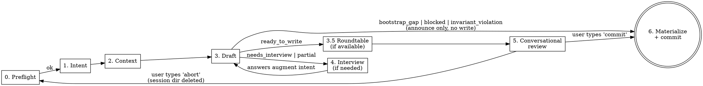

## Framework principles

This skill's invariants: P4 (no redundant storage — drafted entries
uniquely author the F##'s contract, PRD files author the cohesion
narrative), P7 (halt-with-CTA — every exit path produces an
actionable message). See
[`docs/process/KEEL-PRINCIPLES.md`](../../../docs/process/KEEL-PRINCIPLES.md).

# KEEL Refine

Backlog refinement for an existing KEEL project. Given a PRD, a prose description, a bundle directory with design assets, or images pasted in chat, drafts candidate backlog entries and reviews them with you in conversation before committing.

## When to Use

- You have a PRD (or rough feature description) and want backlog entries drafted.
- You have hi-fi comps, wireframes, or UX flows — paste them in chat or point at a bundle directory.
- The project is already bootstrapped — F01-F03 shipped, `ARCHITECTURE.md` describes real layers.
- You are starting a new feature and don't want to write `F##` entries by hand.

**Not for:**
- Initial project setup → use `/keel-setup` (greenfield) or `/keel-adopt` (brownfield).
- Running a feature → use `/keel-pipeline F## spec-path` after the human has reviewed and committed the drafted entry and authored the spec file.
- Writing specs → specs are human-authored. This skill only drafts backlog entries with forward-reference spec paths.

## Design Principle

**Draft first, review conversationally, commit on verb.** Same draft-first ethos as `keel-setup` and `keel-adopt`, with one upgrade: the review surface for the drafting phase is the chat conversation, not the user's editor. The human edits entries in plain English, types `commit` when ready, and the skill commits with a deterministic message — no confirmation prompt. Feature-branch commits are trivially reversible (`git commit --amend`, `git reset`); announcing is safer than prompting.

**Repo is truth, enforced strictly.** Pasted images are staged to `.keel-refine-session/<id>/` (gitignored, outside `docs/`). They move into `docs/exec-plans/prds/<slug>/assets/` only at commit time. Abort → session dir deleted → zero pollution of tracked territory.

## Phases



Branch targets on failure before review:
- `bootstrap_gap` → announce gap, route to `/keel-adopt`, exit. No write.
- `invariant_violation` → announce, exit. No write.
- `blocked` (other) → announce reason, exit. No write.

---

## Phase 0: Preflight (automated, silent)

Before touching anything, verify the repo is in a state where drafting makes sense.

**Do:**
1. Verify `CLAUDE.md`, `ARCHITECTURE.md`, and `docs/exec-plans/active/feature-backlog.md` all exist.
2. Parse the backlog and check the bootstrap gate. Accept **either**:
   - (a) F01, F02, F03 all have `[x]` markers (greenfield-complete), **or**
   - (b) the exact string `<!-- KEEL-BOOTSTRAP: not-applicable -->` is present anywhere in the file.

   Reject otherwise. Do **not** accept "Bootstrap section absent" as valid state — that is indistinguishable from accidental deletion. The marker match is exact (case-sensitive, whitespace-sensitive); any variant fails.
3. For path (a) only: verify the referenced spec files for F01-F03 all exist (if the backlog format lists them). Path (b) skips this check — brownfield bootstrap never existed.
4. Verify `.gitignore` contains a `.keel-refine-session/` line. If missing, append it (single `Edit` call). Announce the addition.
5. Generate a session id: `<ISO-timestamp>-<6-char-random>` (e.g., `20260420-0347-x7k2bp`). Create `.keel-refine-session/<id>/` as the ephemeral workspace for this invocation.

**If check 1 fails (missing files):**
- Print: `"KEEL Refine requires a bootstrapped project. Missing: <what>. Run /keel-setup (greenfield) or /keel-adopt (existing repo) first."`
- Exit. Do not prompt, do not create the session dir, do not proceed.

**If check 2 fails (bootstrap gate not satisfied):**

Print this three-option message verbatim and exit without changes:

```text
KEEL Refine requires a bootstrapped project. Bootstrap gate not satisfied.

Pick one:

  [A] Greenfield: tick F01–F03 as [x] in
      docs/exec-plans/active/feature-backlog.md.

  [B] Brownfield (primary path): your project already has runtime,
      scaffold, and test infra. Paste this exact line between the
      preamble and the first --- divider in feature-backlog.md:

          <!-- KEEL-BOOTSTRAP: not-applicable -->

      That's the only change needed. Shipped F01–F07 placeholders
      are ignored by the parser when the marker is present.

  [C] Brownfield, first-time adoption: run /keel-adopt (it will
      stamp the marker + clear template scaffolding in Phase 5d).
      WARNING: if /keel-adopt has already run, do NOT re-run —
      it will overwrite CLAUDE.md and ARCHITECTURE.md. Use [B].

Exiting without changes.
```

**If check 3 fails (missing spec files on greenfield path):** use the existing "Missing: <what>" message from check 1.

**Do NOT:** Write source code. Write is restricted to `.gitignore` (one line append if missing) and `.keel-refine-session/**` (session workspace).

---

## Phase 1: Intent Ingestion

Parse the user's invocation into a normalized `intent_blob`.

**Four invocation shapes:**

| Invocation | `intent.source` | `intent.content` | `intent.path` | Design assets source |
|-|-|-|-|-|
| `/keel-refine docs/prds/auth.md` | `prd_path` | full text of the file | absolute path | markdown `` refs in the file's dir |
| `/keel-refine docs/prds/auth-redesign/` | `prd_path` | full text of `<dir>/README.md` | absolute dir path | markdown refs + sibling image/pdf files in the directory |
| `/keel-refine "let users edit profile inline"` | `prose` | quoted string | `null` | pasted images in this chat turn, if any |
| `/keel-refine` | `interview` | `""` (filled via interview) | `null` | pasted images in any turn, if any |

**Do:**
1. Parse the positional argument:
   - File path ending `.md` → `prd_path`, file mode.
   - Directory path → `prd_path`, bundle mode. Expect a `README.md` inside; error if absent.
   - Non-path string → `prose`.
   - Absent → `interview`.
2. For `prd_path` file mode: verify file exists and is markdown. If not, print fix suggestion and exit.
3. For `prd_path` bundle mode: verify directory exists and contains a readable `README.md`. Enumerate siblings.
4. For `prose`: accept any non-empty string.
5. For `interview`: ask the minimum viable set:
   - "What feature are you refining? Give me a one-line summary."
   - "What's the user-facing goal?"
   - "Any related specs, prior features, or constraints I should know about?"
   Accumulate answers into `intent.content`.
6. Detect pasted images in the current conversation turn. For each attached image, write it to `.keel-refine-session/<id>/pasted-<n>.<ext>` using the inferred extension from mime type.

**Format and size caps (applied to every candidate design asset):**

| Format | Accepted | Notes |
|-|-|-|
| PNG | yes | standard raster |
| JPG / JPEG | yes | standard raster |
| GIF | yes | treat as static frame 0 |
| SVG | yes | vector |
| PDF | yes | max 20 pages; enforce via `Read` tool's `pages` constraint downstream |
| anything else | no | reject with: `"File <name> format <.ext> is not supported. Export as PNG/SVG/PDF and re-paste."` |

Per-file size cap: **20 MB.** Over cap → reject: `"File <name> is <X>MB (cap 20). Compress, split into frames, or reduce resolution."` No partial-session state; the file is never written to disk.

**Output:** Normalized `intent_blob` in memory with `intent.design_assets: [{path, kind, bytes, label}]` populated from the three possible sources (bundle siblings, markdown refs, pasted attachments). Not yet surfaced to the user.

---

## Phase 2: Repo Context Gathering

Build the `repo_context` that `backlog-drafter` needs.

**Do:**
1. Parse `ARCHITECTURE.md` → extract `architecture_layers`. Canonical sources:
   - Section headings under `## Layers` or `## Module Map`
   - If none, fall back to the section headings in `feature-backlog.md` (excluding `Bootstrap`)
2. Parse `feature-backlog.md` → extract `existing_features` as a list of `{id, title, section, status, needs, source_tag}`.
   - `status: shipped` if entry has `[x]`, else `planned`.
   - `source_tag`: read any `<!-- SOURCE: ... -->` comment on the entry.
3. **Brownfield-marker filter.** If the backlog contains the exact string `<!-- KEEL-BOOTSTRAP: not-applicable -->`, exclude from `existing_features` (and therefore from `next_free_id` allocation):
   - the entire `## Bootstrap` section (all entries within it, regardless of content)
   - any exact-match shipped placeholder entries whose title matches one of:
     - `**F04 [YOUR FOUNDATION FEATURE]**`
     - `**F05 [YOUR SERVICE FEATURE]**`
     - `**F06 [YOUR UI FEATURE]**`
     - `**F07 [YOUR CROSS-CUTTING FEATURE]**`

   Match must be exact on title (case and whitespace sensitive). A customized F04 (real title) is kept in `existing_features`; only bit-exact shipped placeholders are filtered. Result: an untouched brownfield template plus the marker yields `next_free_id = F01`.
4. Compute `next_free_id`: lowest F## integer not present in the filtered `existing_features`. **Freeze this value for the entire refinement session** — even across interview loops and review turns.
5. Parse `CLAUDE.md` → extract `invariants` (the list items under `## Safety Rules`).
6. Derive `spec_dir`: default `docs/product-specs/` unless CLAUDE.md explicitly points elsewhere.
7. Enumerate existing PRD slugs by listing `docs/exec-plans/prds/*.md` (filenames minus `.md` extension). Pass to `backlog-drafter` as `prd.existing_slugs` for collision avoidance when synthesizing a new slug.
8. Snapshot `feature-backlog.md` contents (full text + SHA-256 of contents) to `.keel-refine-session/<id>/backlog-snapshot.md` and `.keel-refine-session/<id>/backlog-snapshot.sha`. Used for staleness detection at commit time.

**Do NOT:**
- Invent layers not declared in `ARCHITECTURE.md` or present in the backlog.
- Change `next_free_id` mid-session — idempotency depends on it being frozen.
- Write outside `.keel-refine-session/<id>/`.

---

## Phase 3: Agent Dispatch

Invoke the `backlog-drafter` agent with the YAML blob.

**Do:**

Dispatch via the `Agent` tool with `subagent_type: "backlog-drafter"`. Pass exactly this prompt shape:

```
You are backlog-drafter. Read .claude/agents/backlog-drafter.md for your contract.

Here is your input blob:

intent:
  source: <prd_path | prose | interview>
  content: |
    <intent.content verbatim>
  path: <path or null>
  design_assets:
    - path: <absolute or repo-relative path>
      kind: <png | jpg | svg | pdf>
      bytes: <int>
      label: <alt text from markdown ref, or null>
    # ... zero or more

repo_context:
  architecture_layers: [<list>]
  existing_features:
    - {id, title, section, status, needs, source_tag}
    ...
  next_free_id: F##
  invariants: [<list>]
  spec_dir: <path>

prd:
  slug: null  # synthesize from intent, avoid collisions with existing_slugs (prose mode)
             # OR: <slug>  # when operating on existing PRD file (file/bundle mode)
  existing_slugs: [<list from Phase 2>]

constraints:
  append_only: true
  never_edit_existing: true
  layer_must_exist_in_architecture: true
  max_entries_per_run: 15
  design_assets_shallow_read_only: true

Return your structured YAML output. No prose.
```

In prose mode, the skill synthesizes both a PRD file and the F##
entries. The PRD narrative is derived from the intent by
`backlog-drafter` and is written to disk atomically with the backlog
append in Phase 6 (see Phase 6 Step 2a). The narrative MUST NOT
contain F## IDs — scope-lint in the validator rejects those.

**Parse the agent's return.** Expect the YAML schema in `.claude/agents/backlog-drafter.md` §Output Format. Validate:
- `status` is one of the six allowed values.
- If `status: ready_to_write` or `partial`: every `self_validation` field must be true.
- Every `drafted_entries[].needs` id exists in `existing_features` or in the drafted set.
- Every `drafted_entries[].section` is in `architecture_layers` or `summary.sections_to_create`.
- Every path in any `drafted_entries[].design_assets` appears in `intent.design_assets[].path`.
- Only UI-layer entries carry `design_assets`; others have empty or absent lists.

**If the agent's output fails validation:** treat as a hard failure. Print the parsing error, clean up the session dir, exit. Do not attempt to fix the agent's output yourself.

---

## Phase 3.5: Roundtable decomposition review (optional)

Runs only when (a) `Roundtable review: true` in CLAUDE.md, (b) roundtable
MCP is available, and (c) the agent returned `status ∈ {ready_to_write, partial}`
with at least one drafted entry. Skip for all other statuses and skip silently
if the MCP is unavailable.

**Why:** Once the human types `commit`, `feature-backlog.md` is updated and
`pre-check` assumes entries are valid. A poorly decomposed entry (cross-layer
bleed, too broad, circular or missing deps, fuzzy test criterion) costs
downstream agents cycles and can slip safety-critical work past the routing
layer. This stress-test happens BEFORE the cards are shown to the human so
the review surface reflects the consensus.

**Do:**
1. Probe roundtable MCP availability (120s timeout per tool call). On
   failure: skip silently, proceed to Phase 4. Do not retry.
2. Call `mcp__roundtable__roundtable-critique` with the drafted entries, the intent
   blob, `architecture_layers`, and `invariants`. Ask it to attack each
   entry: wrong or mixed `section`, too-broad scope (smallest testable
   unit violation), missing or circular `needs`, fuzzy `test_criterion`,
   missing invariant enforcement, under-specified design asset coverage.
3. Call `mcp__roundtable__roundtable-canvass` with the critique output + original
   drafted entries. Synthesize a consensus slate: which entries keep,
   which split, which merge, which retitle, which reword test criteria.
4. Apply the consensus edits to the in-memory drafted set ONLY if they
   pass the same validation rules applied to agent output (needs resolve,
   sections exist, design asset paths are in `intent.design_assets`).
   Reject individual edits that would violate validation; keep the
   original entry in that case and log the rejection.
5. Annotate each modified entry with a `<!-- SOURCE-ROUNDTABLE: ... -->`
   tag alongside the existing `SOURCE` tag so the source is visible to
   the human during Phase 5 review.
6. Write the raw critique + canvass output to
   `.keel-refine-session/<id>/roundtable.md` for transparency. Not
   committed — session-ephemeral.

Roundtable is advisory. The human still reviews every card in Phase 5
and can reject any consensus edit. The skill never skips the review loop
just because roundtable approved.

---

## Phase 4: Interview Loop (only if `status ∈ {needs_interview, partial}`)

The agent returned questions it couldn't resolve from the PRD alone.

**Do:**
1. For each `interview_questions[]` entry:
   - Print: `"[{field}] {why_asked} (constraints: {constraints})"`
   - Accept human answer. Valid answers: free text, `skip` (leave as HUMAN marker), `abort` (end session, discard).
2. Accumulate answers into an augmented `intent.content`:
   ```
   <original content>

   ---
   Clarifications from refinement interview:
   - Q: {field} — {why_asked}
     A: {human answer}
   ```
3. Re-invoke the agent (Phase 3) with the augmented intent. `next_free_id` stays frozen. `existing_features` refreshed from current backlog (in case of concurrent changes).

**Budgets:**
- Max 20 interview turns per `/keel-refine` session.
- Max 3 questions per single drafted entry.
- If either budget is exceeded: print `"Interview budget exceeded. Remaining questions will ship as HUMAN markers. Continue to review? [y/N]"`. On no: abort. On yes: proceed to Phase 5 with markers.

**On `abort`:** `rm -rf .keel-refine-session/<id>/`, print `"Refinement aborted. No changes."`, exit.

**On `partial`:** proceed to Phase 5 with the ready entries. Interview remaining cards there, or ship them with HUMAN markers if the user decides to commit without resolution.

---

## Phase 5: Conversational Review (per-card walkthrough)

Match NORTH-STAR §Autonomy Ceiling line 103: `/keel-refine` "reviews
each card conversationally with the human." Every drafted entry is
walked individually before `commit` is valid — no block-review escape
hatch, no "accept all" shortcut. Accuracy over speed.

**Phase 5 rules:**

- **No git operations during the walk.** Phase 6 Step 4 is the only `git add` / `git commit` in this skill. Per-card commits during Step 2 are a process violation that structurally recreates the Step-3 elision bug from the ParchMark testbed (`testbed-feedback/post-walk-state-skipped.md`).

### Step 1 — Orientation summary (not a review surface)

Print the slate first so the human has the shape before walking:

```
Drafted {N} entries from {intent.source basename}:

  F{id} {title}  → {section}  ({marker_count} markers)
  F{id} {title}  → {section}  ({marker_count} markers)
  ...

Summary:
  Sections to create: {list or "none"}
  Collisions:         {list or "none"}
  Unused assets:      {list or "none"}

Walking card {first_card} of {total_cards}...
```

Where:
- **Prose / synthesized mode** (new PRD, Card 0 is the PRD narrative):
  `first_card = 0`, `total_cards = N + 1`.
- **File / bundle mode** (PRD already exists, no Card 0):
  `first_card = 1`, `total_cards = N`.

Orientation only. `commit` here is invalid — the walk hasn't started.
Proceed to Step 2 immediately.

### Step 2a — Card 0: the PRD narrative (prose/synthesized mode only)

Before walking F## cards, present the synthesized PRD narrative for
human edit. Applies only when a new PRD is being created this
session (prose mode, no existing PRD file).

Display:

```
Card 0 of {N+1}: the PRD narrative (new file)

Slug: {proposed-slug}
Path: docs/exec-plans/prds/{slug}.md

Narrative:
---
{synthesized narrative content}
---

Verbs:
  accept                  — keep as synthesized, proceed to F## cards
  edit slug: <new-slug>   — change the slug (will collision-check)
  edit prd: <text>        — replace the full narrative
  abort                   — discard session, no commit
```

Edits made here (`edit slug`, `edit prd`) are stored in session state
and become the canonical input to Phase 6 Step 2a. The synthesized
narrative produced by `backlog-drafter` is the starting draft only —
once Card 0 is walked, the session holds the final slug and final
narrative, and Phase 6 Step 2a writes that final text, not the
original synthesis.

If the invocation is file mode (PRD file already exists) or bundle
mode, skip card 0 entirely and start at card 1.

### Step 2 — Walk each card in F## order

For each drafted entry, print the full card. The current card stays
active until an advancing verb (`accept`, `drop F##`, `back`) is
issued.

**Card display:**

```
Card {n} of {N}:

F{id} {title}                        → {section}
  Spec:     {spec_ref}
  Needs:    {comma-joined or "—"}
  Design:   {comma-joined or "—"}
  Test:     {test_criterion}

  Open markers:
    [1] {marker 1 text}
    [2] {marker 2 text}
    ...

Verbs:
  accept                         — keep as drafted, advance
  edit <field>: <value>          — replace title/section/test/spec/needs/design
  answer marker <n>: <text>      — drop marker n, record answer; apply via
                                   a follow-up `edit` if it belongs in a field
  skip marker <n>                — ship marker as-is (pre-check will block
                                   /keel-pipeline on this entry until a
                                   human resolves it)
  drop F##                       — remove this card from the draft, advance
  back                           — revisit the prior card (no-op on card 1)
```

If the card has zero markers the `Open markers:` block is omitted
entirely; `accept` is a single-keystroke advance. Zero-marker cards
are still walked — the NORTH-STAR requirement is per-card
conversation, not per-marker.

**Edit-time validation** applies to every `edit`, `answer marker`, and
`drop` action:
- `needs` must still resolve to real ids (existing features plus
  cards still present in the draft after any `drop`s in this walk).
- `section` must still exist in `architecture_layers` or
  `sections_to_create`.
- `design_assets` entries must still be in `intent.design_assets[]`.
- Dep-cycle, title-dup, entry-cap checks.

Reject a card-level action with a specific reason. Card stays active;
user retries or advances.

### Step 3 — Post-walk confirmation (required gate)

After every drafted card has been walked, the walk is not complete
until the user has typed `commit`, `revisit F##`, or `abort`. Do
NOT transition to Phase 6 without this confirmation. An orchestrator
that transitions from Step 2 to Phase 6 without printing Step 3's
message and accepting one of the three verbs has executed an
incomplete walk — abort and restart.

Print:

```
Walk complete. {N} cards drafted for PRD: {slug}.

  [F##] {title}  → {section}  ({marker_count} markers)
  ...

Are all {N} F## entries from this PRD ready?

Verbs:
  commit         — materialize PRD file, append backlog, git commit
  revisit F##    — re-enter walk at F##
  abort          — discard session, no commit
```

The `commit` verb is only valid after Step 3's prompt has been shown
and the user has typed it. If an orchestrator skips Step 3 and
attempts materialization, that is a process violation.

- `commit` is **only valid in post-walk state**. Attempting it during
  Step 2 re-points to the current unwalked card and prints:
  `"Card F## has not been walked yet. Resume? (accept / drop F## / edit / answer marker N / skip marker N / back)"`.
  Does not materialize anything.
- `revisit F##` re-activates F## for editing; cards walked after F##
  stay walked unless re-visited individually.
- `abort` runs `rm -rf .keel-refine-session/<id>/` and exits.
- `commit` proceeds to Phase 6.

### Turn caps

- **Global:** 30 user inputs per session, across Step 2 + Step 3. On
  exhaustion, accept only `commit` / `abort`.
- **Per-card soft cap:** 5 inputs on a single card. On reaching:
  `"Card F{id} has consumed 5 turns. If you're making progress, keep
  going — this is a nudge, not a stop. Otherwise 'accept', 'drop F##',
  or 'back' to move on."` Soft warning only.

### Handling `status: partial` entries from Phase 4

Cards whose fields came out of the drafter as `❓` placeholders
(Phase 4 interview budget exhausted, or human typed `skip` on a
drafter-initiated question) are walked identically to any other card.
The human answers via `answer marker <n>` + a follow-up `edit`, or
`skip marker <n>` to ship the `<!-- HUMAN: -->` marker for pre-check
to catch at pipeline time. No separate presentation mode.

---

## Phase 6: Materialize + Announce-Commit

The user typed `commit`. Validate staleness, write the files, git-commit with a deterministic message. Announce — do not prompt.

**Step 0 — Verify Step 3 confirmation was received.**

Before any Phase 6 work, verify the user typed `commit`, `revisit F##`, or `abort` in response to Phase 5 Step 3's prompt. If the skill transitioned from Phase 5 Step 2 directly to Phase 6 without emitting Step 3's prompt and receiving an advancing verb, print Step 3's prompt now and wait for input. Do NOT proceed with materialization until the explicit `commit` verb is typed.

This is a re-entrant backstop for the Phase 5 Step 3 hard-stop: an orchestrator that skipped Step 3 catches itself here on Phase 6 entry.

**Step 1 — Staleness check.**

Re-read `feature-backlog.md` and SHA-256 it. Compare to the snapshot captured in Phase 2.

- **If unchanged:** proceed.
- **If changed:**
  - Load the snapshot diff between pre-session and current.
  - Identify any ids that appeared in the current file that weren't in the snapshot (human-added during the session, or from a concurrent `/keel-refine`).
  - Renumber drafted entries forward to avoid collision if possible. If renumbering would change dependency refs, abort instead with a clear error: `"feature-backlog.md changed during review. F## N...M now collide. Drafts preserved in .keel-refine-session/<id>/; re-run /keel-refine after reconciling."`
  - Never silently clobber.

**Step 2 — Move assets into tracked territory.**

Before touching the filesystem, take the pre-run snapshot described in
the Atomicity block below. The snapshot MUST cover `feature-backlog.md`,
the PRD file at `docs/exec-plans/prds/<slug>.md`, and the contents of
`docs/exec-plans/prds/<slug>/assets/`. Step 2 moves assets into that
directory, so the filename set of that directory MUST be captured
BEFORE the first `mv` / `Write` / `rm` call runs. Without this, Step 4
validator failure leaves orphan assets in tracked territory.

**Basename collision check.** Before moving any asset, enumerate the
filenames that already exist in `docs/exec-plans/prds/<slug>/assets/`
(the pre-session snapshot). For each `intent.design_assets[]` entry to
be moved, check whether its basename already exists in that directory.
If any collision is detected, halt with CTA:

> *"Asset move would overwrite existing file at
> `docs/exec-plans/prds/<slug>/assets/<basename>`. Rename the session
> asset, or remove/rename the existing one. The skill cannot safely
> move assets that collide on basename with pre-existing files."*

Only proceed with the move if every session asset has a unique basename
relative to the pre-existing assets directory.

For each `intent.design_assets[]` entry that was referenced by at least one drafted entry:
- If the source path is under `.keel-refine-session/<id>/`: move it to `docs/exec-plans/prds/<slug>/assets/<basename>`. Create the target dir first if missing — `Write` a `.gitkeep` file into the empty dir to materialize it. Choose the copy method by file type:
  - **Text-format assets (SVG, markdown):** prefer `Write` of the new file + Bash `rm` of the old (idempotent and auditable).
  - **Binary assets (PNG, JPG/JPEG, GIF, PDF):** MUST use Bash `mv` (or `cp` + `rm`). The `Write` tool is text-only and will corrupt binary content. Never use `Write` for binary files.
- If the source path was already under `docs/` (bundle mode with pre-committed assets): leave in place.
- Update the `design_assets` paths on drafted entries to reflect the final locations.

Unused assets (in `intent.design_assets[]` but not referenced by any drafted entry): **leave in the session dir.** They get deleted on session end.

Under the PRD-scope model, assets live under their PRD's folder (`docs/exec-plans/prds/<slug>/assets/`). The legacy `docs/prds/drafts/<timestamp>/` path is obsolete — do not create it.

### Step 2a — Write or update the PRD file

- **Prose mode (new PRD):** Write the **final PRD narrative** to
  `docs/exec-plans/prds/<slug>.md`. Atomic `Write` call. The "final
  narrative" is the text as finalized through Card 0 edits in Phase 5
  Step 2a — NOT the original text synthesized by `backlog-drafter`.
  If the human typed `edit prd: <text>` during the walk, use THAT
  text. Likewise for `edit slug: <new-slug>` — the final slug becomes
  the basename of the file path.
- **File/bundle mode (existing PRD):** Copy the source PRD into
  `docs/exec-plans/prds/<slug>.md` if it isn't already there.
  Preserve the narrative verbatim.
- Create the parent directory `docs/exec-plans/prds/` if it does not
  exist. Use `mkdir -p` (or equivalent) via `Bash` before the `Write`
  call. This is the first-PRD case on a project that has never run
  `/keel-refine` before — without this step, the `Write` fails.

**Step 3 — Write backlog entries.**

Compute the full set of per-section appended blocks. Per-entry format (exact):

```markdown

- [ ] **F## Title**
  Spec: <spec_ref><if needs non-empty: " | Needs: <comma-joined needs>">
  <if design_assets non-empty:>Design: <comma-joined design_asset paths>
  PRD: <slug>  <!-- OR: PRD-exempt: <legacy|bootstrap|infra|trivial> -->
  Test: <test_criterion>
  <!-- DRAFTED: {ISO-date} by backlog-drafter; {len(human_markers)} markers remain -->
  {source_tag}
  <!-- HUMAN: {marker 1} -->
  ...
```

Every drafted F## entry MUST carry exactly one of:
- `PRD: <slug>` — pointing at the PRD file written or updated in Step 2a (the `<slug>` matches the basename of `docs/exec-plans/prds/<slug>.md`), OR
- `PRD-exempt: <reason>` — where `<reason>` is one of `legacy`, `bootstrap`, `infra`, `trivial`. Only applies to narrow carve-outs; a standard refine run writing a PRD in Step 2a emits `PRD: <slug>` on every entry.

Entries missing both forms violate invariant 7 and will fail `validate-prds.py` in Step 4.

Formatting rules (same as before, with `Design:` and `PRD:` added):
- Blank line before the entry.
- `source_tag` is emitted as-is (full `<!-- SOURCE: ... -->` comment). Do NOT re-wrap.
- `| Needs: ...` segment omitted when empty. No trailing pipe.
- `Design:` line omitted entirely when `design_assets` is empty.
- `PRD:` (or `PRD-exempt:`) line is mandatory on every entry. Never omit.
- HUMAN markers indented two spaces. One per line.
- `DRAFTED:` prefix with colon — load-bearing for `doc-gardener`.

**Atomicity (covers backlog, PRD file, and PRD assets):**
- Compute all appends in memory.
- Snapshot pre-run state BEFORE the first mutating operation in Phase 6 Step 2. The snapshot MUST cover:
  - `feature-backlog.md` — full text.
  - `docs/exec-plans/prds/<slug>.md` — full text if the file existed pre-session; otherwise record "absent" so rollback knows to delete rather than restore.
  - `docs/exec-plans/prds/<slug>/assets/` — record the set of filenames that existed in this directory pre-session (may be empty, or the directory may not exist yet). Rollback restores this exact pre-session state: remove any file added during this session, keep any file that was already present.
- One `Edit` per section in fixed order (Bootstrap → Foundation → Service → UI → Cross-cutting). Multiple sections → multiple `Edit` calls.
- On any failure (including validator failure in Step 4):
  1. Restore `feature-backlog.md` from snapshot via a full-file `Write`.
  2. Either delete `docs/exec-plans/prds/<slug>.md` (if newly-created this session) or restore it from snapshot (if it pre-existed).
  3. Remove any file under `docs/exec-plans/prds/<slug>/assets/` that was added during this session — i.e., any file whose name is NOT in the pre-session filename set. Use Bash `rm` per path. If the `assets/` directory did not exist pre-session and is empty after the cleanup, `rmdir` it. Files that existed pre-session MUST be left untouched.
  4. If `docs/exec-plans/prds/<slug>/` was created by this session (i.e., did not exist pre-session) AND is empty after step 3, `rmdir` it. If it contained pre-existing content, leave it.
  5. If `docs/exec-plans/prds/` was created by this session (first-PRD case) AND is empty after step 4, `rmdir` it. If it already existed pre-session or contains other PRDs, leave it.
  6. Abort.

The snapshot-and-rollback MUST include assets because Phase 6 Step 2 moves session-staged design files into `docs/exec-plans/prds/<slug>/assets/` before the backlog/PRD writes happen. Without asset rollback, a late failure (e.g., validator failure in Step 4) leaves orphan asset files in tracked territory while the backlog and PRD get restored — the session would leak pollution.

**Step 4 — Stage and commit.**

Collect the set of paths to stage:
- `docs/exec-plans/active/feature-backlog.md` (always, if changed)
- `docs/exec-plans/prds/<slug>.md` (the PRD file written or updated in Step 2a)
- Any files under `docs/exec-plans/prds/<slug>/assets/` (new asset files, if any)
- Any new section heading creations in the backlog (already part of the backlog file)

- Before `git add`, run `python3 scripts/validate-prds.py --repo .`. If validator exits non-zero, abort Phase 6 with the validator's halt message. Do not proceed with materialization.

Execute via `Bash`:
```
git add <path1> <path2> ...     # explicit paths only, never -A, never -u
git commit -m "<message>"
```

Commit message shape (deterministic):
- `backlog: refine <source-basename> (<F##-range-or-list>)`
- Examples:
  - `backlog: refine auth-redesign (F12-F14)` — directory source, contiguous range
  - `backlog: refine auth.md (F12, F13)` — file source, listed ids
  - `backlog: refine "edit profile inline" (F12)` — prose source, truncated to 40 chars
  - `backlog: refine via interview (F12, F13)` — interview source

**Step 5 — Announce.**

Print:
```
Committing: <message>
  docs/exec-plans/active/feature-backlog.md  (+<lines> lines)
  docs/exec-plans/prds/<slug>.md  (new | updated)
  {each new asset path under docs/exec-plans/prds/<slug>/assets/} (new)

[<short-sha>] <message>

Next: /keel-pipeline F<first-id> docs/product-specs/<spec>.md when ready.
      Specs referenced by drafted entries:
        <spec_ref> — does not yet exist, author before piping
        ...
```

No confirmation prompt. User who wants a different message uses `git commit --amend -m "..."` after the fact.

**Step 6 — Session cleanup.**

`rm -rf .keel-refine-session/<id>/`. The commit is the new source of truth; ephemeral state is no longer needed.

---

## Phase 7 (there is no Phase 7)

The skill exits at Phase 6 with a commit in place. The human's next action is either `/keel-pipeline F##` (when ready) or editing the spec file(s) referenced by the drafted entries. Both are separate, human-initiated actions.

---

## Rules

**Commits:**
- The skill commits on user-typed `commit` verb. No confirmation prompt — announce and do.
- Never `git push`. Never `git commit --amend`. Never `git reset`, `git checkout`, `git branch`.
- `git add` uses explicit per-path arguments only. Never `-A`, never `-u`, never `.`.
- Never run the pipeline. Never invoke `/keel-pipeline`.

**Writes:**
- `.keel-refine-session/**` — session workspace, ephemeral.
- `docs/exec-plans/prds/<slug>.md` — PRD narrative file, written or updated at commit time.
- `docs/exec-plans/prds/<slug>/assets/**` — referenced design assets, moved from session dir at commit time.
- `docs/exec-plans/active/feature-backlog.md` — appended to at commit time.
- `.gitignore` — append `.keel-refine-session/` one time, in preflight, only if missing.
- No other write path. Not code files. Not spec files. Not `ARCHITECTURE.md` or `CLAUDE.md`.

**Reads:**
- Any repo file for context.
- Pasted images in chat (via Claude's native image handling) + written copies in the session dir.

**Drafting invariants (unchanged from prior contract):**
- Freeze `next_free_id` at Phase 2; never renumber or recompute mid-session except on staleness at commit.
- Agent output is authoritative — do not second-guess, fix, or silently skip entries. If validation fails, abort.
- Interview answers are stateless across invocations; a fresh `/keel-refine` starts a new session.
- Bootstrap is sacred. If the agent returns `bootstrap_gap`, route the human to `/keel-adopt`. Never emit bootstrap-pipeline tasks. Brownfield projects carrying `<!-- KEEL-BOOTSTRAP: not-applicable -->` are considered bootstrap-satisfied — `next_free_id` starts at F01 because shipped placeholders are filtered in Phase 2.
- Specs are human territory. This skill never creates spec files, not even empty stubs. `Spec:` paths are forward references.

**Format/size (paste-time validation):**
- Formats: PNG, JPG/JPEG, GIF, SVG, PDF.
- Per-file cap: 20 MB.
- PDF page cap: 20 pages.
- Reject at paste with a clear error message. Never silently drop or truncate.

## Failure Modes (skill-level)

| Symptom | Cause | Action |
|-|-|-|
| Preflight fails (files) | Missing `CLAUDE.md` / `ARCHITECTURE.md` / `feature-backlog.md` | Print fix suggestion, exit |
| Preflight fails (bootstrap gate) | Neither F01–F03 ticked nor marker present | Print three-option A/B/C message, exit |
| `.gitignore` missing `.keel-refine-session/` | New install or user removed it | Append the line (one `Edit`), announce, proceed |
| PRD path doesn't resolve | User typo | Print fix suggestion, exit |
| PRD dir has no `README.md` | User misused bundle mode | Print fix suggestion, exit |
| Pasted file exceeds format/size cap | Wrong format or too large | Print specific error, do not write anything, exit |
| Agent returns malformed YAML | Agent failure | Print parsing error, clean up session dir, exit |
| Agent returns `ready_to_write` with a false `self_validation` field | Agent misbehavior | Treat as parsing error — do NOT enter review |
| User action in Phase 5 walk violates validation | Bad edit / answer / drop | Reject with reason; active card stays active; no advance |
| `commit` attempted in Phase 5 before walk is complete | User tried to short-circuit | Re-point to current unwalked card, prompt for advancing verb, do not materialize |
| Global turn cap reached in Phase 5 | Over-iteration | Announce cap, accept only `commit` / `abort` thereafter |
| Per-card soft cap reached in Phase 5 | Possibly-stuck card | Print warning, continue accepting card-level verbs |
| Staleness at commit (hash mismatch) | Concurrent backlog edit | Preserve drafts in session dir, announce collision, exit without commit |
| `Edit` to `feature-backlog.md` fails mid-commit | Permissions / conflict | Restore from snapshot, announce failure, exit |
| User types `abort` | User choice | `rm -rf` session dir, announce, exit |
| Interview budget exhausted | PRD too ambiguous | Offer proceed-to-review with markers, else abort |

## Notes

- `backlog-drafter` returns structured YAML to this skill (not a handoff file). Only consumer of the pattern today. If more agents adopt it, factor a shared parser.
- The `<!-- DRAFTED: ... -->` comment is removed by `doc-gardener` during the post-landing sweep once the entry is `[x]`. Don't worry about long-term hygiene here.
- The `<!-- SOURCE: ... -->` tag is permanent — it's the idempotency anchor. Future `/keel-refine` runs use it to detect "already drafted from this source."
- `docs/exec-plans/prds/<slug>/assets/` is the canonical home for assets belonging to a drafted PRD. Over time a human may choose to move them into `docs/design-assets/shared/` or a per-feature directory. `doc-gardener` does not touch these — they're historical record.
- Claude Code's `Read` tool handles PNG, JPG, SVG, and PDF (up to 20 pages with `pages` param) natively via vision. That's why the `backlog-drafter` and `frontend-designer` agents can see design assets without any intermediary parsing agent.
