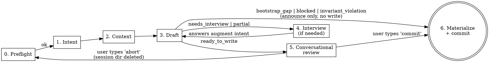

# KEEL Refine

Backlog refinement for an existing KEEL project. Given a PRD, a prose description, a bundle directory with design assets, or images pasted in chat, drafts candidate backlog entries and reviews them with you in conversation before committing.

## When to Use

- You have a PRD (or rough feature description) and want backlog entries drafted.
- You have hi-fi comps, wireframes, or UX flows — paste them in chat or point at a bundle directory.
- The project is already bootstrapped — F01-F03 shipped, `ARCHITECTURE.md` describes real layers.
- You are starting a new feature and don't want to write `F##` entries by hand.

**Not for:**
- Initial project setup → use `/keel-setup` (greenfield) or `/keel-adopt` (brownfield).
- Running a feature → use `/keel-pipeline F## spec-path` after the human has reviewed and committed the drafted entry and authored the spec file.
- Writing specs → specs are human-authored. This skill only drafts backlog entries with forward-reference spec paths.

## Design Principle

**Draft first, review conversationally, commit on verb.** Same draft-first ethos as `keel-setup` and `keel-adopt`, with one upgrade: the review surface for the drafting phase is the chat conversation, not the user's editor. The human edits entries in plain English, types `commit` when ready, and the skill commits with a deterministic message — no confirmation prompt. Feature-branch commits are trivially reversible (`git commit --amend`, `git reset`); announcing is safer than prompting.

**Repo is truth, enforced strictly.** Pasted images are staged to `.keel-refine-session/<id>/` (gitignored, outside `docs/`). They move into `docs/prds/drafts/<timestamp>/` only at commit time. Abort → session dir deleted → zero pollution of tracked territory.

## Phases



Branch targets on failure before review:
- `bootstrap_gap` → announce gap, route to `/keel-adopt`, exit. No write.
- `invariant_violation` → announce, exit. No write.
- `blocked` (other) → announce reason, exit. No write.

---

## Phase 0: Preflight (automated, silent)

Before touching anything, verify the repo is in a state where drafting makes sense.

**Do:**
1. Verify `CLAUDE.md`, `ARCHITECTURE.md`, and `docs/exec-plans/active/feature-backlog.md` all exist.
2. Parse the backlog: check that F01, F02, F03 all have `[x]` markers (bootstrap complete).
3. Parse the backlog: verify the referenced spec files for F01-F03 all exist (if the backlog format lists them).
4. Verify `.gitignore` contains a `.keel-refine-session/` line. If missing, append it (single `Edit` call). Announce the addition.
5. Generate a session id: `<ISO-timestamp>-<6-char-random>` (e.g., `20260420-0347-x7k2bp`). Create `.keel-refine-session/<id>/` as the ephemeral workspace for this invocation.

**If any check (1-3) fails:**
- Print: `"KEEL Refine requires a bootstrapped project. Missing: <what>. Run /keel-setup (greenfield) or /keel-adopt (existing repo) first."`
- Exit. Do not prompt, do not create the session dir, do not proceed.

**Do NOT:** Write source code. Write is restricted to `.gitignore` (one line append if missing) and `.keel-refine-session/**` (session workspace).

---

## Phase 1: Intent Ingestion

Parse the user's invocation into a normalized `intent_blob`.

**Four invocation shapes:**

| Invocation | `intent.source` | `intent.content` | `intent.path` | Design assets source |
|-|-|-|-|-|
| `/keel-refine docs/prds/auth.md` | `prd_path` | full text of the file | absolute path | markdown `` refs in the file's dir |
| `/keel-refine docs/prds/auth-redesign/` | `prd_path` | full text of `<dir>/README.md` | absolute dir path | markdown refs + sibling image/pdf files in the directory |
| `/keel-refine "let users edit profile inline"` | `prose` | quoted string | `null` | pasted images in this chat turn, if any |
| `/keel-refine` | `interview` | `""` (filled via interview) | `null` | pasted images in any turn, if any |

**Do:**
1. Parse the positional argument:
   - File path ending `.md` → `prd_path`, file mode.
   - Directory path → `prd_path`, bundle mode. Expect a `README.md` inside; error if absent.
   - Non-path string → `prose`.
   - Absent → `interview`.
2. For `prd_path` file mode: verify file exists and is markdown. If not, print fix suggestion and exit.
3. For `prd_path` bundle mode: verify directory exists and contains a readable `README.md`. Enumerate siblings.
4. For `prose`: accept any non-empty string.
5. For `interview`: ask the minimum viable set:
   - "What feature are you refining? Give me a one-line summary."
   - "What's the user-facing goal?"
   - "Any related specs, prior features, or constraints I should know about?"
   Accumulate answers into `intent.content`.
6. Detect pasted images in the current conversation turn. For each attached image, write it to `.keel-refine-session/<id>/pasted-<n>.<ext>` using the inferred extension from mime type.

**Format and size caps (applied to every candidate design asset):**

| Format | Accepted | Notes |
|-|-|-|
| PNG | yes | standard raster |
| JPG / JPEG | yes | standard raster |
| GIF | yes | treat as static frame 0 |
| SVG | yes | vector |
| PDF | yes | max 20 pages; enforce via `Read` tool's `pages` constraint downstream |
| anything else | no | reject with: `"File <name> format <.ext> is not supported. Export as PNG/SVG/PDF and re-paste."` |

Per-file size cap: **20 MB.** Over cap → reject: `"File <name> is <X>MB (cap 20). Compress, split into frames, or reduce resolution."` No partial-session state; the file is never written to disk.

**Output:** Normalized `intent_blob` in memory with `intent.design_assets: [{path, kind, bytes, label}]` populated from the three possible sources (bundle siblings, markdown refs, pasted attachments). Not yet surfaced to the user.

---

## Phase 2: Repo Context Gathering

Build the `repo_context` that `backlog-drafter` needs.

**Do:**
1. Parse `ARCHITECTURE.md` → extract `architecture_layers`. Canonical sources:
   - Section headings under `## Layers` or `## Module Map`
   - If none, fall back to the section headings in `feature-backlog.md` (excluding `Bootstrap`)
2. Parse `feature-backlog.md` → extract `existing_features` as a list of `{id, title, section, status, needs, source_tag}`.
   - `status: shipped` if entry has `[x]`, else `planned`.
   - `source_tag`: read any `<!-- SOURCE: ... -->` comment on the entry.
3. Compute `next_free_id`: lowest F## integer not present in `existing_features`. **Freeze this value for the entire refinement session** — even across interview loops and review turns.
4. Parse `CLAUDE.md` → extract `invariants` (the list items under `## Safety Rules`).
5. Derive `spec_dir`: default `docs/product-specs/` unless CLAUDE.md explicitly points elsewhere.
6. Snapshot `feature-backlog.md` contents (full text + SHA-256 of contents) to `.keel-refine-session/<id>/backlog-snapshot.md` and `.keel-refine-session/<id>/backlog-snapshot.sha`. Used for staleness detection at commit time.

**Do NOT:**
- Invent layers not declared in `ARCHITECTURE.md` or present in the backlog.
- Change `next_free_id` mid-session — idempotency depends on it being frozen.
- Write outside `.keel-refine-session/<id>/`.

---

## Phase 3: Agent Dispatch

Invoke the `backlog-drafter` agent with the YAML blob.

**Do:**

Dispatch via the `Agent` tool with `subagent_type: "backlog-drafter"`. Pass exactly this prompt shape:

```
You are backlog-drafter. Read .claude/agents/backlog-drafter.md for your contract.

Here is your input blob:

intent:
  source: <prd_path | prose | interview>
  content: |
    <intent.content verbatim>
  path: <path or null>
  design_assets:
    - path: <absolute or repo-relative path>
      kind: <png | jpg | svg | pdf>
      bytes: <int>
      label: <alt text from markdown ref, or null>
    # ... zero or more

repo_context:
  architecture_layers: [<list>]
  existing_features:
    - {id, title, section, status, needs, source_tag}
    ...
  next_free_id: F##
  invariants: [<list>]
  spec_dir: <path>

constraints:
  append_only: true
  never_edit_existing: true
  layer_must_exist_in_architecture: true
  max_entries_per_run: 15
  design_assets_shallow_read_only: true

Return your structured YAML output. No prose.
```

**Parse the agent's return.** Expect the YAML schema in `.claude/agents/backlog-drafter.md` §Output Format. Validate:
- `status` is one of the six allowed values.
- If `status: ready_to_write` or `partial`: every `self_validation` field must be true.
- Every `drafted_entries[].needs` id exists in `existing_features` or in the drafted set.
- Every `drafted_entries[].section` is in `architecture_layers` or `summary.sections_to_create`.
- Every path in any `drafted_entries[].design_assets` appears in `intent.design_assets[].path`.
- Only UI-layer entries carry `design_assets`; others have empty or absent lists.

**If the agent's output fails validation:** treat as a hard failure. Print the parsing error, clean up the session dir, exit. Do not attempt to fix the agent's output yourself.

---

## Phase 4: Interview Loop (only if `status ∈ {needs_interview, partial}`)

The agent returned questions it couldn't resolve from the PRD alone.

**Do:**
1. For each `interview_questions[]` entry:
   - Print: `"[{field}] {why_asked} (constraints: {constraints})"`
   - Accept human answer. Valid answers: free text, `skip` (leave as HUMAN marker), `abort` (end session, discard).
2. Accumulate answers into an augmented `intent.content`:
   ```
   <original content>

   ---
   Clarifications from refinement interview:
   - Q: {field} — {why_asked}
     A: {human answer}
   ```
3. Re-invoke the agent (Phase 3) with the augmented intent. `next_free_id` stays frozen. `existing_features` refreshed from current backlog (in case of concurrent changes).

**Budgets:**
- Max 20 interview turns per `/keel-refine` session.
- Max 3 questions per single drafted entry.
- If either budget is exceeded: print `"Interview budget exceeded. Remaining questions will ship as HUMAN markers. Continue to review? [y/N]"`. On no: abort. On yes: proceed to Phase 5 with markers.

**On `abort`:** `rm -rf .keel-refine-session/<id>/`, print `"Refinement aborted. No changes."`, exit.

**On `partial`:** proceed to Phase 5 with the ready entries. Interview remaining cards there, or ship them with HUMAN markers if the user decides to commit without resolution.

---

## Phase 5: Conversational Review (replaces prior materialize-immediately)

Present the drafted entries as editable cards in chat. Loop until the user types `commit` or `abort`.

**Initial presentation:**

```
Drafted {N} entries from {intent.source basename}. Review each:

F{id} {title}                     → {section}
  Spec:     {spec_ref}
  Needs:    {comma-joined or "—"}
  Design:   {comma-joined or "—"}
  Test:     {test_criterion OR "❓ " + marker question}
  Open:     {count of HUMAN markers}

{repeat for each drafted entry}

Summary:
  Sections to create: {list or "none"}
  Collisions:         {list or "none"}
  Unused assets:      {list or "none"}

Type edits in plain English (e.g. 'F12 test is "user logs in, sees dashboard"; drop F14').
Type `commit` when ready. Type `abort` to discard.
```

**Accepting edits.** Parse free-form edit commands against the in-memory draft. Examples of supported edit patterns:

| User intent | Example utterance | Effect on in-memory draft |
|-|-|-|
| Edit a field | `F12 test is "..."` | Replace `test_criterion` for F12, remove matching HUMAN marker if it was the source |
| Resolve a marker | `F12 marker 1: <answer>` | Remove that marker from `human_markers`, apply the answer to the referenced field |
| Drop an entry | `drop F14` | Remove F14 from the drafted set. Renumbering of subsequent ids stays frozen. |
| Retitle | `F12 title: "..."` | Replace the title |
| Move sections | `F12 section: Service` | Requires section to exist in `architecture_layers` or `sections_to_create`; else reject |
| Add a need | `F12 needs F08, F11` | Replace `needs` list |
| Attach a design asset | `F12 design +login-flow.png` | Append path to `design_assets` if path exists in `intent.design_assets[]`; else reject |
| Remove a design asset | `F12 design -login-flow.png` | Remove path from `design_assets` |

After each edit, re-print only the changed cards (not the whole list).

**Edit-time validation** — apply every self-validation check that applies to the edited state:
- `needs` must still resolve to real ids.
- `section` must still exist in `architecture_layers` or `sections_to_create`.
- `design_assets` entries must still be in `intent.design_assets[]`.
- Dep-cycle check, title-dup check, cap check.

If an edit would violate validation: reject the edit with a specific reason, leave draft unchanged.

**Turn cap:**
- Max 30 edit turns per review session.
- If exceeded: print `"Review turn cap reached. Type 'commit' to ship current state, 'abort' to discard."`. Accept only those two verbs thereafter.

**On `abort`:** `rm -rf .keel-refine-session/<id>/`, print `"Refinement aborted. No changes to the repo."`, exit.

**On `commit`:** proceed to Phase 6.

**Special case — `status: partial` entry into Phase 5.** Cards for `ready_to_write` entries are shown normally; cards for entries that need interview are shown with `❓` placeholders. User can still edit, still type `commit` — any unresolved marker ships as `<!-- HUMAN: -->` in the materialized entry.

---

## Phase 6: Materialize + Announce-Commit

The user typed `commit`. Validate staleness, write the files, git-commit with a deterministic message. Announce — do not prompt.

**Step 1 — Staleness check.**

Re-read `feature-backlog.md` and SHA-256 it. Compare to the snapshot captured in Phase 2.

- **If unchanged:** proceed.
- **If changed:**
  - Load the snapshot diff between pre-session and current.
  - Identify any ids that appeared in the current file that weren't in the snapshot (human-added during the session, or from a concurrent `/keel-refine`).
  - Renumber drafted entries forward to avoid collision if possible. If renumbering would change dependency refs, abort instead with a clear error: `"feature-backlog.md changed during review. F## N...M now collide. Drafts preserved in .keel-refine-session/<id>/; re-run /keel-refine after reconciling."`
  - Never silently clobber.

**Step 2 — Move assets into tracked territory.**

For each `intent.design_assets[]` entry that was referenced by at least one drafted entry:
- If the source path is under `.keel-refine-session/<id>/`: move it to `docs/prds/drafts/<session-timestamp>/<basename>` (create the target dir via `Write` first if missing — a `.gitkeep` file in the empty dir is sufficient). Use `Bash` with a narrowly-scoped `mv` only as fallback; prefer `Write` of the new file + Bash `rm` of the old.
- If the source path was already under `docs/` (bundle mode with pre-committed assets): leave in place.
- Update the `design_assets` paths on drafted entries to reflect the final locations.

Unused assets (in `intent.design_assets[]` but not referenced by any drafted entry): **leave in the session dir.** They get deleted on session end.

**Step 3 — Write backlog entries.**

Compute the full set of per-section appended blocks. Per-entry format (exact):

```markdown

- [ ] **F## Title**
  Spec: <spec_ref><if needs non-empty: " | Needs: <comma-joined needs>">
  <if design_assets non-empty:>Design: <comma-joined design_asset paths>
  Test: <test_criterion>
  <!-- DRAFTED: {ISO-date} by backlog-drafter; {len(human_markers)} markers remain -->
  {source_tag}
  <!-- HUMAN: {marker 1} -->
  ...
```

Formatting rules (same as before, with `Design:` added):
- Blank line before the entry.
- `source_tag` is emitted as-is (full `<!-- SOURCE: ... -->` comment). Do NOT re-wrap.
- `| Needs: ...` segment omitted when empty. No trailing pipe.
- `Design:` line omitted entirely when `design_assets` is empty.
- HUMAN markers indented two spaces. One per line.
- `DRAFTED:` prefix with colon — load-bearing for `doc-gardener`.

**Atomicity:**
- Compute all appends in memory.
- One `Edit` per section in fixed order (Bootstrap → Foundation → Service → UI → Cross-cutting). Multiple sections → multiple `Edit` calls.
- Snapshot pre-run state before first `Edit`. On any failure, restore from snapshot via a full-file `Write` and abort.

**Step 4 — Stage and commit.**

Collect the set of paths to stage:
- `docs/exec-plans/active/feature-backlog.md` (always, if changed)
- Any files under `docs/prds/drafts/<session-timestamp>/` (new asset files, if any)
- Any new section heading creations in the backlog (already part of the backlog file)

Execute via `Bash`:
```
git add <path1> <path2> ...     # explicit paths only, never -A, never -u
git commit -m "<message>"
```

Commit message shape (deterministic):
- `backlog: refine <source-basename> (<F##-range-or-list>)`
- Examples:
  - `backlog: refine auth-redesign (F12-F14)` — directory source, contiguous range
  - `backlog: refine auth.md (F12, F13)` — file source, listed ids
  - `backlog: refine "edit profile inline" (F12)` — prose source, truncated to 40 chars
  - `backlog: refine via interview (F12, F13)` — interview source

**Step 5 — Announce.**

Print:
```
Committing: <message>
  docs/exec-plans/active/feature-backlog.md  (+<lines> lines)
  {each new asset path} (new)

[<short-sha>] <message>

Next: /keel-pipeline F<first-id> docs/product-specs/<spec>.md when ready.
      Specs referenced by drafted entries:
        <spec_ref> — does not yet exist, author before piping
        ...
```

No confirmation prompt. User who wants a different message uses `git commit --amend -m "..."` after the fact.

**Step 6 — Session cleanup.**

`rm -rf .keel-refine-session/<id>/`. The commit is the new source of truth; ephemeral state is no longer needed.

---

## Phase 7 (there is no Phase 7)

The skill exits at Phase 6 with a commit in place. The human's next action is either `/keel-pipeline F##` (when ready) or editing the spec file(s) referenced by the drafted entries. Both are separate, human-initiated actions.

---

## Rules

**Commits:**
- The skill commits on user-typed `commit` verb. No confirmation prompt — announce and do.
- Never `git push`. Never `git commit --amend`. Never `git reset`, `git checkout`, `git branch`.
- `git add` uses explicit per-path arguments only. Never `-A`, never `-u`, never `.`.
- Never run the pipeline. Never invoke `/keel-pipeline`.

**Writes:**
- `.keel-refine-session/**` — session workspace, ephemeral.
- `docs/prds/drafts/<session-timestamp>/**` — moved from session dir at commit time.
- `docs/exec-plans/active/feature-backlog.md` — appended to at commit time.
- `.gitignore` — append `.keel-refine-session/` one time, in preflight, only if missing.
- No other write path. Not code files. Not spec files. Not `ARCHITECTURE.md` or `CLAUDE.md`.

**Reads:**
- Any repo file for context.
- Pasted images in chat (via Claude's native image handling) + written copies in the session dir.

**Drafting invariants (unchanged from prior contract):**
- Freeze `next_free_id` at Phase 2; never renumber or recompute mid-session except on staleness at commit.
- Agent output is authoritative — do not second-guess, fix, or silently skip entries. If validation fails, abort.
- Interview answers are stateless across invocations; a fresh `/keel-refine` starts a new session.
- Bootstrap is sacred. If the agent returns `bootstrap_gap`, route the human to `/keel-adopt`. Never emit bootstrap-pipeline tasks.
- Specs are human territory. This skill never creates spec files, not even empty stubs. `Spec:` paths are forward references.

**Format/size (paste-time validation):**
- Formats: PNG, JPG/JPEG, GIF, SVG, PDF.
- Per-file cap: 20 MB.
- PDF page cap: 20 pages.
- Reject at paste with a clear error message. Never silently drop or truncate.

## Failure Modes (skill-level)

| Symptom | Cause | Action |
|-|-|-|
| Preflight fails | Missing `CLAUDE.md` / `ARCHITECTURE.md` / `feature-backlog.md` or bootstrap incomplete | Print fix suggestion, exit |
| `.gitignore` missing `.keel-refine-session/` | New install or user removed it | Append the line (one `Edit`), announce, proceed |
| PRD path doesn't resolve | User typo | Print fix suggestion, exit |
| PRD dir has no `README.md` | User misused bundle mode | Print fix suggestion, exit |
| Pasted file exceeds format/size cap | Wrong format or too large | Print specific error, do not write anything, exit |
| Agent returns malformed YAML | Agent failure | Print parsing error, clean up session dir, exit |
| Agent returns `ready_to_write` with a false `self_validation` field | Agent misbehavior | Treat as parsing error — do NOT enter review |
| User edit in Phase 5 violates validation | Bad edit | Reject the edit with reason, draft unchanged, keep accepting edits |
| Turn cap reached in Phase 5 | Over-iteration | Announce cap, accept only `commit` / `abort` thereafter |
| Staleness at commit (hash mismatch) | Concurrent backlog edit | Preserve drafts in session dir, announce collision, exit without commit |
| `Edit` to `feature-backlog.md` fails mid-commit | Permissions / conflict | Restore from snapshot, announce failure, exit |
| User types `abort` | User choice | `rm -rf` session dir, announce, exit |
| Interview budget exhausted | PRD too ambiguous | Offer proceed-to-review with markers, else abort |

## Notes

- `backlog-drafter` returns structured YAML to this skill (not a handoff file). Only consumer of the pattern today. If more agents adopt it, factor a shared parser.
- The `<!-- DRAFTED: ... -->` comment is removed by `doc-gardener` during the post-landing sweep once the entry is `[x]`. Don't worry about long-term hygiene here.
- The `<!-- SOURCE: ... -->` tag is permanent — it's the idempotency anchor. Future `/keel-refine` runs use it to detect "already drafted from this source."
- `docs/prds/drafts/<session-timestamp>/` is a canonical home for assets drafted-but-not-yet-spec'd. Over time a human may choose to move them into `docs/design-assets/shared/` or a per-feature directory. `doc-gardener` does not touch these — they're historical record.
- Claude Code's `Read` tool handles PNG, JPG, SVG, and PDF (up to 20 pages with `pages` param) natively via vision. That's why the `backlog-drafter` and `frontend-designer` agents can see design assets without any intermediary parsing agent.
