# KEEL Setup

Guided greenfield setup for a freshly installed KEEL project.
Drafts everything from context, asks for confirmation — never a blank page.

## When to Use

- Fresh project, just ran `install.py`
- No existing source code to scan
- NOT for brownfield — use `/keel-adopt` instead

## Design Principle

**Draft first, ask second.** Always produce a draft from whatever context
is available (stack conventions, user-provided docs, package files, README).
Present for review. Open-ended questions only when no reasonable default
exists. Multiple-choice-with-recommendation over blank prompts.

## Phases

```dot
digraph setup {
  rankdir=LR;
  ingest [label="0. Ingest" shape=box];
  identity [label="1. CLAUDE.md" shape=box];
  northstar [label="2. North Star" shape=box];
  arch [label="3. ARCHITECTURE" shape=box];
  invariants [label="4. Invariants" shape=box];
  safety [label="5. Safety config" shape=box];
  done [label="Done" shape=doublecircle];

  ingest -> identity;
  identity -> northstar [label="human reviews"];
  northstar -> arch [label="human reviews"];
  arch -> invariants [label="human reviews"];
  invariants -> safety [label="human confirms each"];
  safety -> done [label="human reviews"];
}
```



---

## Phase 0: Context Ingestion (automated, silent)

Before asking anything, scan for existing material that informs the setup.

**Do:**
1. Read CLAUDE.md — the installer already filled parchmark, React/TypeScript + FastAPI/Python,
   Full-stack markdown note-taking app. Extract these values.
2. Read README.md or README if present
3. Read any non-KEEL docs in docs/ (user may have brought their own)
4. Read package/dependency files (package.json, Cargo.toml, mix.exs,
   requirements.txt, go.mod, pyproject.toml, etc.)
5. Check if the user provided context in their message ("I need something
   like...", "here's my spec", "look at this doc first")

**Output:** An internal context summary. Do NOT print this to the user —
use it to pre-populate drafts in subsequent phases.

**Do NOT:** Write any files. This phase is read-only.

---

## Phase 1: Project Identity — CLAUDE.md (draft → human reviews)

**Draft** a refined CLAUDE.md from:
- Installer-provided name/stack/description (already in the file)
- README content if present
- Package file metadata
- Stack conventions (a Phoenix app has predictable safety rules, test
  commands, directory structure; a Next.js app has different ones)
- Any user-provided context from Phase 0

Replace all `<!-- CUSTOMIZE -->` sections with real content derived from
the stack and context. For sections where you cannot derive a reasonable
default, use `<!-- HUMAN: [specific question] -->` markers.

Fill the `## Pipeline Preferences` section with sensible defaults:
- Roundtable review: `true` (default — gracefully skipped if MCP unavailable)

Present the draft:
> "Here's CLAUDE.md based on what I know about [project name] ([stack]).
> Review and tell me what to change."

**Write** the refined CLAUDE.md. Wait for confirmation before proceeding.

---

## Phase 2: North Star (draft → human reviews)

**Draft** docs/north-star.md from context:
- Project description from Phase 1
- Stack implications (what growth stages look like for this stack)
- User-provided vision docs if any
- Reasonable defaults for the guiding questions (what are we building,
  who steers, what do we adopt/adapt/skip)

Present the draft:
> "Here's a north star based on what we've established. Edit the parts
> that don't match your vision."

**Write** docs/north-star.md. Wait for confirmation.

---

## Phase 3: Architecture Intent (draft → human reviews)

**Draft** ARCHITECTURE.md as aspirational structure:
- Derive layer conventions from the stack (Phoenix: contexts/schemas/
  live_views; Next.js: app/api/components; Django: apps/models/views;
  Go: cmd/internal/pkg)
- Entry points, data flow, module categories
- Mark uncertain sections with `<!-- HUMAN: ... -->` questions

This is aspirational — the project is empty. The architecture describes
what the project WILL look like, not what exists.

Present the draft:
> "Here's an architecture outline based on [stack] conventions.
> Adjust the structure to match how you want to organize this project."

**Write** ARCHITECTURE.md. Wait for confirmation.

---

## Phase 4: Domain Invariants (per-item confirmation)

Propose invariants based on the stack and project type. Show relevant
examples from `examples/domain-invariants/`.

**For each candidate:**

```
CANDIDATE INVARIANT #N:
  Rule: [plain language]
  Why: [what could go wrong without this]
  Grep pattern: [how safety-auditor detects violations]

  Accept? [y/n/edit]
```

Wait for human response on EACH candidate before presenting the next.

If the user adds invariants not in the examples, include those too.

After all candidates reviewed:
> "We have N confirmed invariants. Moving to Phase 5 to wire them
> into the safety enforcement layer."

---

## Phase 5: Safety + Agent Config (automated → human reviews)

Wire confirmed invariants and stack-specific commands into all config files.

**5a. Write `docs/design-docs/core-beliefs.md`**

Use the template from `docs/design-docs/core-beliefs.md`. Fill in:
- Domain safety section with confirmed invariants
- Testing strategy adapted to the project's stack and test framework
- Design philosophy derived from north star

**5b. Configure `.claude/agents/safety-auditor.md`**

Replace `<!-- CUSTOMIZE -->` sections with:
- The confirmed invariant rules
- The grep patterns from Phase 4
- The critical file paths for this project

**5c. Configure `.claude/hooks/safety-gate.py`**

Set the `CRITICAL_PATTERNS` variable to match the project's critical files
based on the stack and invariants.

**5d. Configure stack-specific agent commands**

Fill in `<!-- CUSTOMIZE -->` sections in:
- `.claude/agents/pre-check.md` — build/compile command
- `.claude/agents/test-writer.md` — test framework, mock framework, test command
- `.claude/agents/implementer.md` — formatter, domain invariants
- `.claude/agents/landing-verifier.md` — test command per pipeline variant
- `.claude/agents/scaffolder.md` — framework scaffold command
- `.claude/agents/docker-builder.md` — stack required tools
- `.claude/agents/config-writer.md` — build/compile command

**Write** all files. Present a summary of what was configured.

**STOP.** Tell the human:
> "Safety enforcement and agent commands are configured. Review the
> changes — these control what the pipeline enforces on every feature."

Wait for confirmation.

---

## After Setup

Print:
```
KEEL setup complete.

Next:
  1. Create your feature backlog — docs/exec-plans/active/feature-backlog.md
  2. Write your first product spec — docs/product-specs/
  3. Run: /keel-pipeline F01 docs/product-specs/your-spec.md
```

## Rules

- **Every phase has a human checkpoint.** Never proceed without confirmation.
- **Phase 4 is per-item.** Present one invariant at a time.
- **Draft first, ask second.** Always produce a draft from available context.
- **Don't ask what you already know.** If the installer filled the stack and
  the README describes the project, don't ask "what are you building?"
- **Mark what you don't know.** Use `<!-- HUMAN: ... -->`, never guess at intent.
- **Don't touch code.** This skill writes KEEL config docs, not project code.
- **Don't automate backlog/specs.** What to build and in what order is human judgment.
