# KEEL Setup

Guided greenfield setup for a freshly installed KEEL project.
Drafts everything from context, asks for confirmation — never a blank page.

## When to Use

- Fresh project, just ran `install.py`
- No existing source code to scan
- NOT for brownfield — use `/keel-adopt` instead

## Design Principle

**Draft first, ask second.** Always produce a draft from whatever context
is available (stack conventions, user-provided docs, package files, README).
Present for review. Open-ended questions only when no reasonable default
exists. Multiple-choice-with-recommendation over blank prompts.

## Phases

```dot
digraph setup {
  rankdir=LR;
  ingest [label="0. Ingest" shape=box];
  identity [label="1. Project guide" shape=box];
  northstar [label="2. North Star" shape=box];
  arch [label="3. ARCHITECTURE" shape=box];
  invariants [label="4. Invariants" shape=box];
  safety [label="5. Safety config" shape=box];
  bootstrap [label="6. Bootstrap backlog" shape=box];
  commit [label="7. Commit config" shape=box];
  done [label="Done" shape=doublecircle];

  ingest -> identity;
  identity -> northstar [label="human reviews"];
  northstar -> arch [label="human reviews"];
  arch -> invariants [label="human reviews"];
  invariants -> safety [label="human confirms each"];
  safety -> bootstrap [label="human reviews"];
  bootstrap -> commit [label="human reviews"];
  commit -> done [label="human blesses"];
}
```



---

## Paths — the master directory (`<masters>`)

Phase 5 fills `<!-- CUSTOMIZE -->` blanks in the agent masters. The masters
live in a host-resolved directory: `.claude/agents/` on a Claude Code install,
`.keel/agents/` on a Codex install — exactly one is present (single-host).
Resolve `<masters>` to whichever is present; every `<masters>/<role>.md` path
below is relative to it. One rule, both hosts — see the master-directory
locator in [`docs/process/HOST-SURFACES.md`](../../../docs/process/HOST-SURFACES.md).
Every other path this skill writes (the project guide,
`.keel/hooks/keel-safety-gate.py`, `docs/...`) is already host-neutral.

---

## Phase 0: Context Ingestion (automated, silent)

Before asking anything, scan for existing material that informs the setup.

**Do:**
1. Read the project guide — the installer already filled [PROJECT_NAME], [STACK],
   [DESCRIPTION]. Extract these values.
2. Read README.md or README if present
3. Read any non-KEEL docs in docs/ (user may have brought their own)
4. Read package/dependency files (package.json, Cargo.toml, mix.exs,
   requirements.txt, go.mod, pyproject.toml, etc.)
5. Check if the user provided context in their message ("I need something
   like...", "here's my spec", "look at this doc first")

**Output:** An internal context summary. Do NOT print this to the user —
use it to pre-populate drafts in subsequent phases.

**Do NOT:** Write any files. This phase is read-only.

---

## Phase 1: Project Identity — the project guide (draft → human reviews)

**Draft** a refined project guide from:
- Installer-provided name/stack/description (already in the file)
- README content if present
- Package file metadata
- Stack conventions (a Phoenix app has predictable safety rules, test
  commands, directory structure; a Next.js app has different ones)
- Any user-provided context from Phase 0

Replace all `<!-- CUSTOMIZE -->` sections with real content derived from
the stack and context. For sections where you cannot derive a reasonable
default, use `<!-- HUMAN: [specific question] -->` markers.

When you describe the stack, name the toolchain (e.g. `uv`, FastAPI,
Angular) but do **not** write a specific language/runtime version floor
(e.g. "Python 3.12+", "Node 20+"). The authoritative version is pinned by
the scaffold — `pyproject.toml` `requires-python` / `.python-version` /
`package.json` `engines` — and a guessed prose floor will contradict that
pin once the scaffold lands. Point at the pinned file; never repeat the
number (P4: one number, one home).

Fill the `## Pipeline Preferences` section. Every knob (Review panel, Branching
policy, Prototype mode, Maintenance review, Onboarding commit) ships with a
sensible default and a doc block explaining it; keep the defaults unless the
project needs otherwise, and adjust any during the interview.

Present the draft:
> "Here's the project guide based on what I know about [project name] ([stack]).
> Review and tell me what to change."

**Write** the refined project guide. Wait for confirmation before proceeding.

---

## Phase 2: North Star (draft → human reviews)

**Draft** NORTH-STAR.md (project root) from context:
- Project description from Phase 1
- Stack implications (what growth stages look like for this stack)
- User-provided vision docs if any
- Reasonable defaults for the guiding questions (what are we building,
  who steers, what do we adopt/adapt/skip)

Present the draft:
> "Here's a north star based on what we've established. Edit the parts
> that don't match your vision."

**Write** NORTH-STAR.md. Wait for confirmation.

---

## Phase 3: Architecture Intent (draft → human reviews)

**Draft** ARCHITECTURE.md as aspirational structure:
- Derive layer conventions from the stack (Phoenix: contexts/schemas/
  live_views; Next.js: app/api/components; Django: apps/models/views;
  Go: cmd/internal/pkg)
- Entry points, data flow, module categories
- Mark uncertain sections with `<!-- HUMAN: ... -->` questions

This is aspirational — the project is empty. The architecture describes
what the project WILL look like, not what exists.

**Multi-model pressure test (optional — only if roundtable MCP is available).**

Architecture decisions encoded here propagate into every future feature via
the arch-advisor-consult / arch-advisor-verify pair. A second opinion on
greenfield layer choices is cheap insurance. If roundtable is unavailable,
skip this step silently.

1. **Critique pass** — call `mcp__roundtable__roundtable-critique` with the draft
   architecture, stack, and north-star summary. Attack the draft: wrong
   layer conventions for this stack, missing seams that will hurt later,
   structure that fights framework defaults, YAGNI over-structuring.
2. **Canvass consensus** — call `mcp__roundtable__roundtable-canvass` with the
   critique output and draft to synthesize a consensus architecture.
3. Use the consensus draft as the version presented below. Note
   meaningful changes in a `<!-- roundtable: ... -->` comment so the
   human knows what was adjusted and why.

> **Optional escalation (opt-in, not prescribed).** If canvass surfaces a
> non-trivial split that you cannot reconcile before presenting to the
> human, you MAY invoke `mcp__roundtable__roundtable-converge` on the prior
> dispatch as a final reconciliation pass. If convergence returns a clearer recommendation, use it in place of the canvass output for the next step; otherwise keep the canvass result and surface the split to the human. Skip when the panel already
> agreed, when there is a single-model panel, or when time/token budget
> would not afford a second round. See `docs/process/REVIEW-PANEL.md` §"When the
> panel splits".

Present the draft:
> "Here's an architecture outline based on [stack] conventions.
> Adjust the structure to match how you want to organize this project."

**Write** ARCHITECTURE.md. Wait for confirmation.

---

## Phase 4: Domain Invariants (per-item confirmation)

Propose invariants based on the stack and project type. Show relevant
examples from `examples/domain-invariants/`.

**Multi-model pressure test (optional — only if roundtable MCP is available).**

Before presenting candidates to the human, stress-test the draft slate with
the `roundtable` MCP server. Invariants propagate into every future feature
via the safety-auditor, so a second opinion is cheap insurance. If roundtable
is unavailable, skip this step silently and proceed.

1. **Critique pass** — call `mcp__roundtable__roundtable-critique` with the draft
   invariants, stack context, and project description. Ask it to attack the
   slate: missing invariants, ones that will produce false positives, grep
   patterns that won't match real violations, rules that conflict with stack
   conventions.
2. **Canvass consensus** — take the critique output plus the original
   draft and call `mcp__roundtable__roundtable-canvass` to synthesize a consensus
   slate: which invariants survive, which get reworded, which get dropped,
   which get added.
3. Use the consensus slate as the candidate list for human confirmation
   below. Note in the preamble which invariants came from the models vs.
   the original draft so the human knows what to scrutinize.

> **Optional escalation (opt-in, not prescribed).** If canvass surfaces a
> non-trivial split that you cannot reconcile before presenting to the
> human, you MAY invoke `mcp__roundtable__roundtable-converge` on the prior
> dispatch as a final reconciliation pass. If convergence returns a clearer recommendation, use it in place of the canvass output for the next step; otherwise keep the canvass result and surface the split to the human. Skip when the panel already
> agreed, when there is a single-model panel, or when time/token budget
> would not afford a second round. See `docs/process/REVIEW-PANEL.md` §"When the
> panel splits".

**For each candidate:**

```
CANDIDATE INVARIANT #N:
  Rule: [plain language]
  Why: [what could go wrong without this]
  Grep pattern: [how safety-auditor detects violations]
  Source: [draft | roundtable-added | roundtable-reworded]

  Accept? [y/n/edit]
```

Wait for human response on EACH candidate before presenting the next.
The human is still the final authority — roundtable informs, it does not decide.

If the user adds invariants not in the examples, include those too.

After all candidates reviewed:
> "We have N confirmed invariants. Moving to Phase 5 to wire them
> into the safety enforcement layer."

---

## Phase 5: Safety + Agent Config (automated → human reviews)

Wire confirmed invariants and stack-specific commands into all config files.
**Start by registering the invariants in the project guide §Safety Rules** — that
section is the canonical invariant registry every later step (and
`/keel-refine`) reads.

**Register confirmed invariants in the project guide §Safety Rules.** Rewrite the
§Safety Rules numbered list (Phase 1 drafted it with `[YOUR INVARIANT RULE]`
placeholders, *before* invariants were confirmed) as the Phase 4 confirmed
set. Prefix each rule with a minted `INV-###` ID — `INV-001`, `INV-002`, … in
confirmation order:

    ## Safety Rules

    1. **INV-001 — Short name.** Full rule text.
    2. **INV-002 — Short name.** Full rule text.

These IDs are the traceability anchor: `/keel-refine` parses this list, and
in every Binder (a bounded body of related work that decomposes into Work Items) each `invariants_exercised[].invariant_id` must resolve to an `INV-###`
declared here (schema pattern `^INV-[0-9]{3,}$`). Without IDs no invariant is
citable and every Binder drafts with empty `invariants_exercised`. A project with
no domain invariants leaves the section empty — that is valid; do not invent
rules to fill it.

**5a. Write `docs/design-docs/core-beliefs.md`**

Use the template from `docs/design-docs/core-beliefs.md`. Fill in:
- Domain safety section with confirmed invariants
- Testing strategy adapted to the project's stack and test framework
- Design philosophy derived from north star

Fill **every** `<!-- CUSTOMIZE -->` blank from the project's chosen test
framework — these are setup-owned and the Phase 7 verification halts on any
that survive:
- §Domain Safety (`:11`) — the confirmed invariants as safety tests
- the four testing-layer sections — Layer 1 Safety Invariants (`:66`),
  Layer 2a Integration (`:76`), Layer 3 Service (`:91`), Layer 4 UI (`:100`)
- §Layer 5 Acceptance project-specific criteria (`:123`)
- §Testing Infrastructure (`:127`) — the interface/mock-framework/fixture/tag
  shape for the stack's test runner

Apply the same version-floor rule as Phase 1: name the toolchain, but do
not write a language/runtime version number in prose — reference the
scaffold's pin (`pyproject.toml` / `.python-version` / `package.json`).

**5b. Configure `<masters>/safety-auditor.md`**

Replace `<!-- CUSTOMIZE -->` sections with:
- The confirmed invariant rules
- The grep patterns from Phase 4
- The critical file paths for this project

**5c. Configure `.keel/hooks/keel-safety-gate.py`**

Set the `CRITICAL_PATTERNS` variable to match the project's critical files
based on the stack and invariants.

**5d. Configure stack-specific agent commands**

Fill in `<!-- CUSTOMIZE -->` sections in:
- `<masters>/pre-check.md` — build/compile command
- `<masters>/test-writer.md` — test framework, mock framework, test command
- `<masters>/implementer.md` — formatter (invariants are not filled
  here: implementer.md and keel-safety-check reference the project guide
  §Safety Rules registry filled in Phase 5; nothing to fill in them)
- `<masters>/landing-verifier.md` — test command per pipeline variant
- `<masters>/scaffolder.md` — framework scaffold command
- `<masters>/config-writer.md` — build/compile command

**Write** all files. Present a summary of what was configured.

**STOP.** Tell the human:
> "Safety enforcement and agent commands are configured. Review the changes
> — these control what the pipeline enforces on every feature."

Wait for confirmation.

---

## Phase 6: Bootstrap Backlog Initialization (automated → human reviews)

`/keel-refine` will not run until the bootstrap backlog is satisfied, and the
bootstrap pipeline (scaffold/test-infra) cannot run against the raw shipped
template — WI01/WI02 carry `[YOUR-SPEC]` placeholders. This phase rewrites the
`## Bootstrap` section for the detected stack so the bootstrap pipeline has real
targets, then clears the shipped product placeholders so `/keel-refine` starts
product features cleanly.

This is a bounded, deterministic exception to "don't automate backlog" (see
Rules): bootstrap features are framework infrastructure derived mechanically
from the stack and install choices — not product decisions. Setup never
authors product (WI##) features; `/keel-refine` does.

Target file: `docs/exec-plans/active/backlog.md`.

**6a. Determine the package structure.**
Determine the package structure from the stack established in Phases 0–5: a
single deployable (one scaffold) or several (e.g. a backend API plus a separate
frontend app).

**6b. Synthesize the bootstrap features.** Build the ordered list, numbering
sequentially from WI01:

1. **One scaffold feature per package** — `Agent: scaffolder`,
   `Spec: ARCHITECTURE.md:Module Map`, Test: the stack's boot/serve command
   from the Phase 5d palette (e.g. backend `uv run uvicorn ...` returns 200;
   frontend dev server serves the shell).
2. **Test infrastructure** — last. `Agent: config-writer`,
   `Spec: core-beliefs:Testing`, Test: the stack's test command from Phase 5d
   (e.g. `uv run pytest`, `ng test`).

Chain `Needs:` **linearly**: the first bootstrap feature has no `Needs:`;
every later one declares `Needs: WI0(n-1)` — the immediately preceding
bootstrap feature by Work Item-number (e.g. `Needs: WI01`). A linear chain enforces
sequential execution and avoids the fan-out that stack-mode branching handles
awkwardly. Do **not** fan multiple `Needs:` into the test-infra feature.

Every synthesized entry carries `Binder-exempt: bootstrap` on its metadata line —
invariant 7, and the signal the refine gate, the pipeline, and `/keel-refine`
read to recognise a bootstrap feature. Leave every box unticked `[ ]`: the
pipeline ticks each on landing; **you never tick them by hand.**

**6c. Rewrite the Bootstrap section (idempotent).** Only rewrite if the
`## Bootstrap` section still matches the shipped template (the bit-exact WI01
Project scaffold / WI02 Test infrastructure entries). If it has already been
customized or initialised, skip and log `"6c skipped: Bootstrap section already
customized."` Replace the heading's body with the synthesized entries; keep the
`## Bootstrap (orchestrator-direct, ...)` heading.

**6d. Clear product placeholders (gated, per section).** For each of
Foundation / Service / UI / Cross-cutting: only if that section contains
exactly the bit-exact shipped placeholder (title `**WI03 [YOUR FOUNDATION
FEATURE]**` etc. AND a `[spec:section]` Spec line), remove that one entry,
preserving the section heading and its `<!-- CUSTOMIZE: ... -->` comment. Any
deviation → skip that section only, log it. (Greenfield has no real product
features yet; `/keel-refine` authors WI## product entries.)

**Write** the backlog.

**STOP.** Tell the human:
> "I initialized the bootstrap backlog for [stack]:
> [list WI01..WI0k with their agents]. These are deterministic infrastructure
> features derived from your stack — edit any command, but the shape is fixed.
> Cleared product placeholders: [list, or 'none — already customized']. Review
> `backlog.md` and confirm before we finish."

Wait for confirmation.

---

## Phase 7: Commit setup config (verify → stage → bless → commit)

Setup just authored the repo's initial KEEL configuration. Leaving it
uncommitted face-plants the very first `/keel-pipeline WI01`, which enforces a
clean working tree. Setup owns its own commit — this is **not** the maintenance
lane (that lane is for ongoing non-feature churn; initial configuration is
authored by the skill that produced it). Four ordered sub-steps.

**7a. Residual-marker verification (HALT on any setup-owned survivor).**

Before staging, grep ONLY the files this skill authored (the allowlist below).
Do **not** grep project-wide — the shipped skill sources themselves contain
literal `<!-- CUSTOMIZE` strings, and a brownfield tree's `node_modules`/vendor
dirs would false-halt.

Allowlist (exactly the files setup writes):
- `the project guide`
- `NORTH-STAR.md`
- `ARCHITECTURE.md`
- `docs/design-docs/core-beliefs.md`
- `<masters>/pre-check.md`, `test-writer.md`, `implementer.md`,
  `landing-verifier.md`, `scaffolder.md`, `config-writer.md`,
  `safety-auditor.md`
- `.keel/hooks/keel-safety-gate.py`

Two halting conditions over the allowlist:
1. **Any `DELETE AFTER FILLING`** — the installer strips these on copy
   (`install.py` regex). A survivor means the install is defective; surface it.
2. **Any UNFILLED `<!-- CUSTOMIZE -->` fill blank** — a CUSTOMIZE marker whose
   adjacent value is still a placeholder (`[YOUR ...]`, `[spec:section]`, an
   empty table cell like `| <!-- CUSTOMIZE --> | | | |`). Also halt on any
   surviving `[YOUR INVARIANT RULE`, `[YOUR ...]`, or `<!-- HUMAN:` in an
   allowlist file.

**NOT a fill blank — do not halt on these:** the `## Pipeline Preferences`
knob-label comments in the project guide (`<!-- CUSTOMIZE: Review panel -->`,
`Branching policy`, `Prototype mode`) sit *above* an already-populated value
line (`- **Review panel:** personas`) — they are persistent discoverability
anchors for the knobs and MUST remain. The optional project guide
"Add your own spec files" CUSTOMIZE is user-fills-later.

**NOT in the allowlist — never grepped, never halts:** `backlog.md` (its
section-heading CUSTOMIZE comments are deferred to `/keel-refine` by Phase 6d,
preserved on purpose), `docs/design-docs/ui-design.md` and
`docs/design-docs/index.md` (user-fills-later; `ui-design.md` ships to every
install including non-UI projects), and the resident skill sources (`.claude/skills/` on Claude Code, `.agents/skills/` on Codex).

On a survivor, **HALT (P7)**: list each as `file:line` plus one line of
context, name the phase that should have filled it (e.g. "Phase 5a fills
core-beliefs testing sections"), and the next step:
> "Setup-owned markers are still unfilled. Re-run the listed phase / fill the
> marker, then re-run Phase 7. I will not commit a half-configured repo."

**7b. Stage the allowlist + dirty-tree guard.**

Stage ONLY the enumerated allowlist as an explicit pathspec — **never
`git add -A`** (an `-A` here would sweep a new user's unrelated WIP into the
config commit; that ambiguity is exactly why the pipeline's clean-tree gate
exists). Then run `git status --porcelain`: if any UNSTAGED or untracked
residue remains, note it in the bless prompt:
> "These files are not part of the KEEL config commit and will leave the tree
> dirty; the first `/keel-pipeline` will halt until you commit or stash them:
> `<list>`."

Present `git diff --cached` plus a file/line summary of what is staged.

**7c. Bless gate (default — present-and-bless).**

> "This is your project's initial KEEL configuration. Review the staged diff
> above. Reply `commit` to commit it as one snapshot, or tell me what to
> change."

Wait for the explicit `commit` verb. On a change request: edit, re-stage the
pathspec, re-present — reentrant.

**Onboarding-commit knob.** Read `Onboarding commit:` from the
`## Pipeline Preferences` section you just drafted in the project guide. The default —
and the behavior when the key is absent — is **bless**: present the diff and
wait (7c). Only `Onboarding commit: auto` skips the 7c bless gate and commits
directly (for headless / CI installs). This is a **separate axis** from
pipeline-execution autonomy (`docs/process/AUTONOMY-PROGRESSION.md`) — do NOT
infer auto-commit from the autonomy stage. Pushing (7d) is always interactive
regardless.

**7d. Commit + offer push.**

Commit with message `chore(keel-setup): configure <project>` (`<project>` from
the project guide's name/heading). Capture the commit exit code — if a user pre-commit
hook rejects it, surface stderr and **HALT** (do not proceed to push); do not
use `--no-verify`. Note the current branch in the bless prompt
(`git branch --show-current` → "Committing to branch `<name>`.") — this is a
note, not a forced branch creation.

**Push is always interactive** regardless of autonomy stage (it is a
network/org-visible action). Only if `git remote` lists a remote, offer:
> "Push `<branch>` to `<remote>`? (push/skip)"

On push rejection (e.g. branch protection), report the git error verbatim and
the next step (open a PR / create a branch), then exit cleanly — do not loop,
never force-push.

---

## After Setup

Print:
```
KEEL setup complete — configuration committed; working tree is clean.

Next — run the bootstrap pipeline, THEN refine. (setup → bootstrap → refine)

  1. Build the project skeleton: run each bootstrap feature in order
     (top-to-bottom in backlog.md), one per landing:
       /keel-pipeline WI01
       /keel-pipeline WI02
       ...                      (one invocation per bootstrap feature)
     Each scaffolds part of the project and ticks its own box on landing.
     Run the next only after the previous has landed (merged, if your
     Branching policy is "halt").
  2. When every bootstrap box is [x], draft your first product feature:
       /keel-refine "<one-line feature description>"
     — emits a JSON Binder at docs/exec-plans/binders/<slug>.json plus backlog
     entries, numbered after the bootstrap features.
  3. Run each product feature through the pipeline:
       /keel-pipeline WI## docs/exec-plans/binders/<slug>.json
```

## Rules

- **Every phase has a human checkpoint.** Never proceed without confirmation.
- **Phase 4 is per-item.** Present one invariant at a time.
- **Draft first, ask second.** Always produce a draft from available context.
- **Don't ask what you already know.** If the installer filled the stack and
  the README describes the project, don't ask "what are you building?"
- **Mark what you don't know.** Use `<!-- HUMAN: ... -->`, never guess at intent.
- **Don't touch code.** This skill writes KEEL config docs, not project code.
  Setup writes no project-root code; scaffolder/implementer own application code.
- **Don't automate backlog/specs.** What to build and in what order is human
  judgment. **Exception:** Phase 6 initializes the `## Bootstrap` section
  deterministically from the detected stack and clears bit-exact shipped
  product placeholders. It never authors product (WI##) features —
  `/keel-refine` does.
- **Phase 7 commits only setup-owned files via an explicit pathspec.** It is
  setup's own configuration commit, NOT the maintenance lane. Never
  `git add -A`; never force-push; HALT on any unfilled setup-owned marker
  (7a) or pre-commit-hook rejection (7d).
