# AI Embeddings — Design Document

> Phase 2 of the Command Palette redesign. Adds content-based similarity scoring to the "For You" section using OpenAI embeddings.

<!-- machine-readable revision block — do not edit manually -->
<!-- revision: 1.0.0 -->
<!-- date: 2026-02-16 -->
<!-- commit: 45300c8 -->
<!-- pr: #26 -->
<!-- status: merged -->

| | |
|---|---|
| **Revision** | `1.0.0` |
| **Date** | 2026-02-16 |
| **Author** | AI Embeddings team |
| **Status** | **Merged** → main |
| **PR** | [#26](https://brahma.myth-gecko.ts.net:3000/stackhouse/parchmark/pulls/26) `feature/ai-embeddings` |
| **Commit** | [`45300c8`](https://brahma.myth-gecko.ts.net:3000/stackhouse/parchmark/commit/45300c8) |
| **Merge** | [`8a679b3`](https://brahma.myth-gecko.ts.net:3000/stackhouse/parchmark/commit/8a679b3) |
| **Depends on** | Phase 1 — Command Palette (#25) |

### Revision History

| Rev | Date | Commit | Description |
|-----|------|--------|-------------|
| `1.0.0` | 2026-02-16 | `45300c8` | Initial release — embeddings service, similarity endpoint, blended scoring, backfill CLI |

## System Overview

```mermaid
graph LR
    subgraph Frontend
        CP[Command Palette]
        SC[Scoring Engine]
        API_CLIENT[API Client]
    end

    subgraph Backend
        ROUTER[Notes Router]
        EMB_SVC[Embeddings Service]
        SIM_EP[Similarity Endpoint]
    end

    subgraph External
        OPENAI[OpenAI API<br/>text-embedding-3-small]
    end

    subgraph Storage
        PG[(PostgreSQL<br/>notes.embedding JSON)]
    end

    CP -->|palette opens| API_CLIENT
    API_CLIENT -->|GET /notes/:id/similar| SIM_EP
    SIM_EP -->|load embeddings| PG
    SIM_EP -->|cosine similarity| EMB_SVC
    SIM_EP -->|top N results| API_CLIENT
    API_CLIENT -->|SimilarNote[]| SC
    SC -->|blended scores| CP

    ROUTER -->|create/update note| EMB_SVC
    EMB_SVC -->|generate embedding| OPENAI
    EMB_SVC -->|store vector| PG
```

## Scoring Pipeline

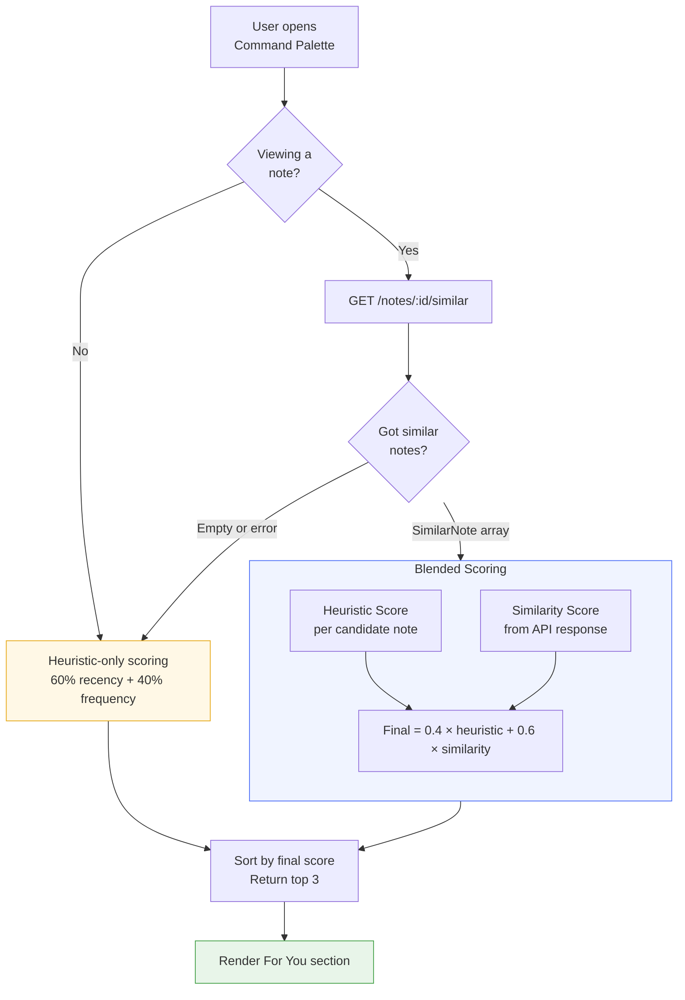

## Embedding Lifecycle

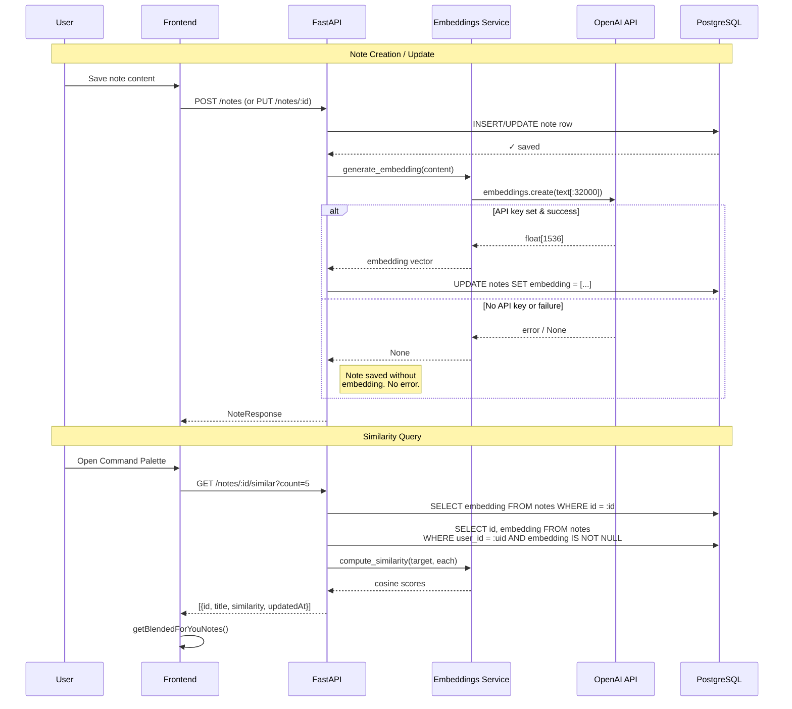

## Data Model

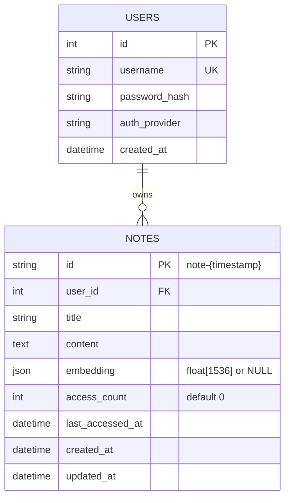

## Migration Chain

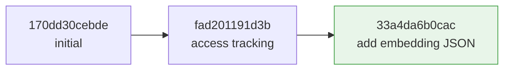

The migration is idempotent — checks if the column exists before adding it.

## Graceful Degradation

```mermaid
flowchart TD
    START([System Start]) --> KEY_CHECK{OPENAI_API_KEY<br/>set?}

    KEY_CHECK -->|No| NO_EMB[Embeddings disabled]
    KEY_CHECK -->|Yes| EMB_ON[Embeddings enabled]

    NO_EMB --> SAVE_NOEMB[Notes save normally<br/>embedding = NULL]
    NO_EMB --> SIM_NOEMB[GET /similar returns []]
    NO_EMB --> SCORE_HEUR[Command Palette uses<br/>heuristic-only scoring]

    EMB_ON --> SAVE_EMB[Notes save +<br/>embedding generated]
    EMB_ON --> API_FAIL{OpenAI call<br/>fails?}
    API_FAIL -->|Yes| SAVE_NOEMB
    API_FAIL -->|No| SAVE_OK[Note saved with<br/>embedding vector]

    SAVE_OK --> SIM_OK[GET /similar returns<br/>ranked results]
    SIM_OK --> SCORE_BLEND[Command Palette uses<br/>blended scoring]

    style NO_EMB fill:#fff8e6,stroke:#e6a817
    style EMB_ON fill:#e8f5e9,stroke:#43a047
    style API_FAIL fill:#fce4ec,stroke:#e53935
```

Every path leads to a working app. No feature flags needed.

## Component Architecture

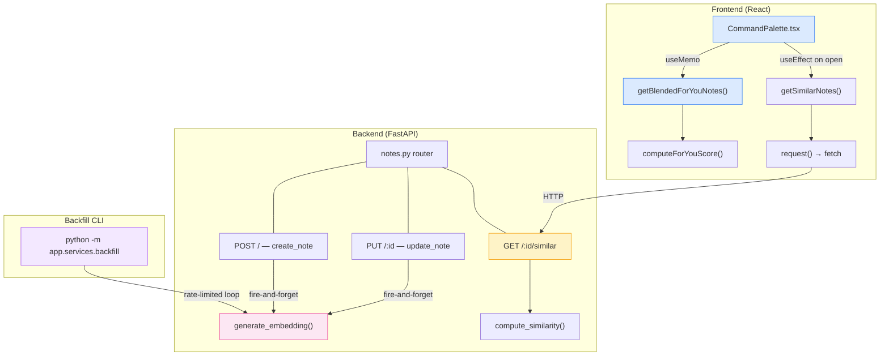

## API Contract

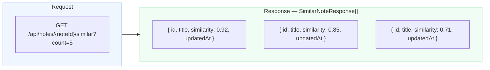

| Field | Type | Description |
|-------|------|-------------|
| `id` | `string` | Note ID |
| `title` | `string` | Note title |
| `similarity` | `float` | Cosine similarity `[0, 1]`, rounded to 4 decimals |
| `updatedAt` | `string` | ISO 8601 timestamp |

## Cosine Similarity

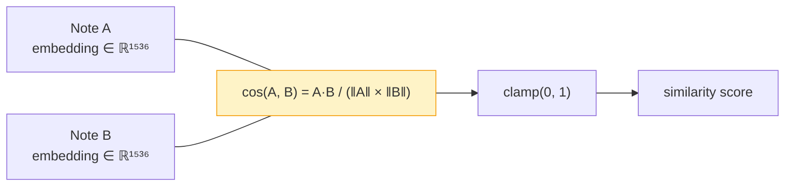

Computed in Python — no pgvector needed. For ~200 notes, full pairwise comparison takes **< 10ms**.

## Backfill Process

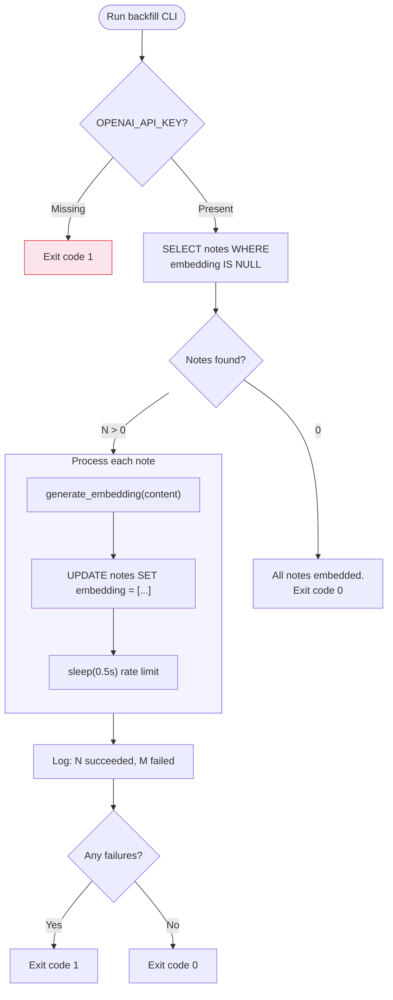

```bash
# Usage
cd backend
OPENAI_API_KEY=sk-... uv run python -m app.services.backfill
```

## Configuration

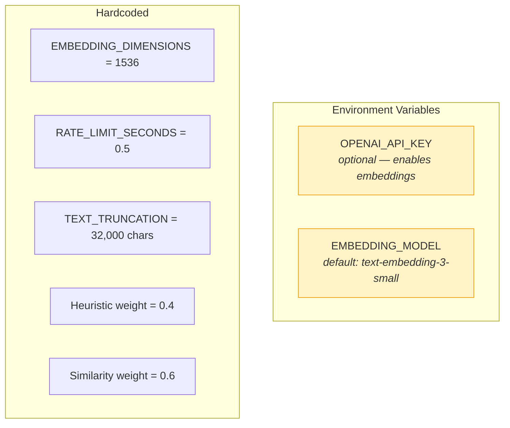

## File Map

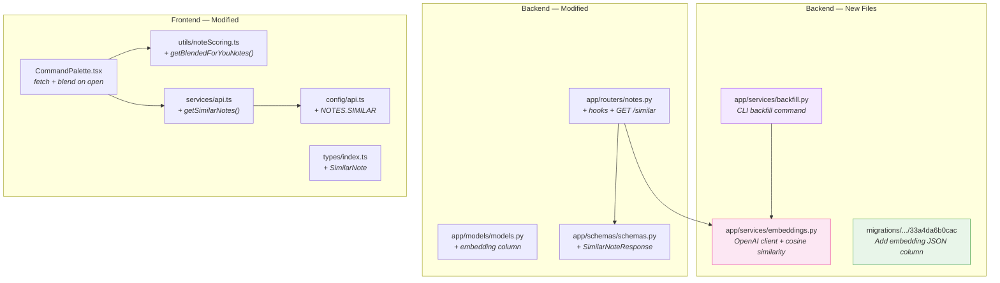

## Test Coverage

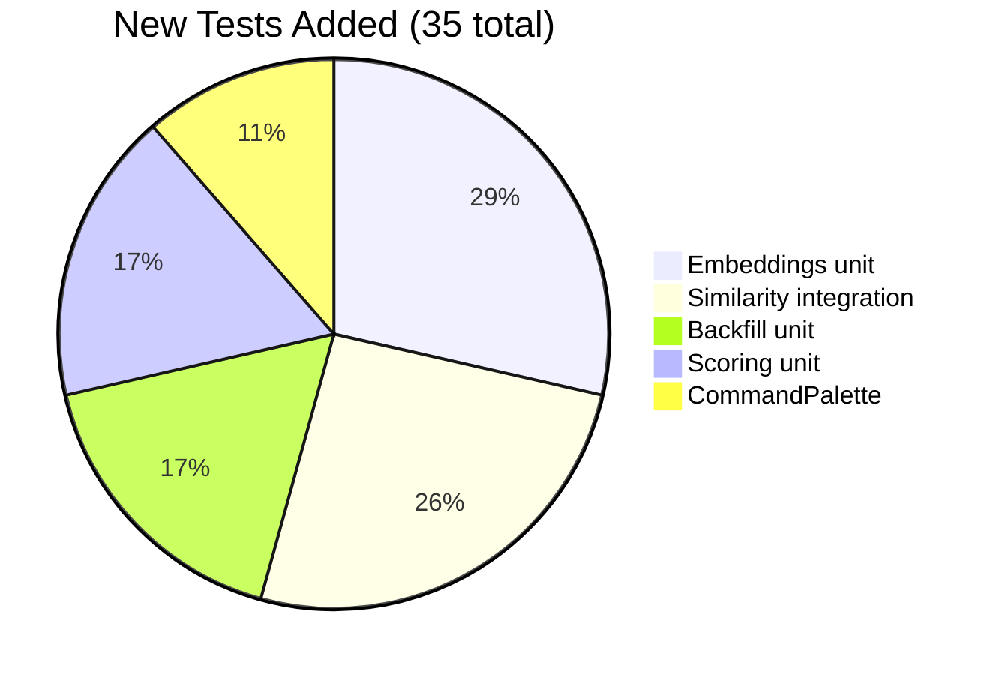

| Suite | Tests | Covers |
|-------|-------|--------|
| `test_embeddings.py` | 10 | Client init, generation, cosine similarity edge cases |
| `test_similarity.py` | 9 | Endpoint auth, 404, no-embedding, ranking, count param |
| `test_backfill.py` | 6 | No-key exit, no-work skip, rate limiting, failure reporting |
| `noteScoring.test.ts` | 6 | Blend fallback, empty similarity, weight verification |
| `CommandPalette.test.tsx` | 4 | Fetch on open, no-fetch without note, error resilience |

## Design Decisions

| Decision | Choice | Why |
|----------|--------|-----|
| **Storage** | JSON column (not pgvector) | ~200 notes/user → Python cosine similarity < 10ms. Avoids pgvector Docker/deployment complexity. |
| **Timing** | Synchronous on save | Note saves are infrequent. 200-500ms OpenAI latency is acceptable. No Celery/Redis needed. |
| **Failure mode** | Fire-and-forget | Embedding failure never blocks note saves. Logs warning, moves on. |
| **Model** | `text-embedding-3-small` | Best cost/quality ratio. 1536 dimensions. Configurable via env var. |
| **Blend weights** | 40% heuristic / 60% similarity | AI signal is stronger, but recency/frequency prevents stale recommendations. |
| **Truncation** | 32,000 chars | OpenAI's token limit for embedding input. Covers virtually all notes. |
