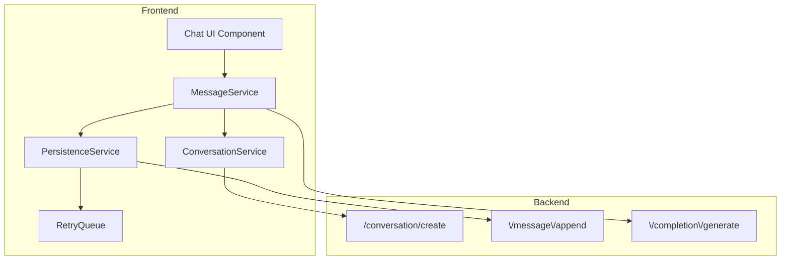
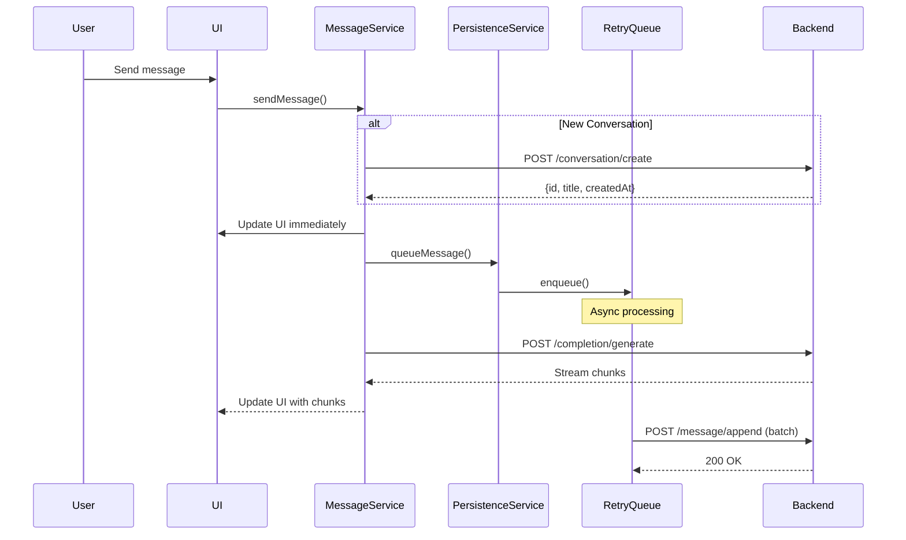

# Hybrid Persistence Architecture: Refactoring Agent Conversation Controller

  

## Problem Statement

  

The current `/agentconversation/run` handler violates the Single Responsibility Principle (SRP) by mixing two distinct concerns:

  

1. **Conversation persistence** - Creating conversations, saving messages to database

2. **Completion generation** - Invoking AgentRunService to generate streaming AI responses

  

This coupling makes the code hard to test, maintain, and scale. The frontend expects a single "one-shot" API call, requiring a coordinated refactor.

  

## Architecture Overview

  



  

## 1. Backend Architecture (SRP)

  

### Service Layer Separation

  

```python

# backend/services/conversation_service.py

class ConversationService:

"""Handles conversation lifecycle management"""

async def create_conversation(self, user_id: str, title: str, config: ChatConfigurationParams) -> Conversation

async def get_conversation(self, conversation_id: str, user_id: str) -> Conversation

  

# backend/services/message_service.py

class MessageService:

"""Handles message persistence"""

async def append_message(self, conversation_id: str, message: ChatMessage, user_id: str) -> None

async def append_messages_batch(self, conversation_id: str, messages: List[ChatMessage], user_id: str) -> None

  

# backend/services/completion_service.py

class CompletionService:

"""Handles AI completion generation"""

async def generate_stream(self, messages: List[ChatMessage], config: ChatConfigurationParams) -> AsyncIterator[str]

```

  

### New API Endpoints

  

- **`POST /conversation/create`** - Synchronous, returns conversation metadata immediately

- **`POST /message/append`** - Async-friendly, accepts single or batch messages

- **`POST /completion/generate`** - Pure streaming endpoint, no side effects

  

## 2. Frontend Architecture (DRY + SRP)

  

### Service Interfaces

  

```typescript

// frontend/src/services/MessageService.ts

interface MessageService {

sendMessage(content: string, conversationId?: string): Promise<void>;

streamCompletion(messages: ChatMessage[], config: ChatConfigurationParams): AsyncIterator<string>;

}

  

// frontend/src/services/PersistenceService.ts

interface PersistenceService {

queueMessage(message: ChatMessage, conversationId: string): void;

flush(): Promise<void>;

getQueueStatus(): QueueStatus;

}

  

// frontend/src/services/RetryQueue.ts

class RetryQueue<T> {

private queue: QueueItem<T>[] = [];

private processing = false;

  

constructor(

private processor: (items: T[]) => Promise<void>,

private options: RetryOptions = { maxRetries: 3, backoffMs: 1000 }

) {}

  

enqueue(item: T): void;

async processQueue(): Promise<void>;

private async processWithRetry(items: T[]): Promise<void>;

}

```

  

## 3. Message Flow (Hybrid Approach)

  



  

## 4. Key Design Decisions

  

### Conversation Creation Remains Synchronous

  

- User needs `conversation_id` immediately for UI state

- Title generation happens server-side for consistency

- Minimal latency impact (one-time per conversation)

  

### Message Persistence is Fire-and-Forget

  

- Messages queued locally with optimistic UI updates

- Batch processing reduces API calls

- Retry logic handles transient failures

  

### Completion Streaming is Pure

  

- No database writes in the streaming endpoint

- Clean separation of concerns

- Easy to scale/cache completion service

  

## 5. Enterprise Patterns Applied

  

### Repository Pattern (Backend)

  

```python

class ConversationRepository:

async def create(self, conversation: Conversation) -> str

async def find_by_id(self, id: str) -> Optional[Conversation]

  

class MessageRepository:

async def append(self, conversation_id: str, message: ChatMessage) -> None

async def append_batch(self, conversation_id: str, messages: List[ChatMessage]) -> None

```

  

### Command/Query Separation (CQRS-lite)

  

- **Commands**: CreateConversation, AppendMessage

- **Queries**: GetConversation, GetMessages

- **Streaming**: Separate concern, not a command or query

  

### Circuit Breaker (Frontend)

  

```typescript

class CircuitBreaker {

private failures = 0;

private lastFailTime?: number;

  

async execute<T>(fn: () => Promise<T>): Promise<T> {

if (this.isOpen()) throw new Error("Circuit breaker is open");

try {

const result = await fn();

this.onSuccess();

return result;

} catch (error) {

this.onFailure();

throw error;

}

}

}

```

  

## 6. Error Handling & Observability

  

```typescript

// frontend/src/services/PersistenceService.ts

class PersistenceService {

private metrics = {

queuedMessages: 0,

successfulSyncs: 0,

failedSyncs: 0,

retryAttempts: 0,

};

  

private emitMetrics(): void {

// Send to analytics/monitoring service

window.analytics?.track("persistence_metrics", this.metrics);

}

}

```

  

## 7. Testing Strategy

  

- **Unit Tests**: Each service class tested in isolation

- **Integration Tests**: Test retry queue with mock failing endpoints

- **E2E Tests**: Verify messages eventually persist even with network interruptions

  

## 8. Migration Strategy

  

### Phase 1: Backend Refactor

  

1. Extract services from existing controller

2. Implement new endpoints alongside existing `/run`

3. Add feature flags to switch between old/new behavior

  

### Phase 2: Frontend Refactor

  

1. Implement new service classes

2. Update Chat.tsx to use hybrid flow

3. Add retry queue and persistence service

  

### Phase 3: Cleanup

  

1. Remove old `/agentconversation/run` endpoint

2. Clean up legacy code paths

3. Update documentation and tests

  

## Benefits

  

✅ **Single Responsibility**: Each service has one clear purpose

✅ **Better UX**: Non-blocking message persistence

✅ **Resilience**: Retry logic handles network failures

✅ **Scalability**: Completion service can be scaled independently

✅ **Testability**: Services can be unit tested in isolation

✅ **Maintainability**: Clear separation of concerns

  

## Potential Gotchas

  

⚠️ **Race Conditions**: Multiple rapid messages might persist out of order

⚠️ **State Divergence**: Frontend state vs backend state can temporarily differ

⚠️ **Debugging Complexity**: Async persistence makes tracing harder

  

**Mitigations**: Message sequence numbers, visual sync indicators, comprehensive logging